# 动态规划

## 原理

动态规划是一种解决问题的范式或思想，简单来说就是分治递归加记忆存储

在无记忆递归中，各个子问题是独立对待的，若子问题并非独立，则同一个子问题可能被解决多次，这会带来大量公共子问题的重复计算

动态规划则是一种有记忆的迭代，将原始问题划分为又穷的子问题，将子问题对应到一个表中，对于公共子问题直接调用表中之前结果而避免重复计算

思考时是从上向下思考，即如何分解，如何更新，计算时是从下向上，即先计算最小子问题，不断合并更新，直到最终要求的问题

这里有个概念，优化解是指已经可以得到最小代价的方法解，我们的目的便是求出整个问题的优化解

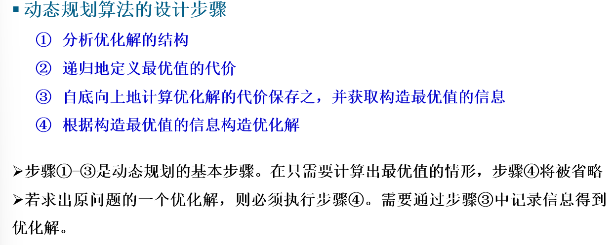

## 常见DP例子

### 矩阵乘法问题

#### 问题描述：

矩阵乘法具有结合律，不同的结合方式代价不同（如一个m×k的矩阵与一个k×n的矩阵相乘，代价为m×k×n，得到一个m×n的矩阵），对于一串矩阵相乘的序列，怎样计算可以最小化总代价？

#### 问题思考：

首先我们尝试穷举所有方法数
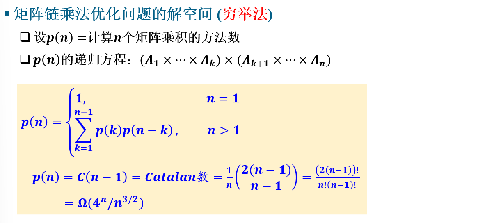

可以看到其解空间是指数级的，对于较大的n，正常穷举是不可能的

接着我们按照求解动态规划问题的步骤来思考
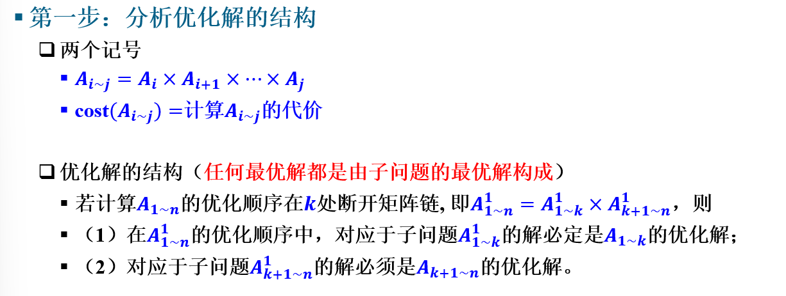

这一步简单来说就是思考优化解如何传递，在本特定问题中，一个优化解必定是以k为分界两个优化解的矩阵乘积

接着，我们可以很容易地得到，解决问题过程中的子问题具有重叠性，这也是我们使用动态规划的重要原因

接下来，我们可以通过最优解之间的传递关系，得到代价的传递关系

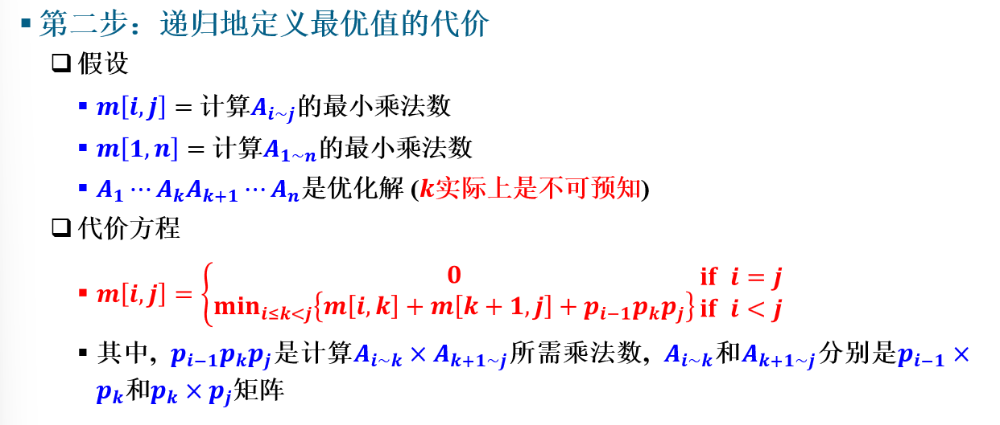

最后，就可以自下向上开始计算最终代价了，即计算m[1,1]等，接着根据这些计算m[1,2]等，接着不断向上，最后即可计算出m[1,5]，即为所求最小代价，而由过程可以得到最优解

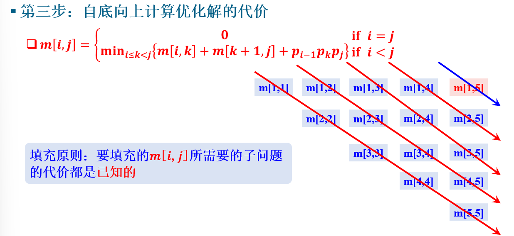

#### 问题解决：

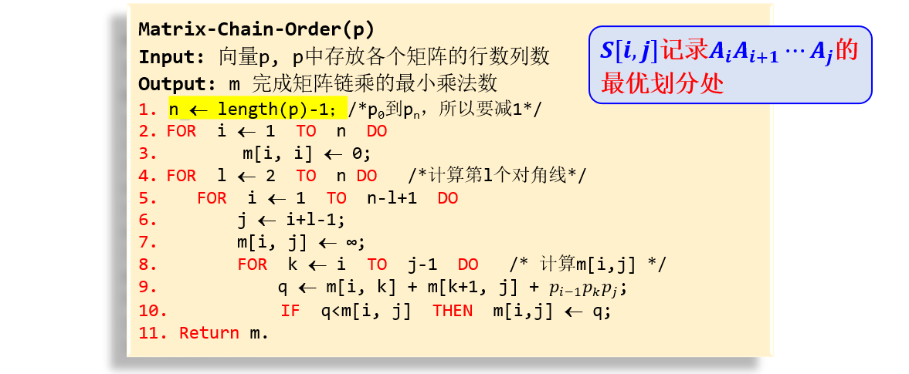

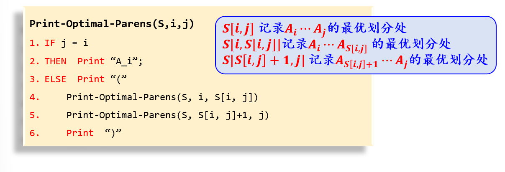

#### 算法分析：

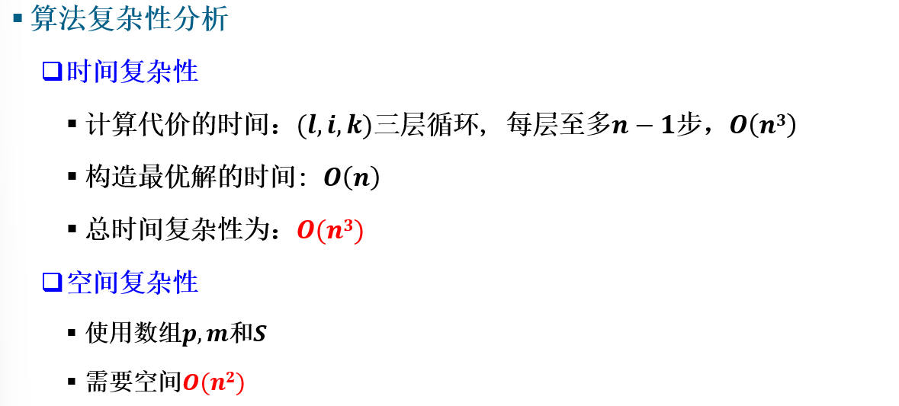

### 最长公共子序列

#### 问题描述：

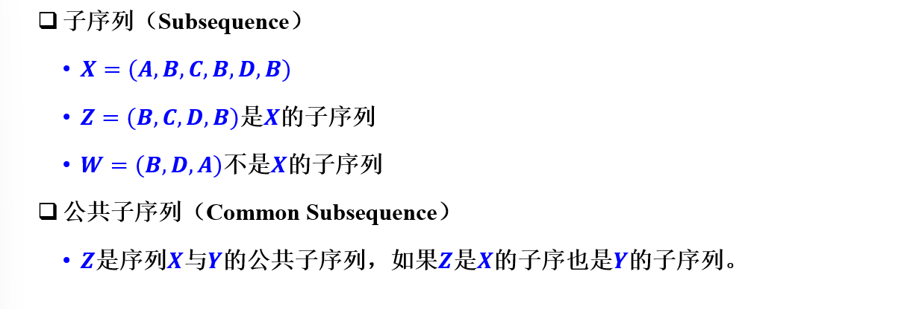

不要求连续，不要求位置相同，考虑次序。即从序列一中选出若干，从序列二中选出等量，保持原有次序完全一致则是公共子序列。

#### 问题分析：

如果用暴力搜索法，需要枚举X的所有子序列，并一一确定是否为Y的子序列，这需要进行2的n次方的比较。

我们引入概念，第i前缀，指原序列前i个元素组成的序列。

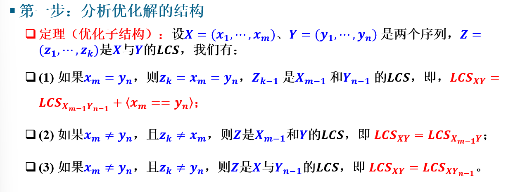

简单来说就是，对于两个序列的最后一个元素，如果其相同，则该元素一定在公共子序列中，且也是公共子序列的最后一个元素，同时，除去最后一个元素后，剩余的仍是问题规模减小的原问题；如果其不相同，则说明两个中至少有一个不构成公共子序列，即公共子序列要么是去掉第一个序列最后一个元素的问题，要么是去掉第二个序列最后一个元素的问题

形象化描述即是，从两个序列末端出发，如果相等则加入，如果不等则分叉，一条路走去掉第一个序列最后一个元素，另外一条走去掉第二个序列最后一个元素。同时由于子问题重叠性，并非无限分叉下去，而是会收敛在一张表中，xy坐标分别是第一个序列的元素个数和第二个序列的元素个数

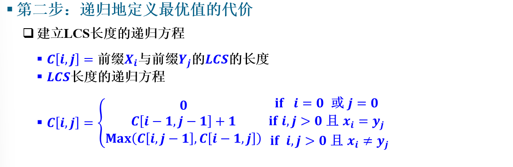

根据优化解的结构，我们可以得到代价的转移方程

接着，我们从上向下思考后，需要从下向上进行计算

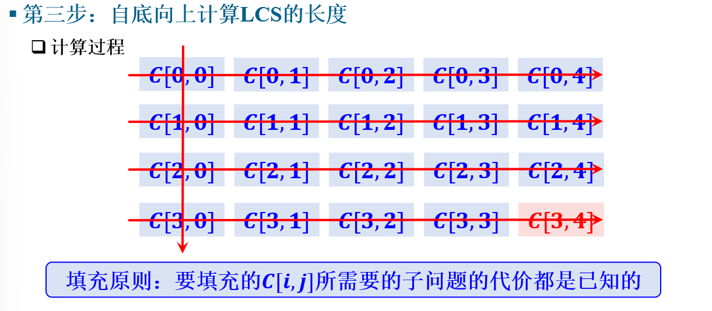

#### 问题解决：

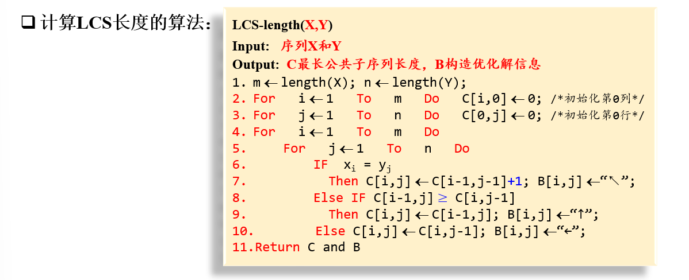

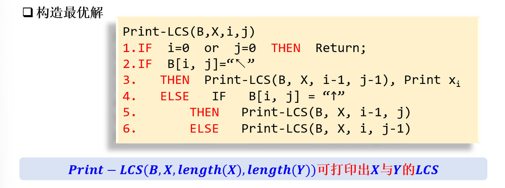

这其中，B数组充当了路径指引的作用，可以按照B的指引走一遍从上到下的路径，于是构建最优化解。

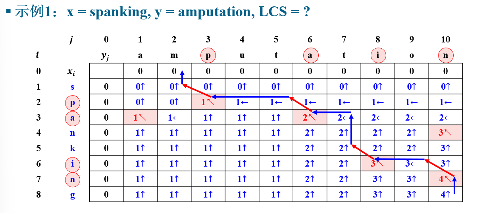

#### 算法分析：

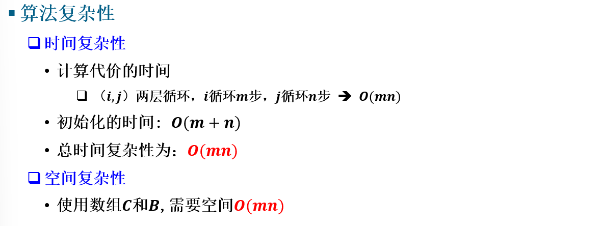

### 最优二叉搜索树

#### 问题描述：

二叉搜索树指的是一种二叉树，对于一个节点来说，左子树所有节点值均小于该结点，右子树所有结点均大于该节点，同时左右子树都是二叉搜索树。

中序遍历二叉搜索树即可得到有序序列

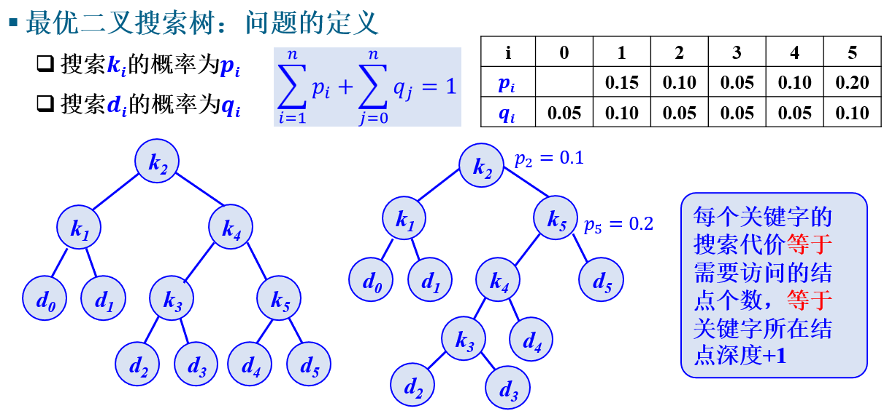

问题定义为，在搜索的情境下，对于某关键字我们要搜索其分类，其中k为排序好的关键字序列，d代表关键字中间值，即搜索失败的情况。已知搜索k和d的概率，求一种树的构建方式，使得搜索树的期望代价最小

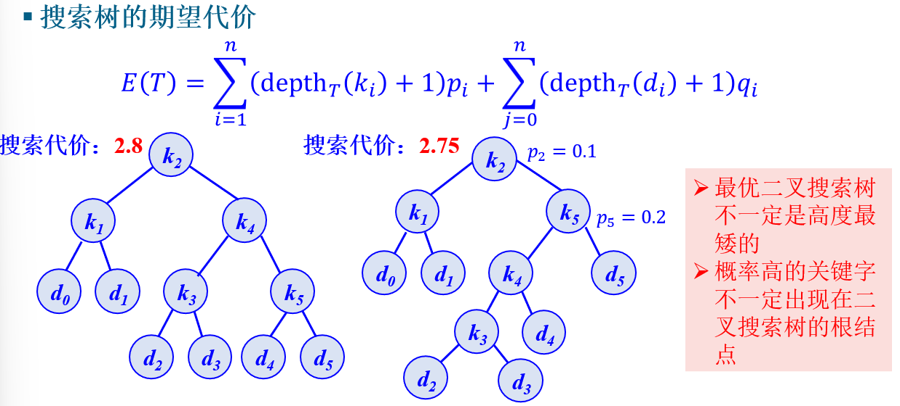

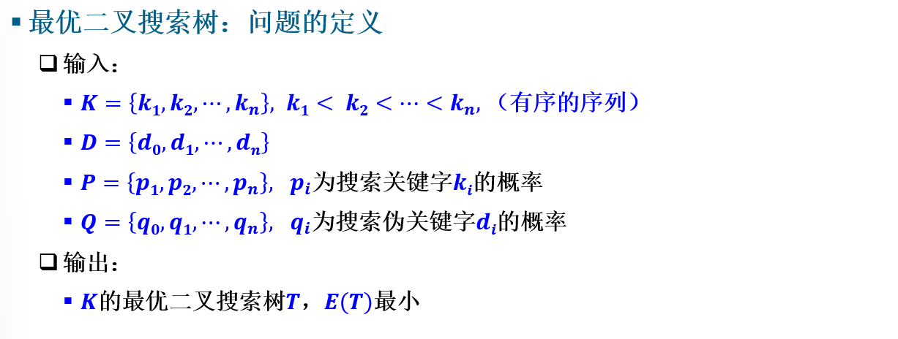

#### 问题分析：

与先前类似，首先我们要找到优化解的传递性，我们可以很轻松地看到，对于一个优化解来说，其包含的子树一定也是该子树的优化解

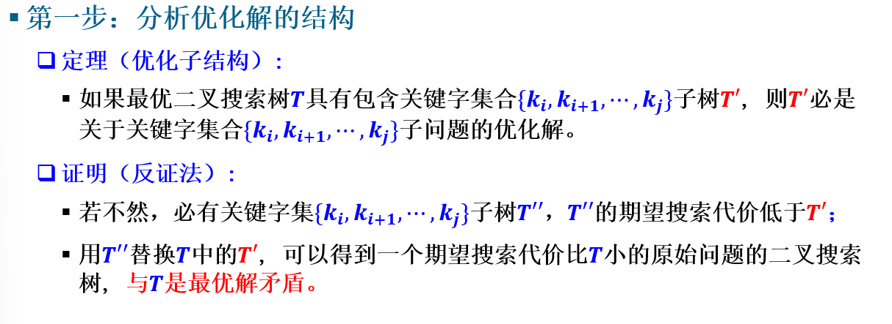

那么，一个树的优化解就是以其中一个结点为根，左右子树都是优化解时总代价比以其他结点为根左右子树优化解的代价都小

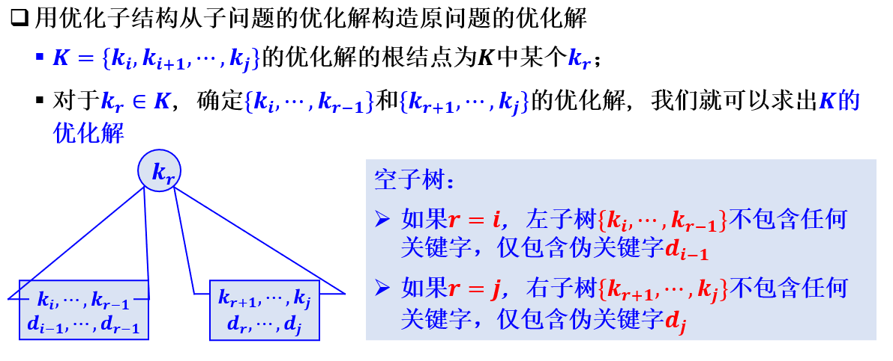

于是我们可以从优化解的结构找到优化解的代价传递方程

注意，这里要加上一个W，因为我们增加了树的高度，使得每个结点的代价都上升了一个概率，这不会影响本轮优化，但是会在整体上有作用

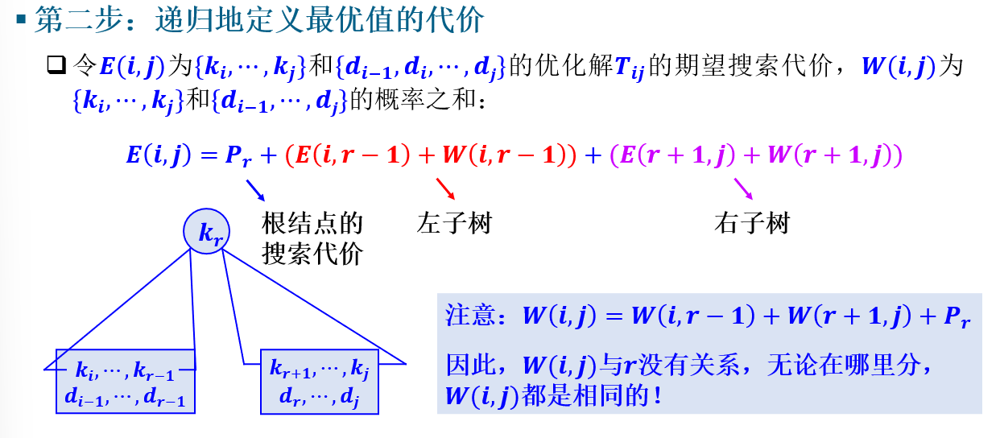

接下来就可以从下向上计算了

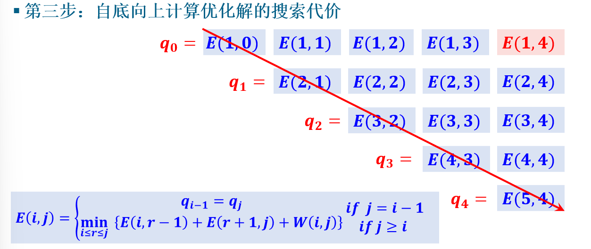

最下层代表只有d元素，从i=j开始才加入了k元素

具体实现与矩阵乘法类似，算法分析部分也是类似，其中w的更新可以在动态规划过程中进行，即每次增加一个q[j]和p[j]

注意，最优二叉搜素树问题与哈夫曼树问题并不相同，最优二叉搜索树的顺序是固定的，需要在顺序不变的情况下找到最优构建方法，具体体现在其通过按照根节点不断拆分成左右子树考虑；而哈夫曼树的顺序是没有规定的，这意味着可以通过贪心的思想，在每一步选择当前最小的两个结点合并，从下向上解决问题。其次，最优二叉树中，并非完全对外部节点进行构建，其内部节点也参与了构建过程；而哈夫曼树中，只是对于外部节点（叶子结点）进行构建，内部结点的值是外部节点确定的。

### 0-1背包问题

#### 问题描述：

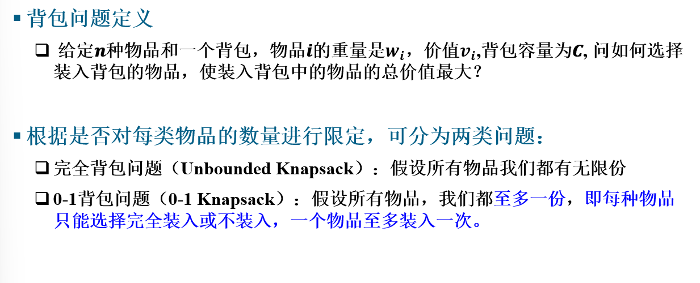

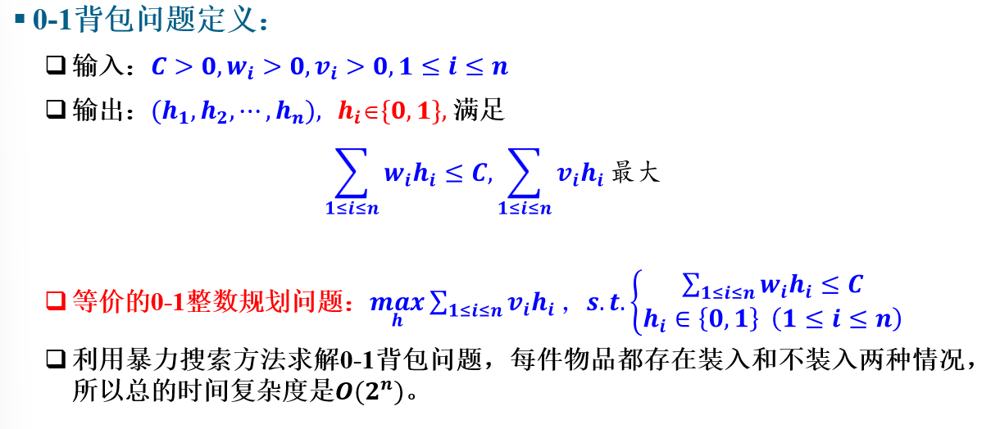

这里0-1整数规划是线性规划的一种

#### 问题分析：

如果仅考虑背包称重分解子问题，我们无法得知各种东西是否已经被用过，而如果仅考虑物品分解子问题，我们又无法保证背包称重在范围内，因此我们需要一个二维数组的动态规划

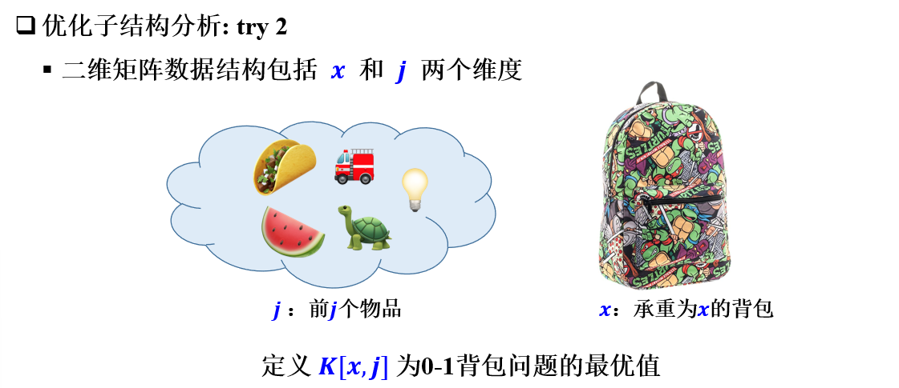

这时候为了将问题分解，我们分为两种情况，一种是前j个物品最优解不包含第j个物品，一种是包含第j个物品

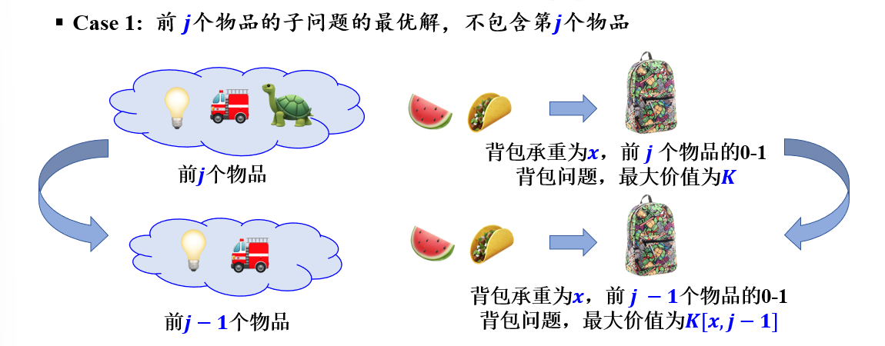

如果不包含第j个物品，那么最大价值应该与同样x承重，前j-1个物品时的最大价值相等

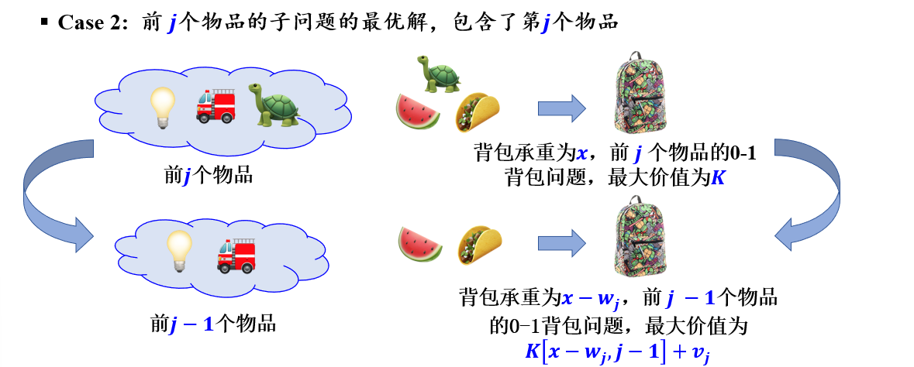

如果包含第j个物品，那么去掉该物品的价值为，减去该物品重量的背包承重，前j-1个物品时的最大价值相等

这样我们就构建了优化解的递归结构

同时，我们可以得到，对于含n个物品的最优解，其前n-1个物品一定是去掉第n个物品重量的承重的最优解

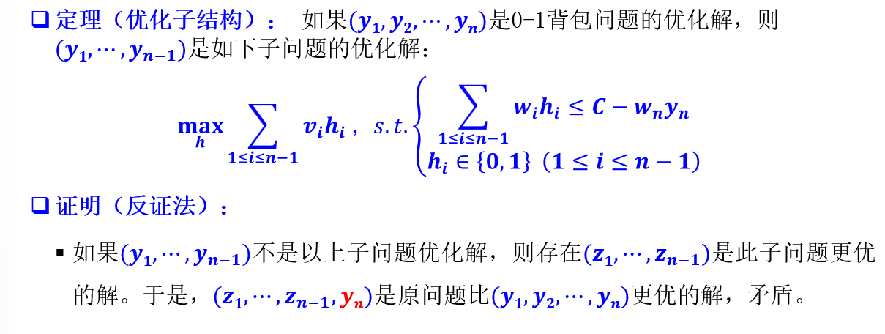

这为我们不断扩展优化解提供了理论依据，于是我们可以得到下面的优化方向

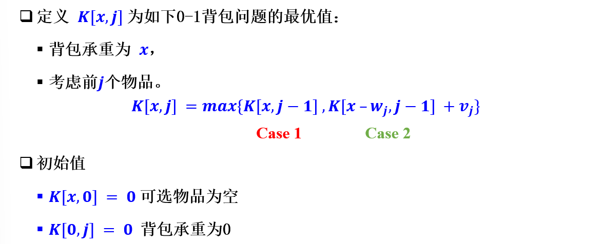

#### 问题解决：

下面我们就可以从下到上解决问题了

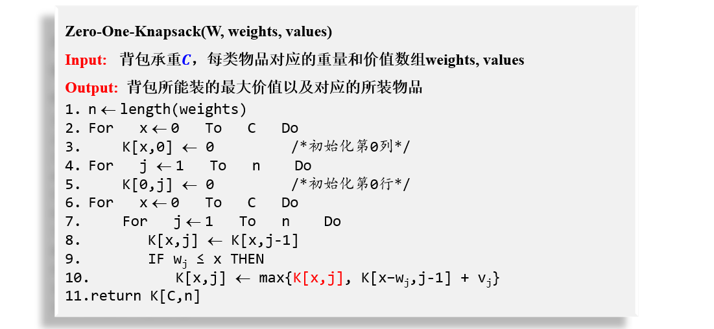

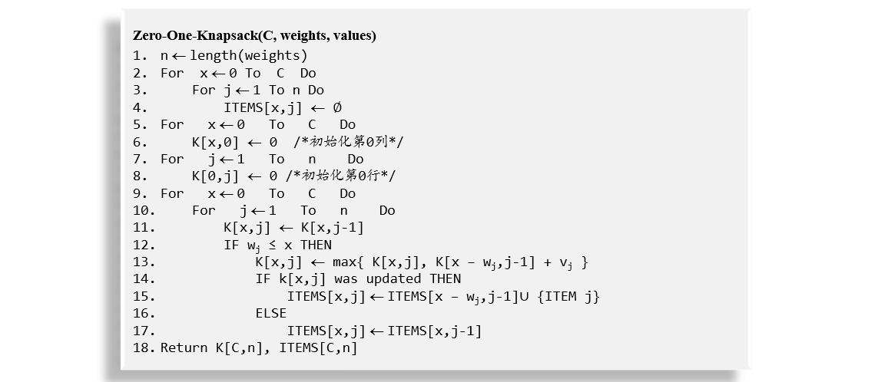

完全背包问题是01背包问题的衍生问题，完全背包意味着每个东西可以重复选择而不是选择后不再存在，在这种情境下，只需要在状态转移方程中，将选择该东西的转移方程改为dp[i][j-w[i]]+v[i]，其中j从小到大遍历。

分组背包问题也是一个变种，这意味着将所有物品分为了好几组，没组中有不同的依赖和排斥关系，我们只需要将其遍历出来化归为01背包问题即可
