# 排序

## 相关概念

排序是指将一个数据元素的任意序列，重新排列成按关键字有序的序列，其目的之一是方便数据查找

排序方法有稳定性和不稳定性之分，在排序过程中，有若干记录的关键字相等，在排序前后，含相等关键字的记录的相对位置保持不变，则为稳定的，否则则为不稳定的。

排序还分为内部排序和外部排序，在排序过程中只使用计算机内存存放记录的排序为内部排序，除内存之外还需要借助外存的为外部排序。外部排序快慢主要取决于内外存之间的数据交换次数，我们所研究的排序方法主要是针对于内部排序的。

内部排序可以抽象化为一个逐步扩大记录的有序序列长度的过程

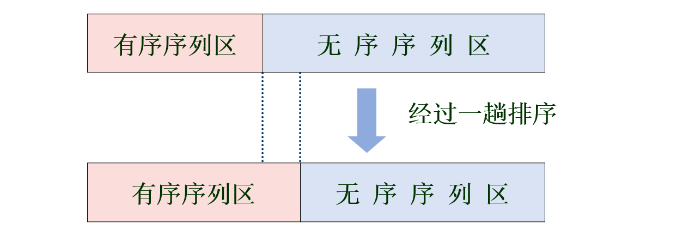

基于不同的扩大方式，内部排序大致分为：

插入类：将无序序列中的一个或几个记录插入到有序序列中

交换类：通过交换无序序列中的记录，得到其中关键字最大或者最小的记录并加入到有序序列中

选择类：从无序序列中选择关键字最大或者最小的记录并加入到有序序列中

归并类：归并两个或以上的有序子序列，增大有序序列长度

其他方法（基数排序等等）

算法评价主要从下面几个方面入手（一般需要用摊还分析的方式分析）

排序的基本操作 ： 比较、移动

辅助使用的存储空间 ： 数据规模一定的条件下，除了记录的存放，执行算法需要的额外存储空间

算法本身的复杂度（主要）

## 插入排序（插入类）

### 基本思想

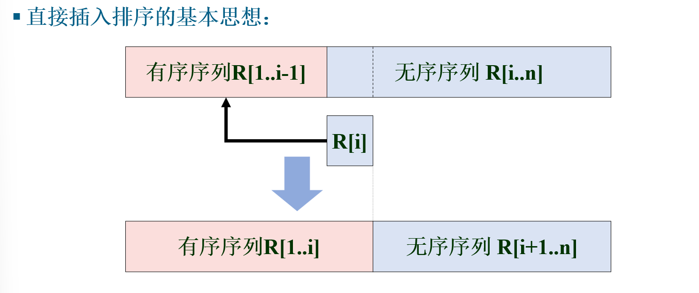

### 直接插入排序

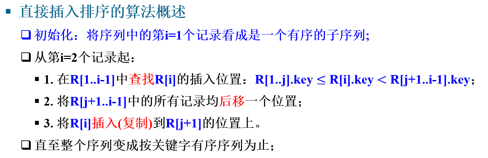

简单来说就是不断将无序序列的第一个元素插入到有序序列中，插入方法为先后移再插入

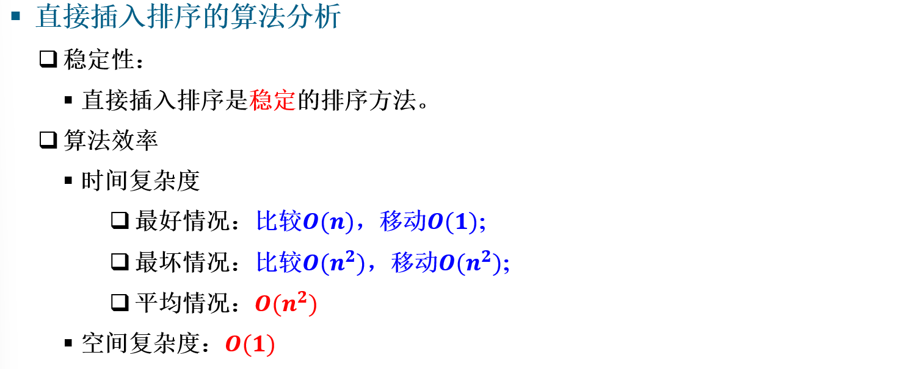

### 折半插入排序

基于直接插入排序，我们利用二分法优化查找部分，降低比较带来的复杂度

具体算法方面只是修改了比较的部分，移动还是不变。

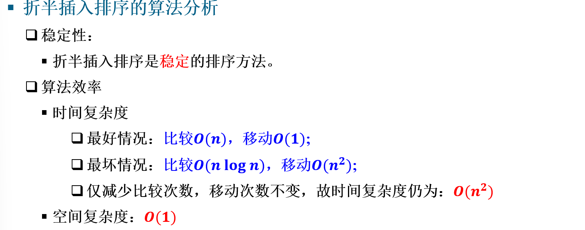

### 表插入排序

（仅优化排序的存储结构，不展开）

### 希尔排序

希尔排序的基本思想是，由于插入排序对于基本有序的序列复杂度很小，所以想到先宏观调整再微观调整的方法，即尝试先使序列趋近于有序，再进行排序。

具体来说如下
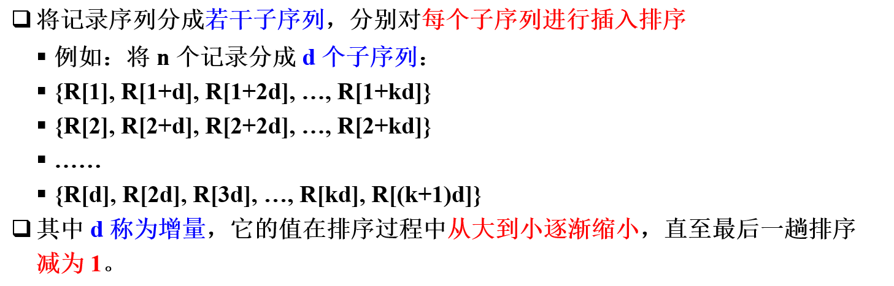

简单来讲，就是分批次进行插入排序，用多批次换来整体有序

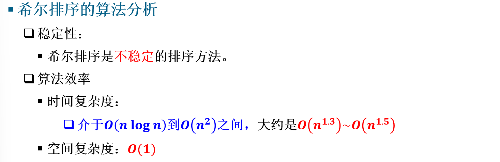

## 冒泡排序和快速排序（交换类）

### 冒泡排序

基本思想是从第一个记录开始，两两比较，将关键字大的记录进行交换，每一趟都能把当前无序序列中的关键字最大的记录沉底，而最小的则上浮一个位置，进行n-1趟即可

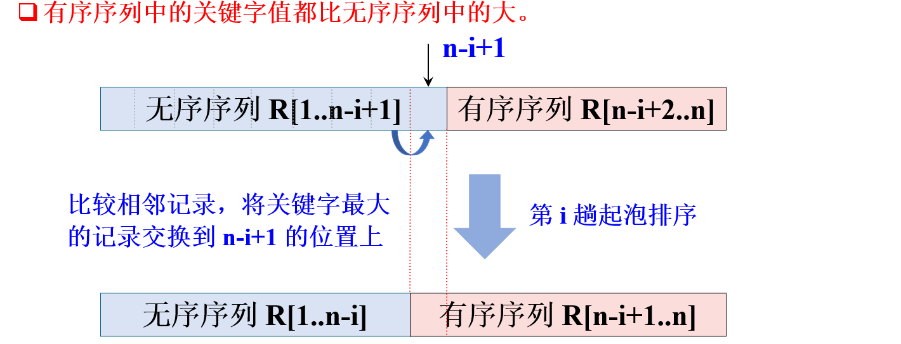

其优点在于，如果序列本身有序，则只需要进行一次冒泡，即进行n-1此比较即可

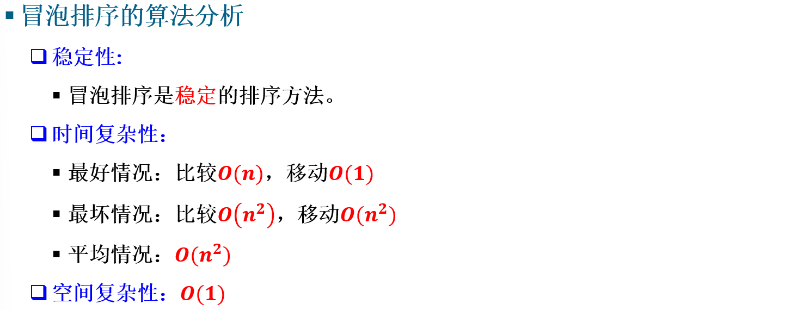

### 快速排序

快速排序本质上是改进的冒泡排序，其基本思想是，取待排序列中的某个对象，以其关键字为基准，将整个序列分为左右两个序列，在每次操作中，以该对象为分界点，比轴小的交换到左侧，比轴大的交换到右侧，则在最后，左侧序列都比轴小，右侧都比轴大，轴的位置正好在中间正确位置。

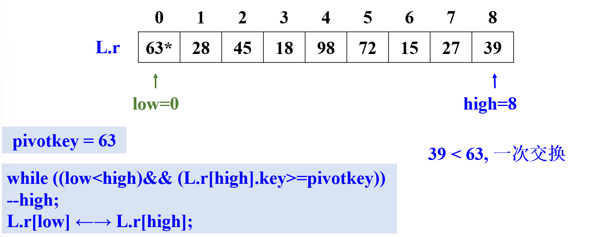

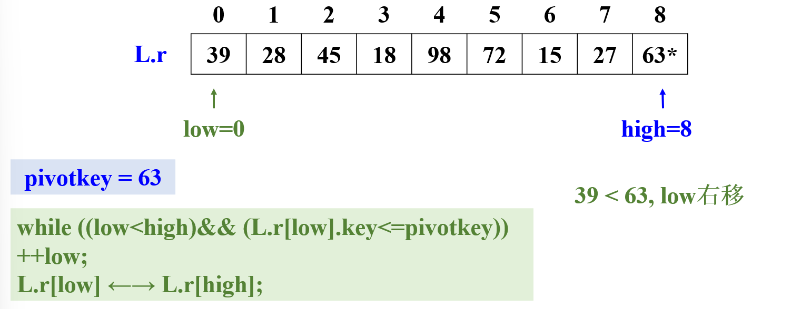

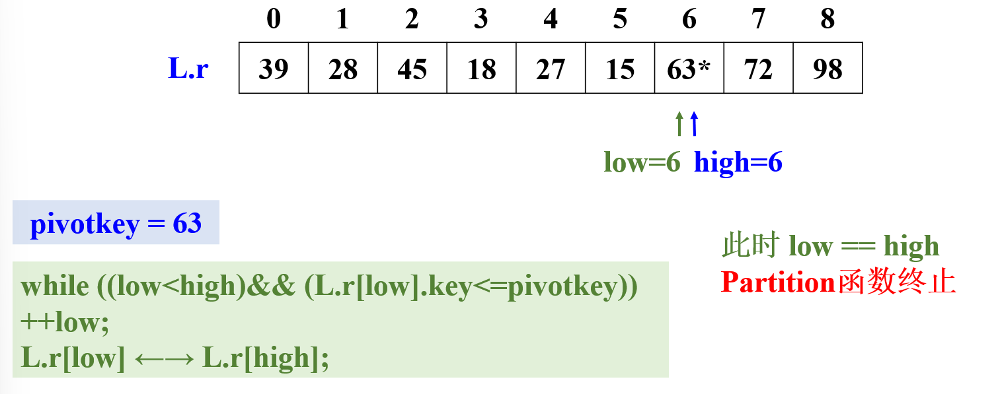

简单来说，就是选最左端元素为轴，分配两个指针，起初在两端，先对右指针的对象判断，如果其大于轴，则右指针左移，直到遇到小于轴的，将其与左指针对象进行互换，接着对左指针的对象进行判断，如果其小于轴（因为每次操作互换后，指针所指的都是刚换过来的位置正确的对象，因此必定向前一步），则左指针右移，直到遇到大于轴的，将其与右指针对象进行互换，接着重复这个过程（即再对右指针进行判断），直到右指针与左指针相遇。此时两个指针位置即轴位置，左侧元素比轴小，右侧元素比轴大。

当然，这样并不能保证整体有序，但是我们可以继续分别对轴右侧序列和左侧序列进行相同的快速排序操作，这个过程可以一直进行下去，直到只有一个元素。

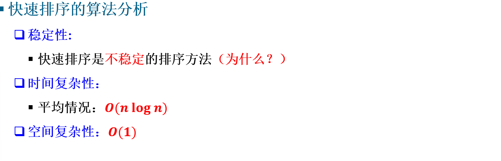

快速排序有非常好的复杂度，并且其不占用额外的空间，直接在原数组上进行排序，但是其不是稳定的，这让其并不是完全通用的解，但是一般情况下快速排序成为普遍使用的解法。

## 选择排序（选择类）

### 简单选择排序

基本思想：

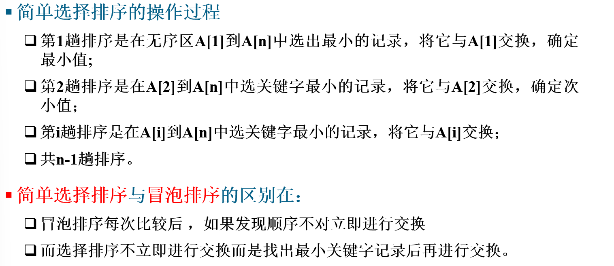

简单选择排序节省冒泡排序不断交换的复杂度，但是其需要进行多次比较，而且这个比较是必须的，不会因为原序列已经有序而停止。

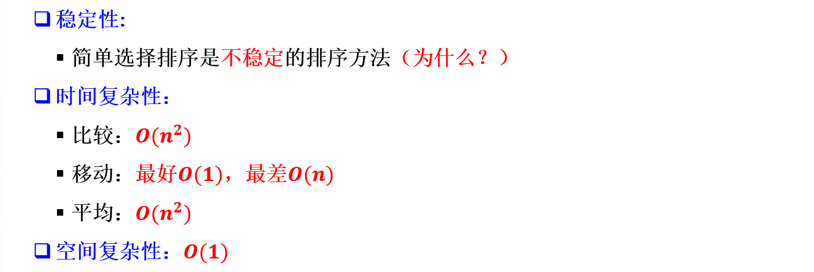

### 树形选择排序

由于简单选择排序中，比较次数是其主要制约因素，因此树形排序尝试利用锦标赛的思想减少比较次数，即一次选择并非需要完全独立于其他选择，其他选择的过程也可以为这次选择提供信息。

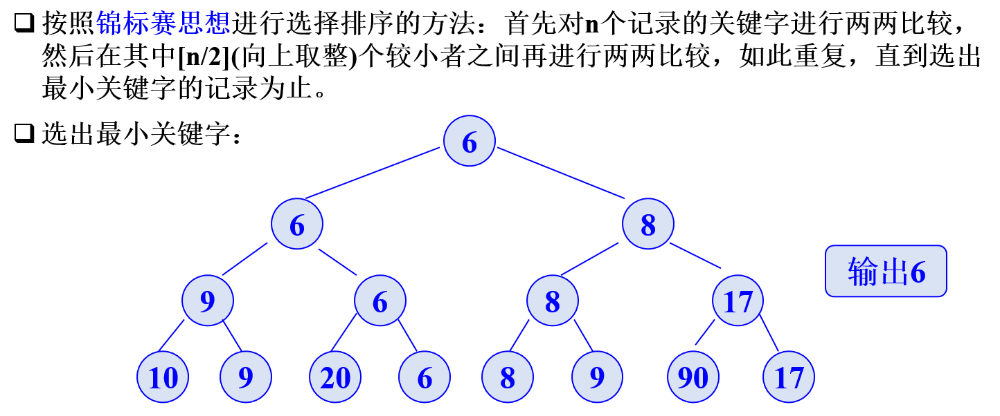

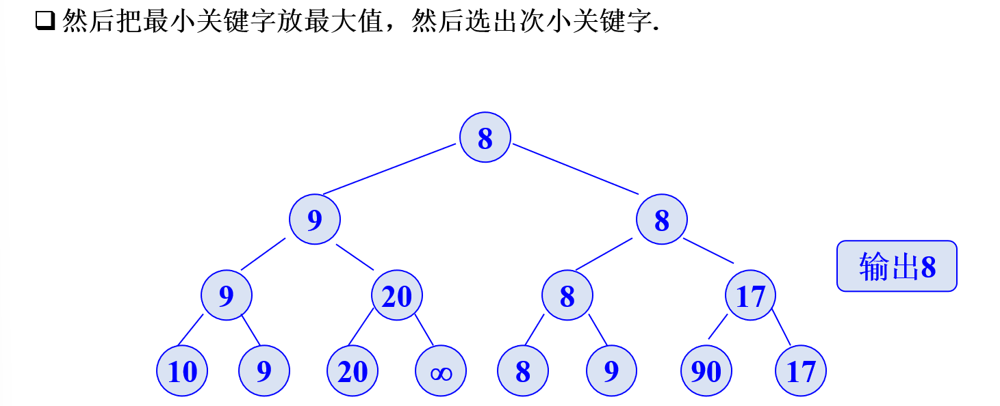

可以看到，这种方式将一次选择的复杂度从n降到了logn，但是同时，由于引入了树结构，其空间复杂度有所增加，不过也是在可接受范围内。同时我们在过程中可以看到，由于每次只是选出最小值，其最大值参与了多次多余的比较。

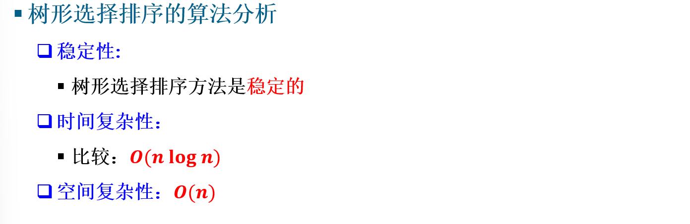

### 堆排序

在堆排序之前，需要先了解堆的定义与性质。

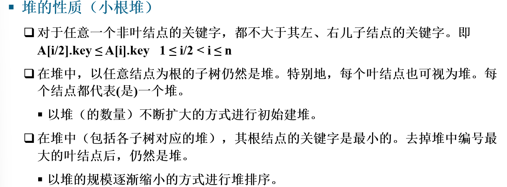

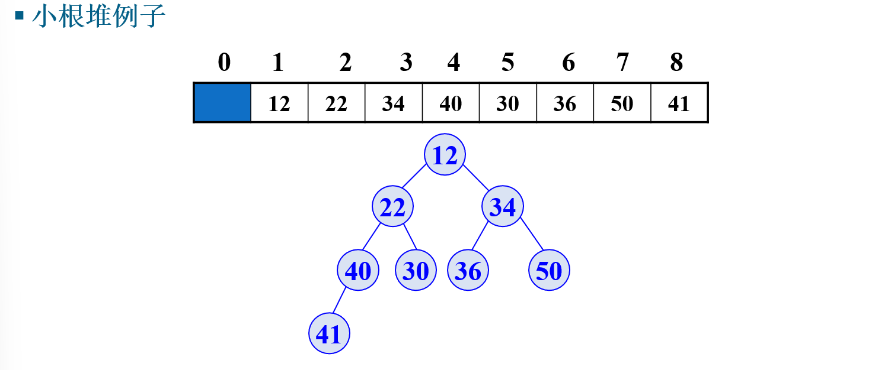

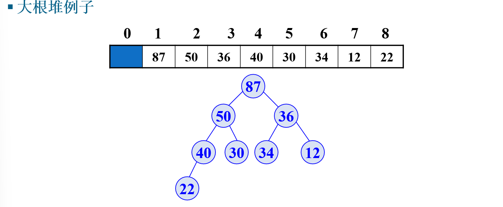

其定义简单来说，就是一棵完全二叉树，树的根节点永远比他的孩子节点大（小）

对于堆排序，为了节省空间，我们并不需要真正构建出来一个树结构，而是用数组下标来模拟树结构，整体的算法如下

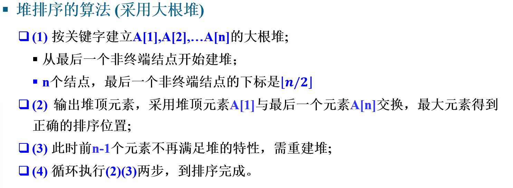

其中非终端节点即非叶子结点，从最后一个非终端节点向前建堆的原因是，建堆过程会将结点与其子结点进行交换调整，终端结点没有子节点。

其中构建大根堆的方式，是从最后一个非终端节点开始比较其与孩子节点的大小，如果该节点大于两个孩子节点，则略过，否则则与孩子节点中较大的一个进行交换，并继续将该节点与交换后其孩子节点进行比较调整。

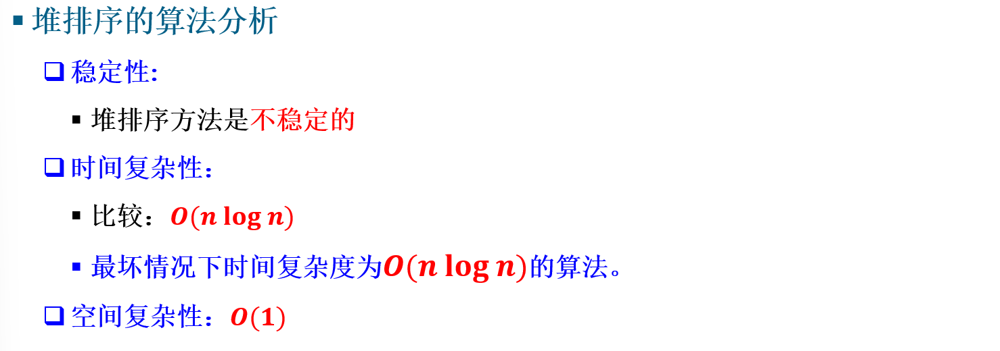

## 归并排序（归并类）

归并排序是一种经典的分治思想的应用，其基本思想主要是将排序分成了三步，分别是分开、排序、合并，其中排序这一步的步骤与整体的排序一致，是一种递归。

归并排序常常使用的是2路归并排序，因为其好操作而且具有很好的速度。

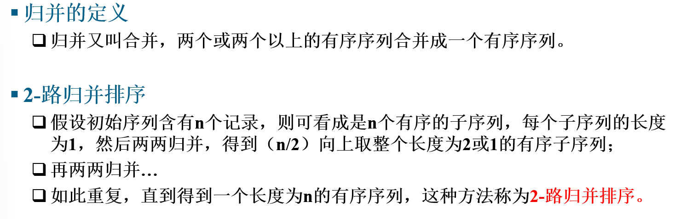

对于排序的三步，即分开、排序、合并，分开可以很简单地实现，排序是递归调用，重要的是如何进行合并，即如何将两段有序序列合并为一段有序的序列。

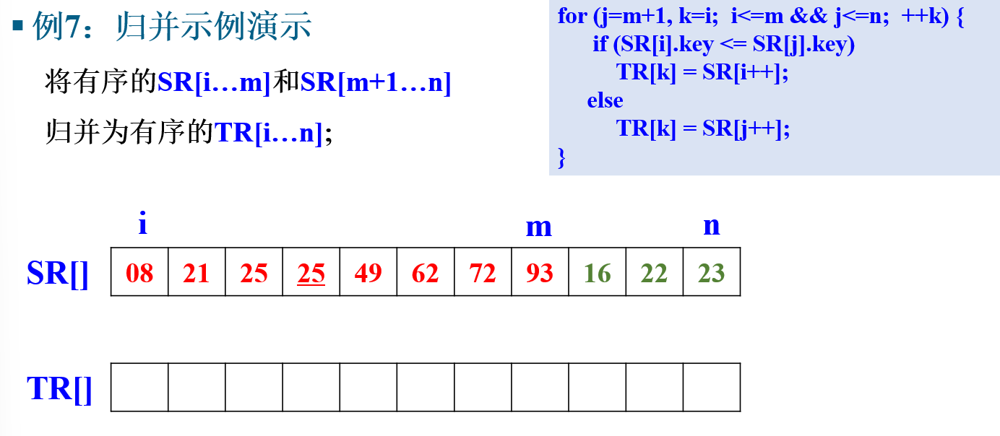

在这个程序中，主要通过k来指向目标序列要更新的位置，i指向第一段序列正在处理的位置，j指向第二段序列正在处理的位置。每次比较i和j所指的值大小，并更新k指向的值，接着更新k和选中的i或j的值，达到从原序列中拿出一个值放到目标序列中的效果。

对于整体的排序如下图所示
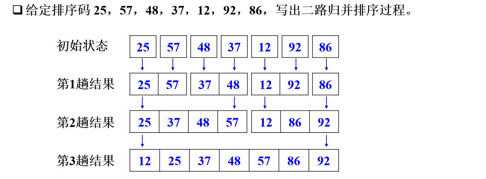

实际上，在真正的代码中，是利用调用时的栈结构从下向上递归调用的，即输入整个的序列，将其分治，直到只剩一个元素，直接返回，返回过程中进行合并。

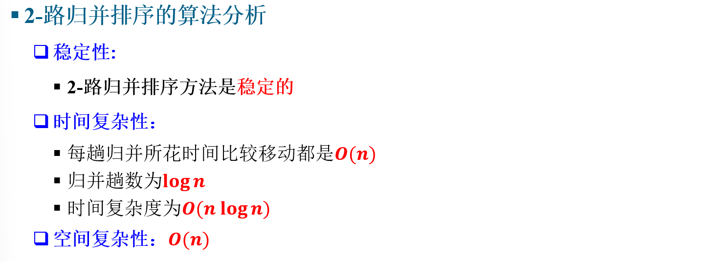

可以看到，归并排序的复杂度也很好，而且是稳定的，但是其利用了额外的空间来存储排序过程中产生的序列，因此具有n的空间复杂度，不过也是可接受的，这使得归并排序也成为常用的排序方法。

## 基数排序（其他）

可以看到，上面的排序方法，在本质上都进行了关键字的比较，而可以证明只要基于关键字比较的排序方法，是有复杂度下界的。那么是否存在一种排序方法不需要进行关键字比较呢？

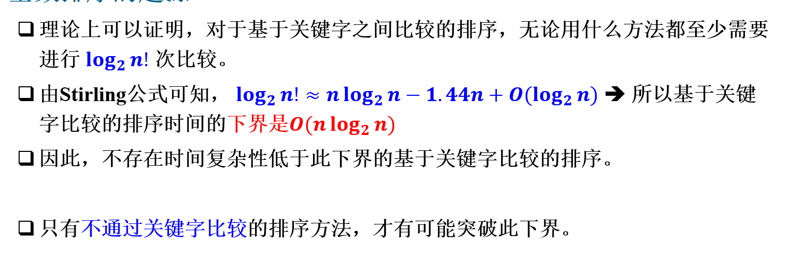

基数排序是一种利用了桶结构的排序方式，将关键字分成一个个分量，接着基于分量的取值范围设置桶的数量，有次序地按照每个分量进行分配与回收，经过所有分量处理后最后得到的便是排序好的序列

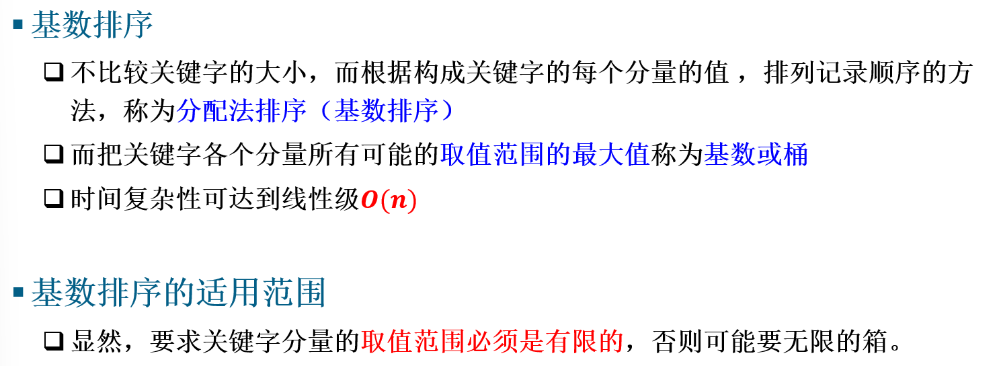

在下例中，先对个位数进行了分配并回收，接着十位数、百位数，最后得到有序序列

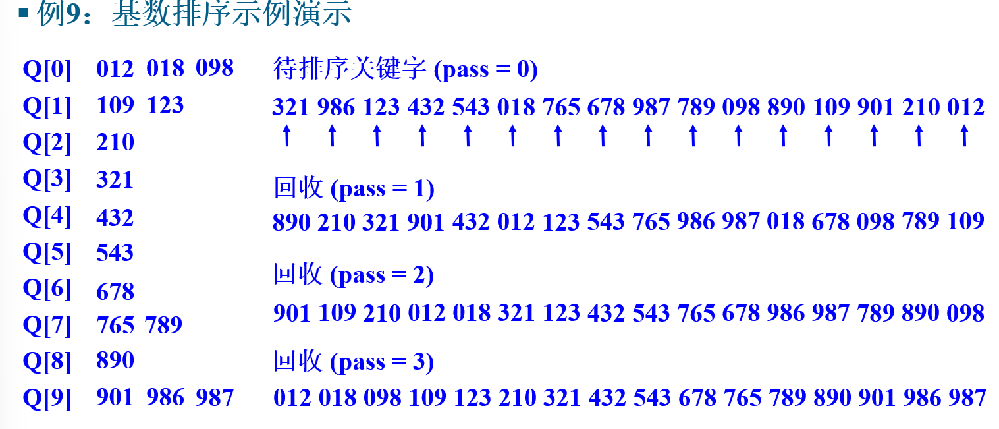

虽然基数排序具有非常好的复杂性，而且具备稳定性，但是其具有较大的限制，即关键字必须可以拆分成可比的分量，同时分量必须有限、分量的取值范围也必须有限。

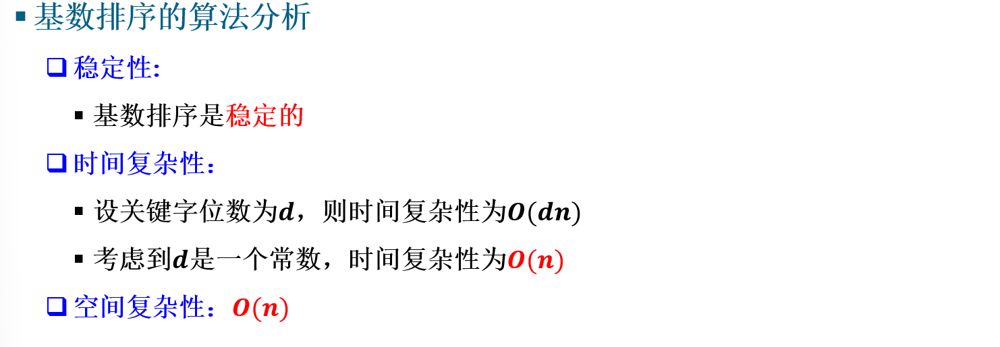

## 内部排序方法比较

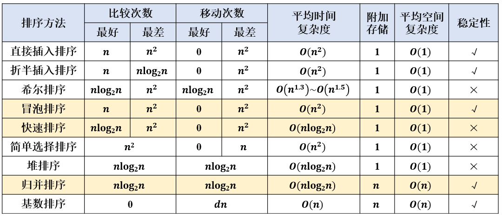

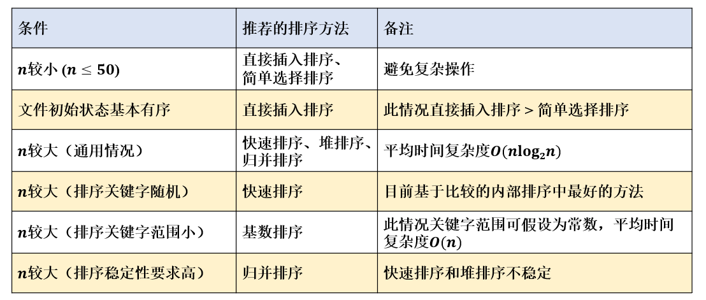
