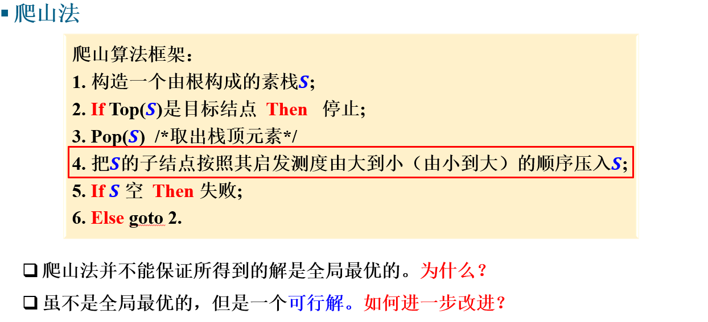
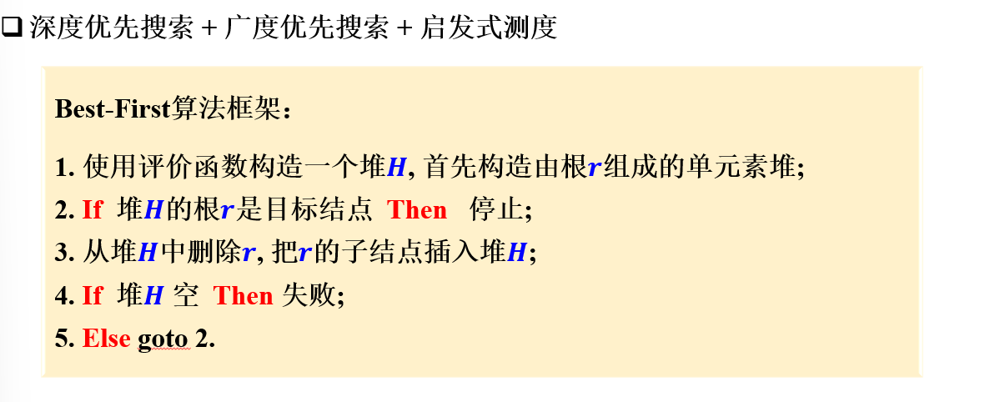
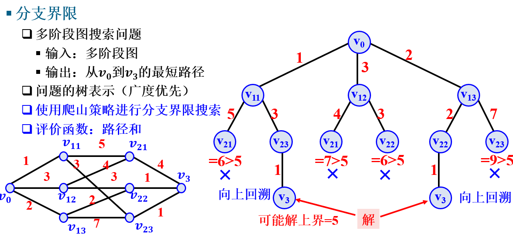

# 搜索

搜索基本上包括了深度搜索和广度搜索两种搜索策略，其目的是在一个未知的集合中，找到符合条件的解集

深度优先是基于栈结构，先走到头再换方向

广度优先是基于队列结构，先尝试所有方向再走下一步

其中深度优先可以更快达到边界，广度优先可以用来解决最少步骤问题

## 搜索的优化

搜索的优化基本思路是，基于额外的启发函数，使搜索的顺序尽可能走向最可能出现答案的方向，防止无效搜索，减少搜索的次数，这其中，选择合适的优化方法固然重要，好的启发函数也不容或缺。

### 爬山法

简单来说，就是在深度优先搜索的基础上，不再使用简单的遍历所有方法，而是采用启发函数来规定结点扩展的顺序

### Best-First搜索

结合深度优先与广度优先，根据评价函数，在目前所产生的所有结点中选择评价函数最值的结点进行扩展，这具有全局优化的概念，而爬山法只是局部最优

### 分支界限

先发现优化解的一个界限，接着剪枝未到达边界但已经超过界限的解

可以使用爬山法等先快速确定一个较优方案，接着进行分支界限搜索，确定全局最优

