# 查找

## 相关概念

### 查找表：

定义：由同一类型的数据元素构成的集合

对查找表可以进行多种操作，包括：

1.查询某个特定数据元素是否在表内

2.检索某个特定数据元素的各种属性

3.插入一个数据元素

4.删去一个数据元素

### 查找的分类：

根据查找方法取决于记录的键值还是记录的存储位置，分别是基于关键字比较的查找和基于关键字存储位置的查找，基于关键字比较的查找包括顺序查找、折半查找、分块查找、查找二叉树等等，基于关键字存储位置的查找包括散列法等

根据被查找的数据集合存储位置可以分为内查找和外查找，内查找只整个过程都在内存中进行，外查找指查找过程中需要访问外存

根据查找方法是否改变数据集合可以分为静态查找和动态查找，静态查找指被查找的数据经过查找之后并不改变，原有记录没有增添或删去；动态查找指被查找的数据集合经过查找之后可能改变，简单来说，静态查找指数据集合固定不变，只进行查找操作，动态查找指查找数据集合会变化，需要频繁插入删除查找

### 概念

1. 主关键字：可以识别唯一的一个记录的数据项（一对一）
2. 次关键字：可以识别若干的一个记录的数据项（一对多）
3. 查找：根据某个指定的值，在查找表中确定一个其关键字等于给定值的数据元素
4. 查找成功：查找表中存在满足条件的记录
5. 查找失败：查找表中不存在满足条件的记录

## 静态查找表

### 顺序表的查找

静态查找表的顺序存储结构为

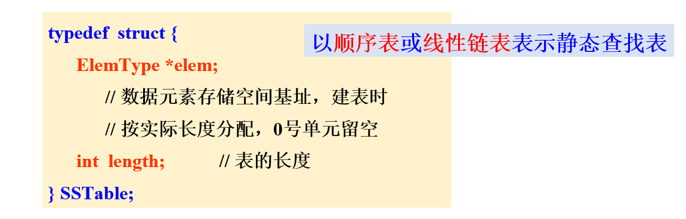

在查找时，从第一个元素向后（或者最后一个元素向前），比较当前位置数据元素的关键字与查找关键字，若相等则输出位置，查找成功；若不相等则走向下一个位置，若直到超出范围也没有查找成功则查找失败

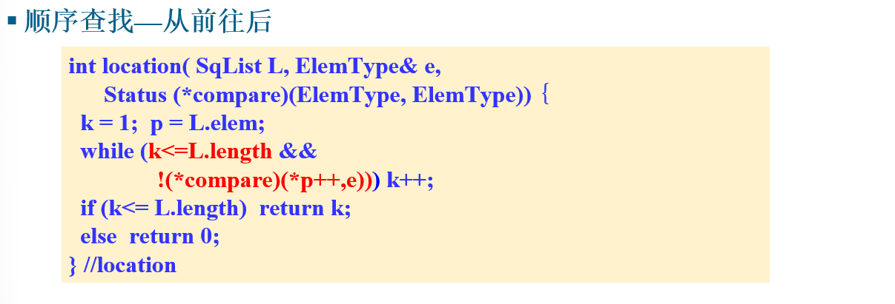

可以看到，其每一步都要检测k是否超范围，这是重复的，因此有下面的改进方法

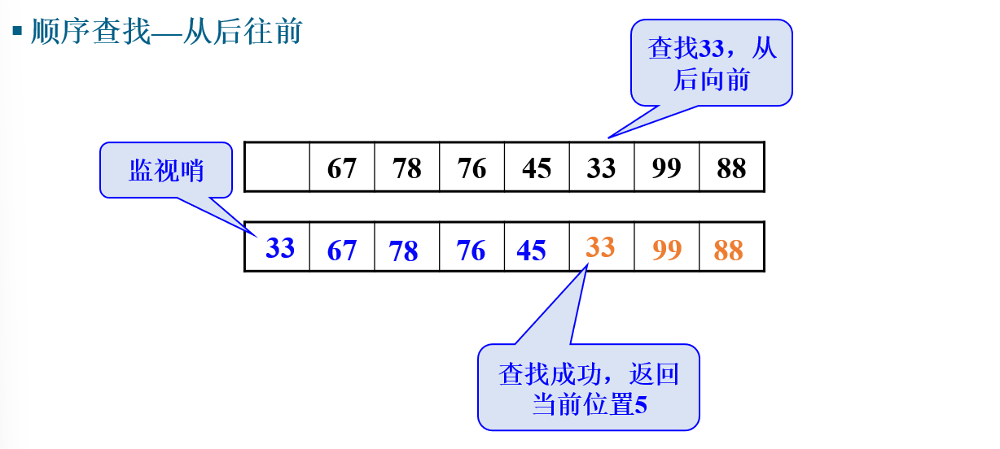

即从后往前查找，同时设置监视哨，不用检测k是否超出范围，因为必定能查找到，只需要最后输出查找到的位置，如果是监视哨的位置则说明查找失败

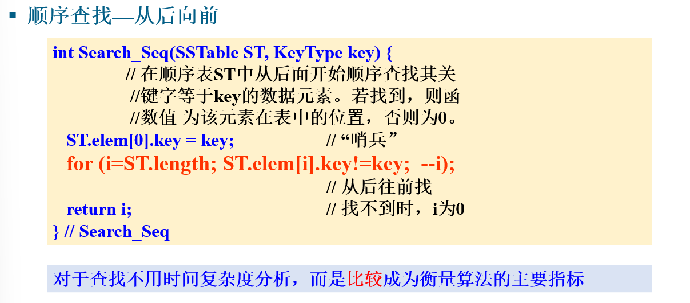

在查找算法中，分析算法时间性能主要靠平均查找长度，平均查找长度是指：为了确定记录在查找表中的位置，需要和定值进行比较的关键字个数的期望值，简单来说，就是平均需要几次比较才能找到对应的记录

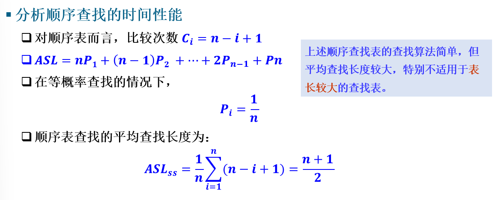

### 有序表的查找

在有序表中，查找表不是简单的顺序表，而是已经进行了排序，表中的元素按照关键字的大小或者特定的排序方式进行了有序处理。对于这种顺序存储同时有序的表结构，查找可以基于折半（二分）的思想进行

基本思想：将要查找的关键字与查找表的中间元素进行比较，若相等则返回中间位置，若查找关键字比中间位置关键字大，则对前半部分进行递归，否则对后半部分进行递归

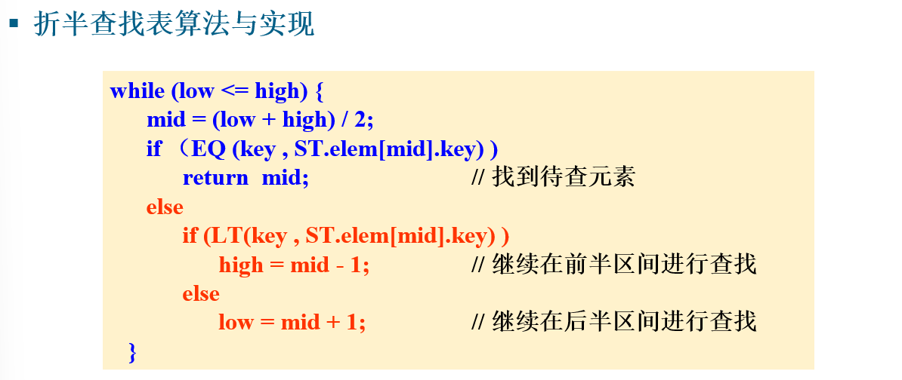

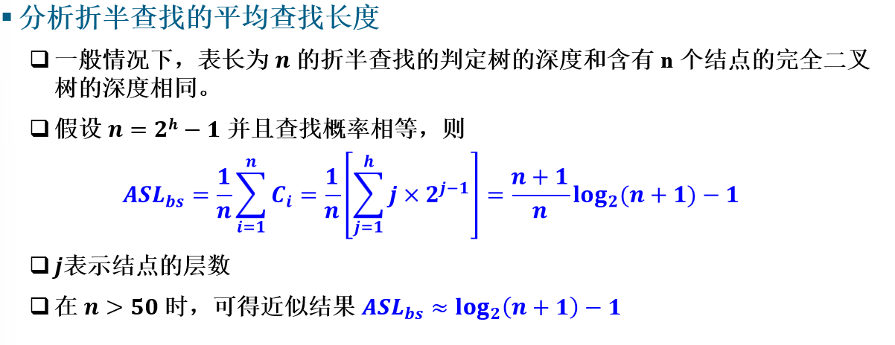

### 索引顺序表的查找

想要结合普通顺序表和有序表，采用分块查找的方式进行查找，将查找表分为n块，后面块的元素大于前面块的元素，可以先确定要查找的关键字在哪个块中，在对块内进行顺序查找

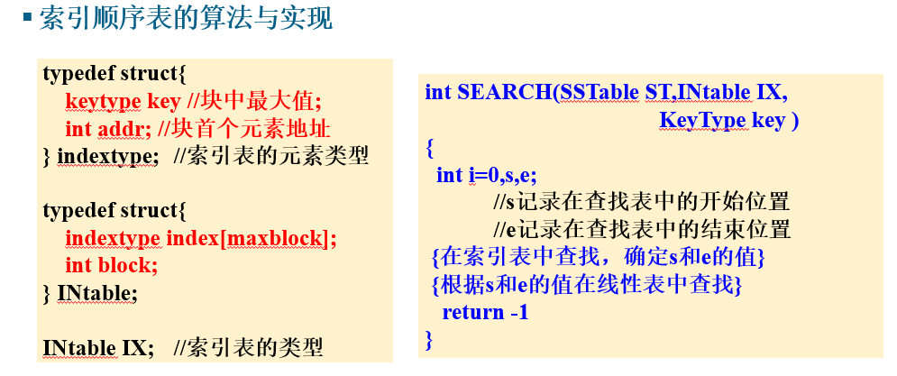

基本思路是，用索引表存储索引，索引由块最大值和块首个元素地址组成，首先先找到该元素所在的块，接着在块内进行查找

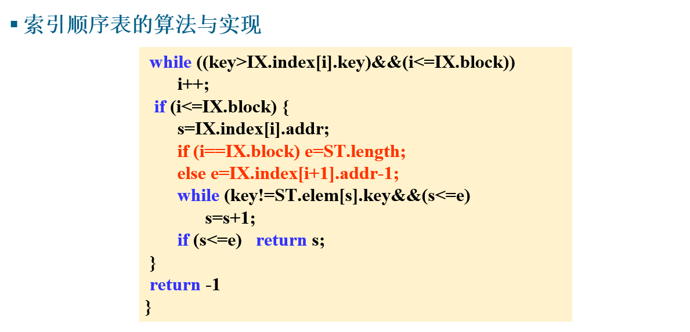

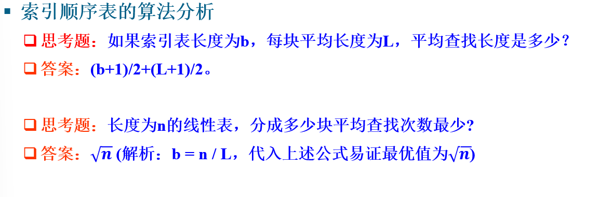

## 动态查找表

### 二叉排序树

#### 定义

一种二叉树，对于每个结点，如果左子树非空则左子树所有结点关键字都小于该结点关键字，如果右子树非空则右子树所有结点关键字都大于该结点关键字，我们中序遍历二叉排序树即可得到有序序列。

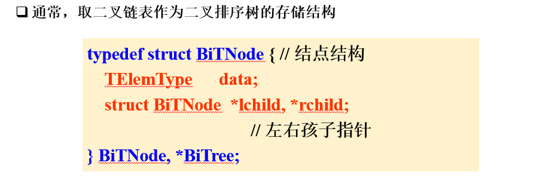

#### 查找

对二叉排序树进行查找时，可以类比二分法查找，即：

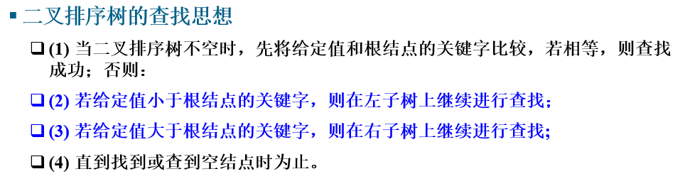

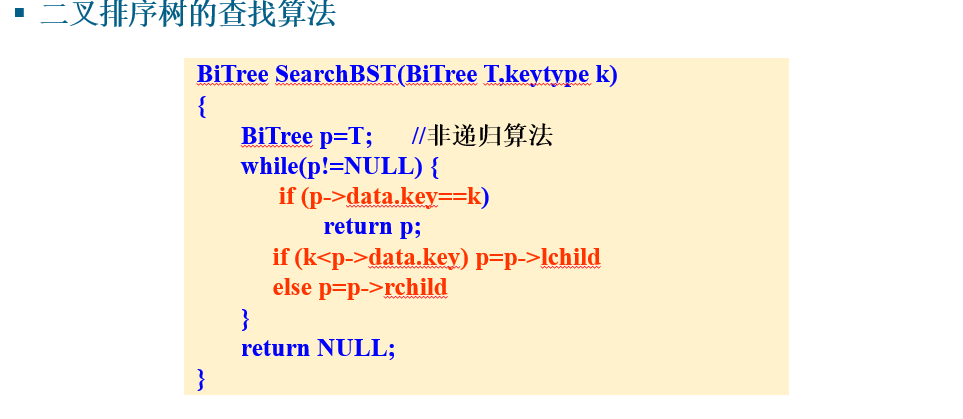

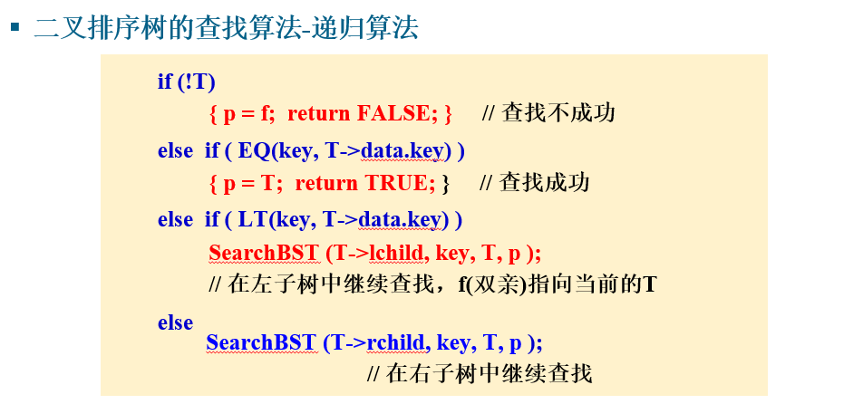

两种查找方法本质相同

可以想到，在查找过程中产生了一条从根节点到该结点（或空结点）的路径，然而由于二叉排序树本身不是唯一的，路径也不是唯一的，这令算法分析不能简单类比折半查找

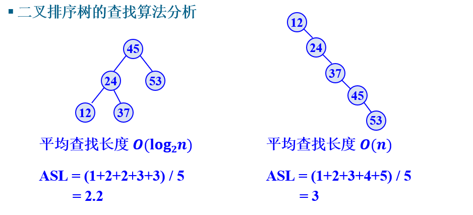

但是可以通过计算得到，二叉排序树的平均查找长度仍然是$O(\log n)$

#### 插入

基本思想：若二叉树为空，则待插入结点为根结点，二叉树非空时若待插入结点与根结点相同，则无需插入，如果大于根结点，则插入到右子树，如果小于根结点，则插入到左子树

可以看到，插入的结点一定是树的叶子结点，是查找路径最后一个结点的左结点或右结点

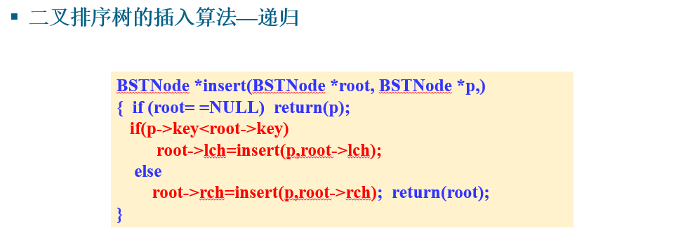

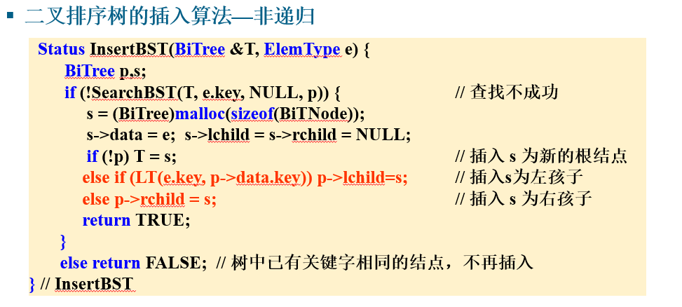

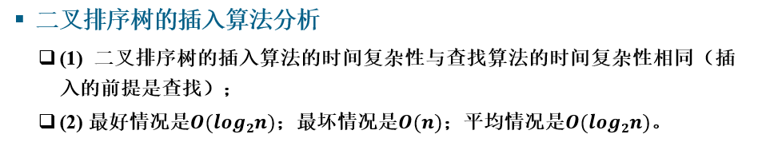

同时，对于二叉排序树的生成，可以通过循环调用插入函数来实现

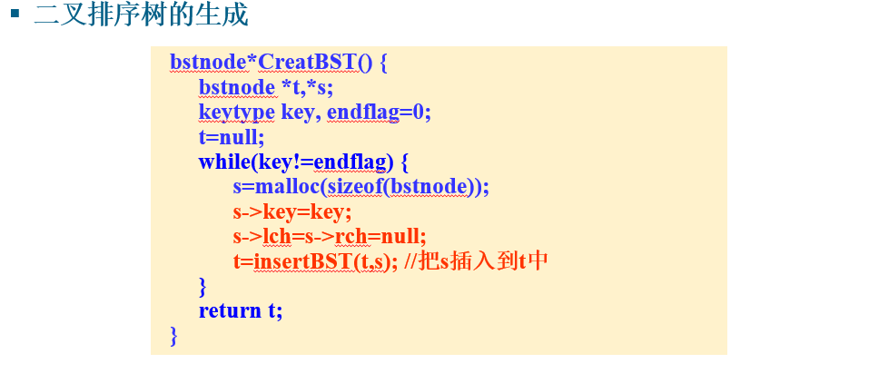

简单来说，就是将一系列数字输入，如果不是结束标志，则将其插入到树中，最后返回树的根结点

#### 删除

删除一个节点，同时要求二叉排序树的特性保持不变

可以将删除结点分为4种方式讨论，分别是删除叶子结点、删除结点只有左子树，删除结点只有右子树，删除结点既有左子树也有右子树

如果是叶子结点，那么可以简单将结点释放，修改双亲结点的指针

如果右子树为空，则用左子树根节点顶替原来结点

如果左子树为空，则用右子树根节点顶替原来结点

如果左右子树都存在，那么将左子树作为右子树中最小结点（右子树的最左侧结点）的左子树

当然，如果左右子树都存在，也可以将左子树中最大的结点或者右子树中最小的结点来替换该结点，这样可以避免增加高度，但是操作较为繁琐

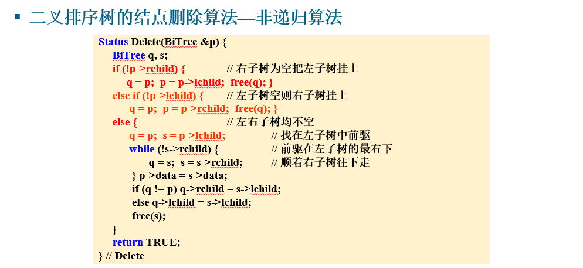

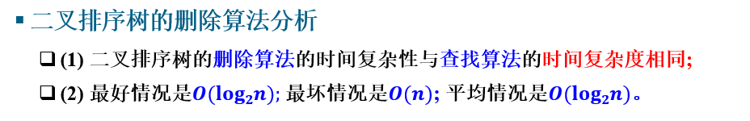

### 平衡二叉树(AVL树)

对于一棵二叉排序树，其深度是不确定的，而对于性状特殊的比如左偏树，查找会退化到顺序查找，于是平衡二叉树便能解决这个问题

平衡二叉树指，一棵二叉排序树，其左右子树都是AVL树，同时左子树与右子树的高度差绝对值不超过1，可以看到，其要求对于每个结点来说，左子树和右子树的差距都不超过1，这种情况下，对于AVL树的查找等操作均可做到$\log$级别

在插入过程中，由于平衡化处理，有可能会抵消掉高度增加，与之对称，在删除操作中，也会进行多次平衡化处理，这实际上会带来祖先结点的不平衡

其大部分操作均与二叉排序树相同，但会多一个平衡化处理操作，即插入一个结点后，检测是否平衡并做对应的处理

注意，这里的各种类型是根据度2结点来看的，即相对于度2结点，插入到度2结点的左子树的左子树（对应LL）等等，同时，对于子树的分配问题，可以想成绳子的顺时针、逆时针转动，度1结点的会将同方向的子树移至另一侧。

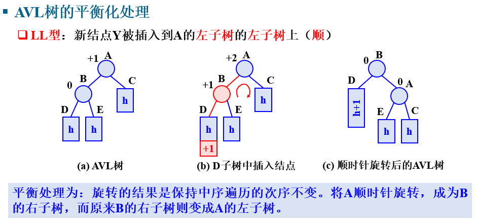

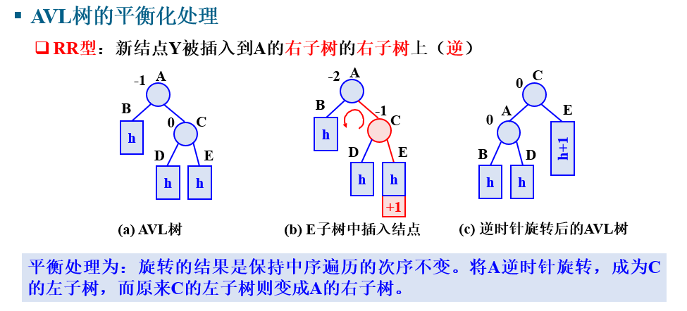

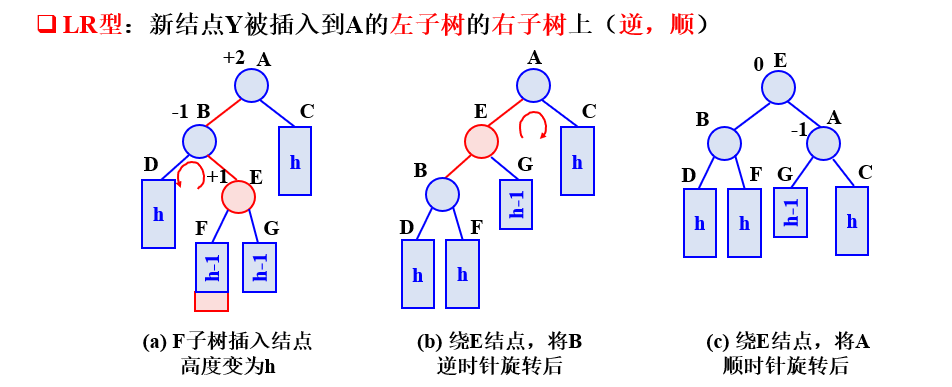

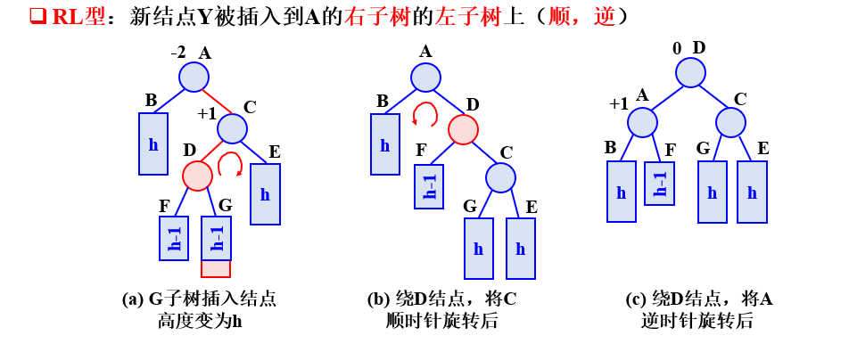

## 哈希表

可以证明，基于比较的查找最小的时间开销也是$\log$级别，如果想要突破，那么就不能基于比较进行查找

在关键字值和存储位置之间建立一个确定的对应关系，通过关键字值直接找到其存储的位置，这样的查找方式叫做哈希表查找

### 相关概念

哈希函数：在关键字与存储位置之间建立的函数关系，用$H(key)$来代表关键字为key的记录的存储位置

哈希地址：哈希函数得到的存储位置

装填因子：设哈希表空间大小为n，填入表中的结点数为m，称$\alpha=m/n$为装填因子

同义词、冲突：若$H(k1)=H(k2)$，则为冲突，k1和k2称为同义词

很难找到一种通用的哈希函数使其不会产生冲突，因此需要找到一种处理冲突等等方法

哈希表：根据设定的哈希函数和处理冲突的方法，将一组关键字映射到一个有限的地址连续的地址区间上，如此构造的查找表叫做哈希表

哈希既是一种查找技术也是一种存储技术，通常用于关键字数目远小于关键字所有取值的数量

### 哈希函数的构造

这几种构造方法中，质数取余法是常用且较方便的哈希函数构造法

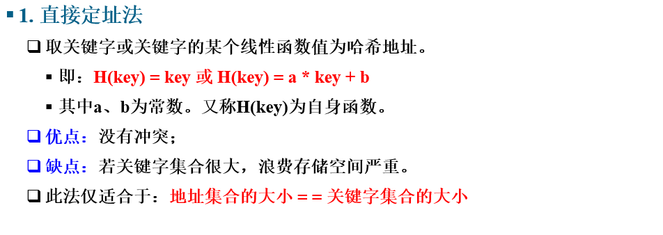

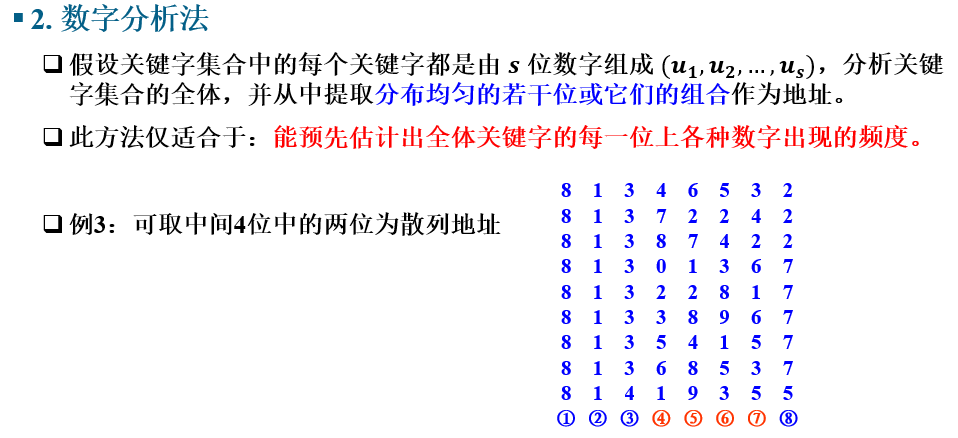

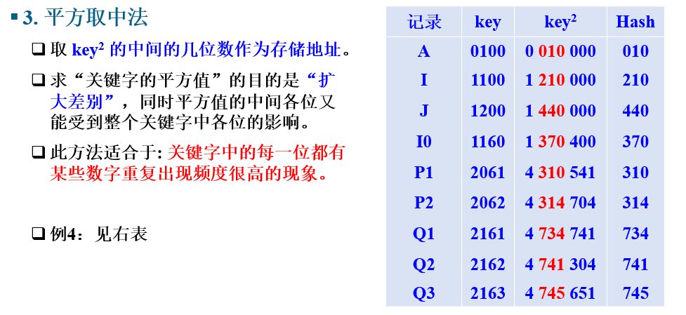

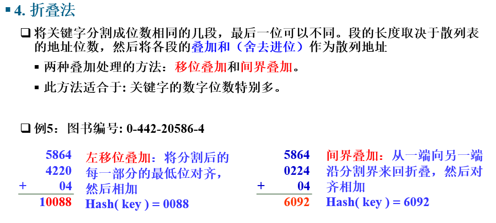

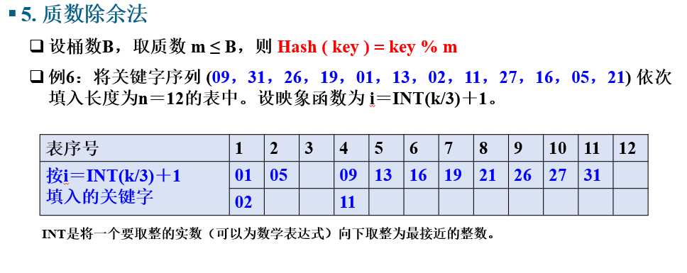

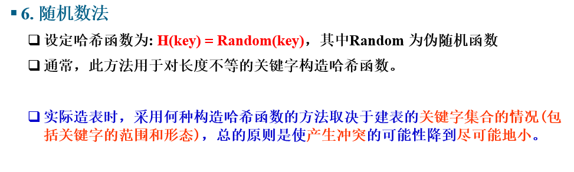

### 处理冲突的方法

处理冲突的本质是，为产生冲突的地址寻找下一个哈希地址，以错开同义词

#### 开放定址法

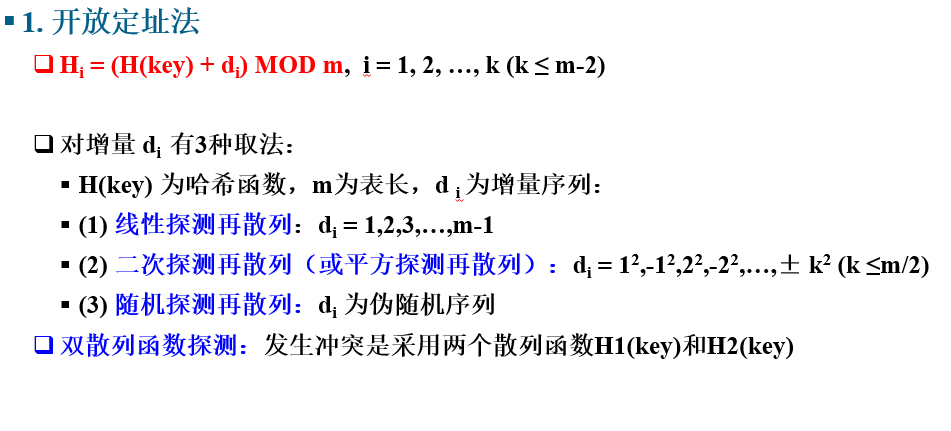

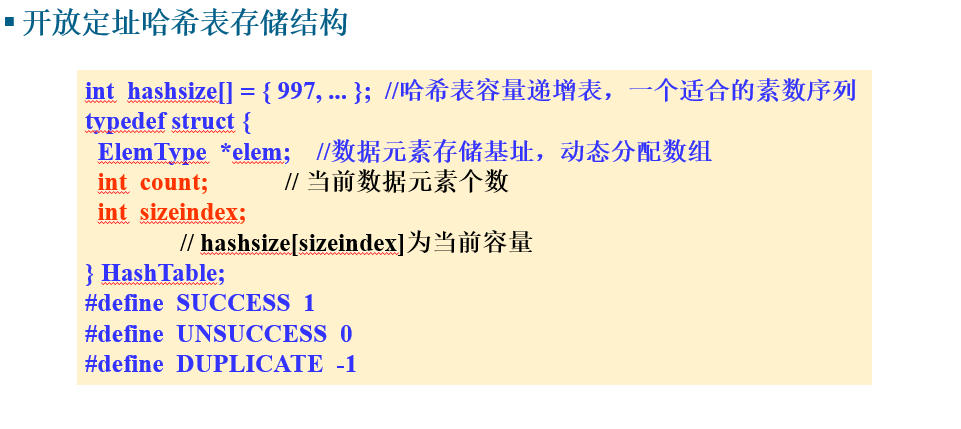

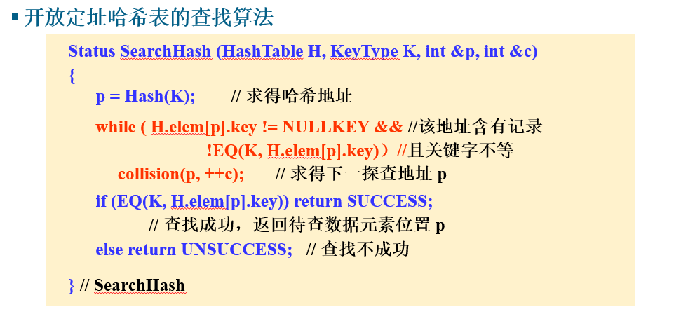

开放定址法是将出现冲突的存储位置向后有规律地进行延伸，在查找时采用相同的方法进行延伸查找

#### 拉链法

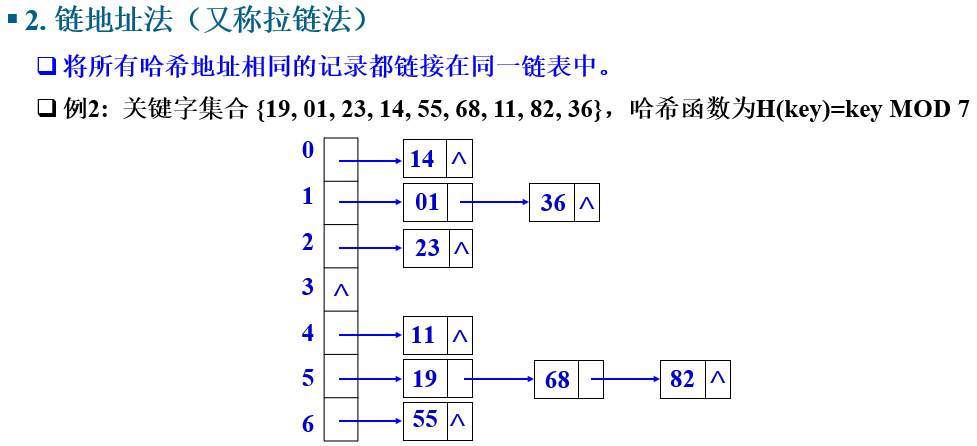

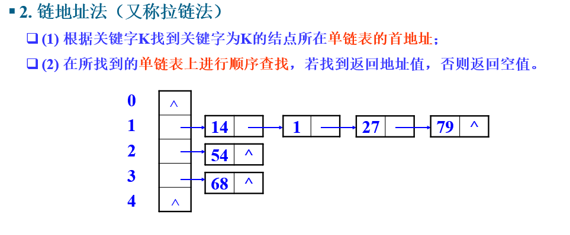

对于冲突的同义词，其连在链表尾部，在寻找时，对于相同哈希地址，对地址的链表进行查找

### 哈希表分析

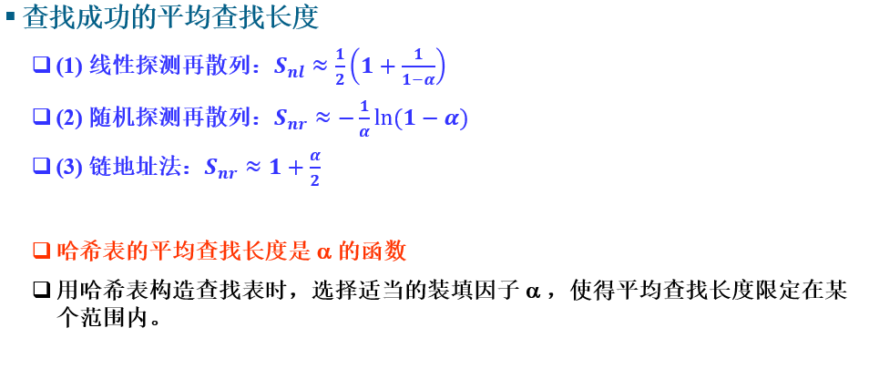

其期望时间是$O(1)$，但有一定的限制
