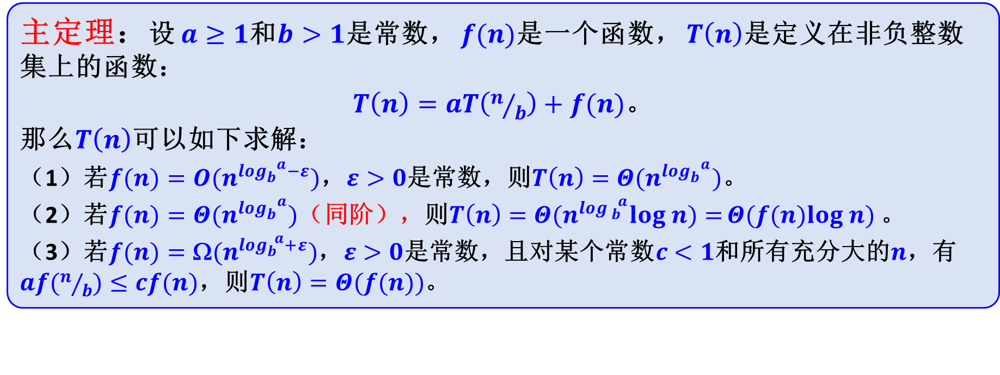
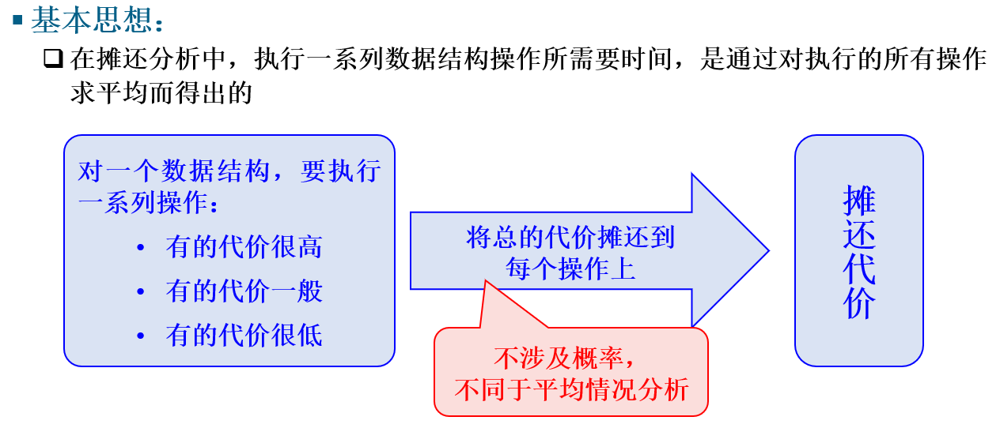
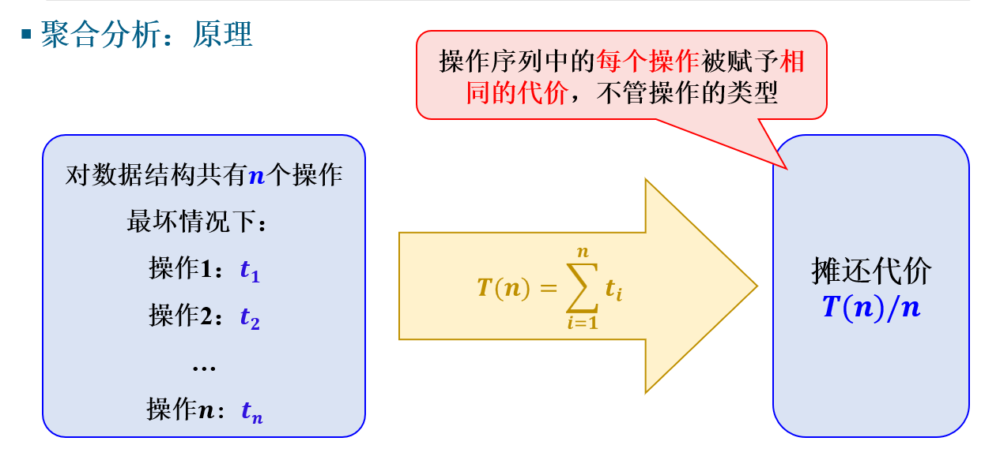
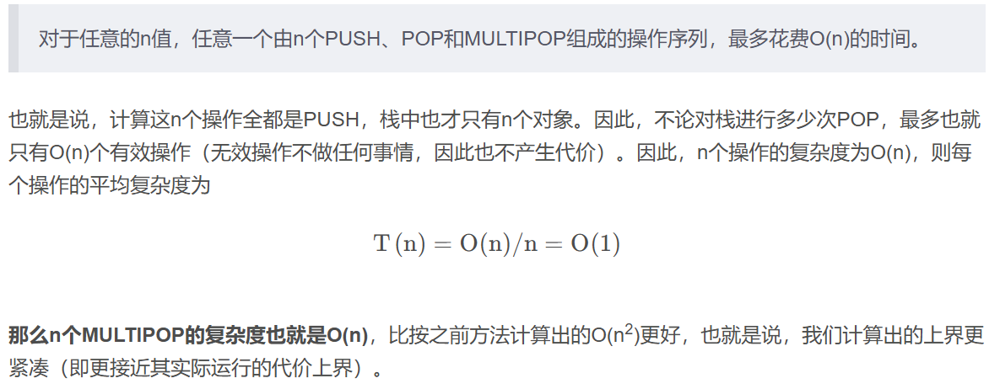
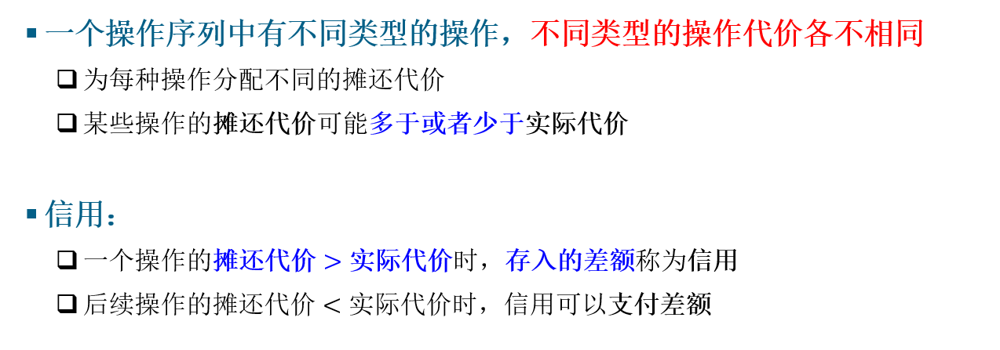
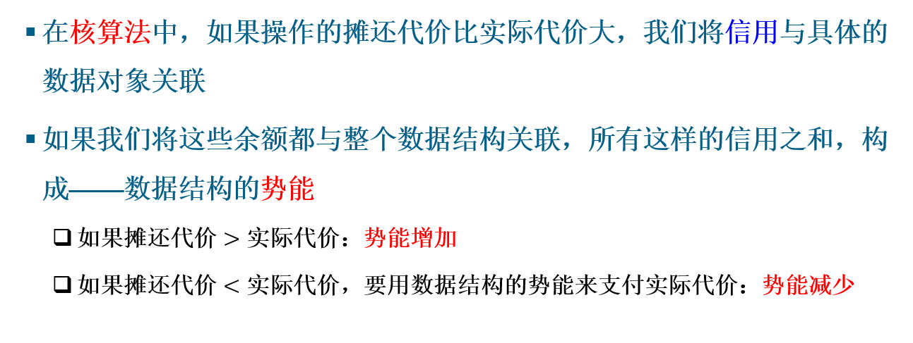
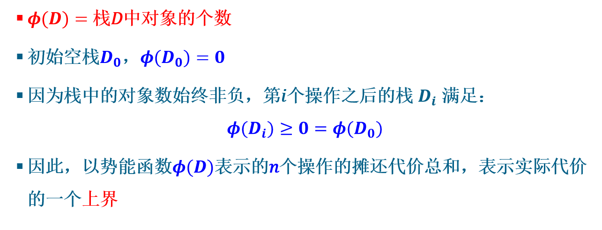

# 算法分析

## 复杂度分析

* 多重循环类：循环退出条件的依赖变量x，每次循环更新的变量y，可通过x与y的关系找到每次循环y的变化值dy，对比循环退出条件即可得到循环次数，若这个循环次数依赖于上层循环，则先计算上层循环次数，上层的每次循环可以对应一个这层循环次数，求和即可。

## 递归函数

## 摊还分析

### 聚合分析

聚合分析基本思想是通过整体性分析，将n个操作放在一起考虑，最后再进行平均，得到每次操作的摊还代价。

### 核算法

### 势能法

基本想法为定义势函数，使得满足势函数值都大于等于最初的势，摊还代价为实际代价加上势差。

势函数是非递减的。
