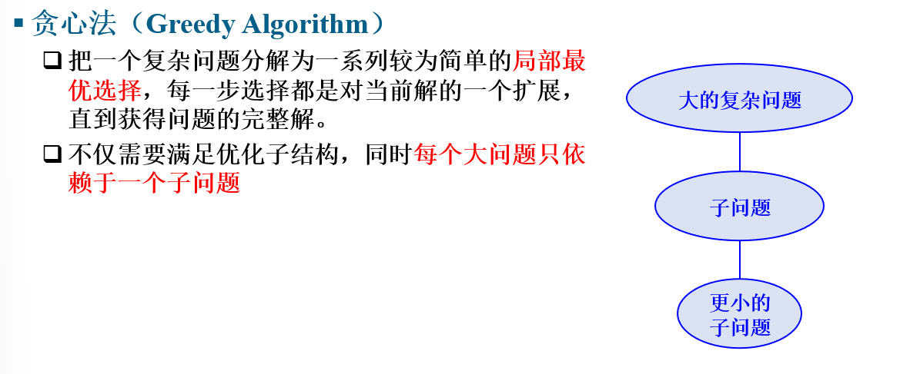
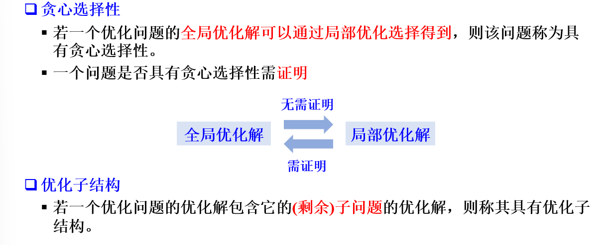
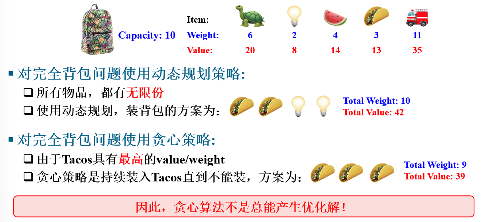
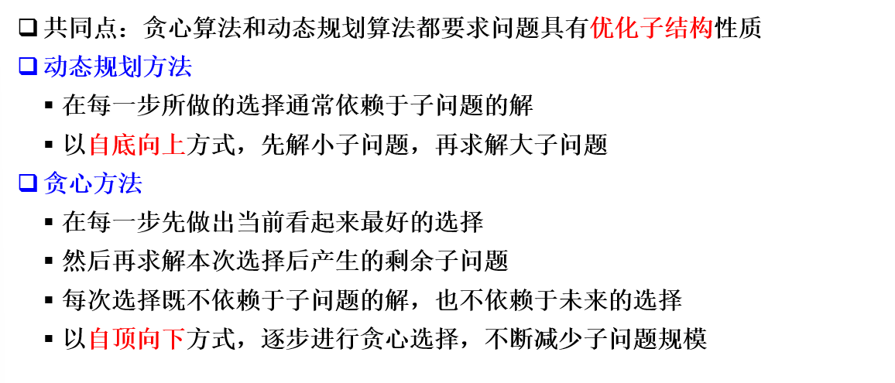
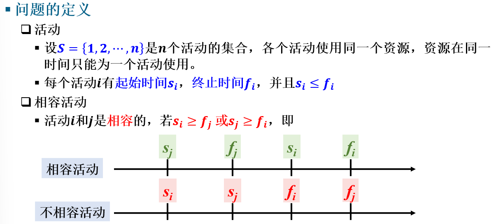
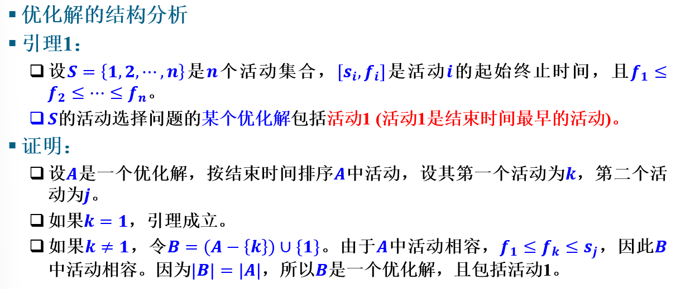
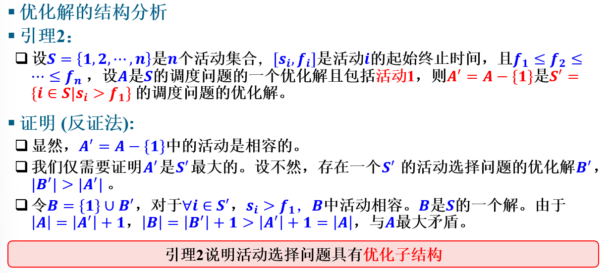
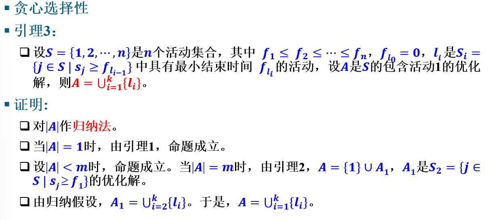
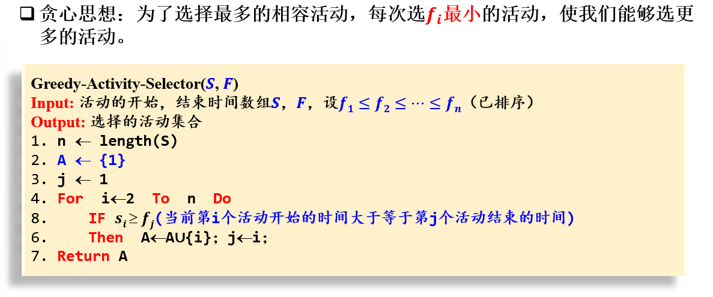
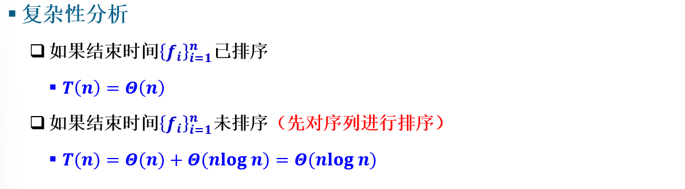

# 贪心算法

## 基本原理

一般应用于求解最优化问题，在每个子结构处求解局部最优解，证明都取局部最优解时整体也取最优解，则可用局部最优求得整体最优，即使不是整体最优也是较优解。

与动态规划比较，贪心法对优化子结构有更强的要求，同时二者能解决的问题有所重叠也有所区分，各自都存在只有一种算法可解的情况，不存在谁包含谁

## 例：活动选择问题

### 问题描述：

每门课都有其上课时间和下课时间，不同课程不能出现时间冲突，那么能否找到一种排课方式使得排课数量最多同时不出现冲突

### 问题分析

即可证存在一个优化解，结束时间最早的活动一定在优化解之中

即证明了优化解具有子结构，即对于一个包含结束时间最早活动的优化解，去掉结束时间最早的活动后，其余的活动组成是对于剩下时间的最优解

即证明可以通过选择去掉结束时间最早的活，在接下来的活动中找结束时间最早的且符合标准的来获得最优解

### 问题解决

简单来说，就是对原活动按照结束时间进行排序，将第一个活动加入解集，接着从下一个活动开始遍历，如果其开始时间小于解集最后元素的结束时间，就把该活动加入解集并更新最后元素的结束时间

### 算法分析

