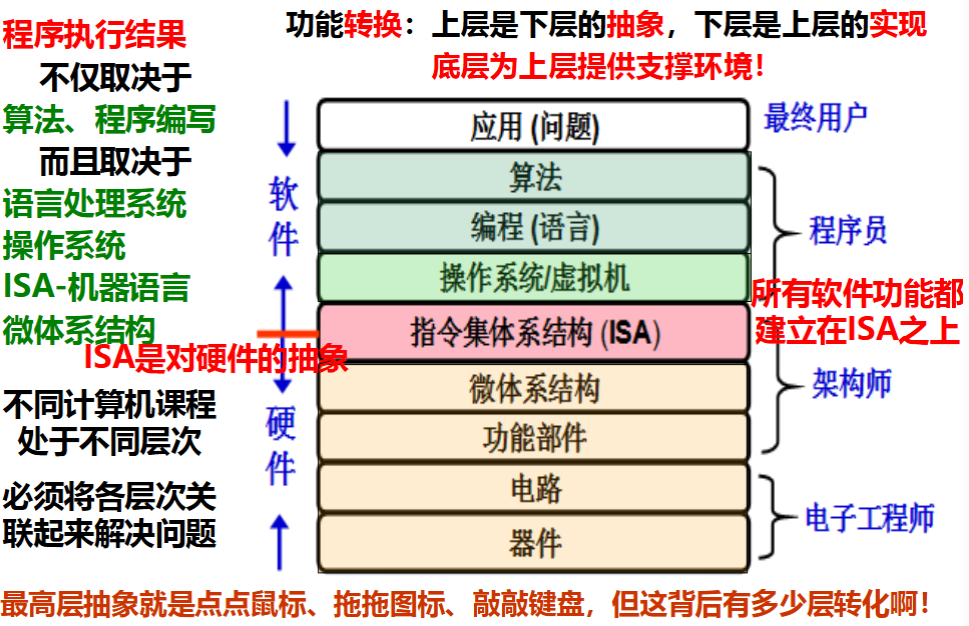
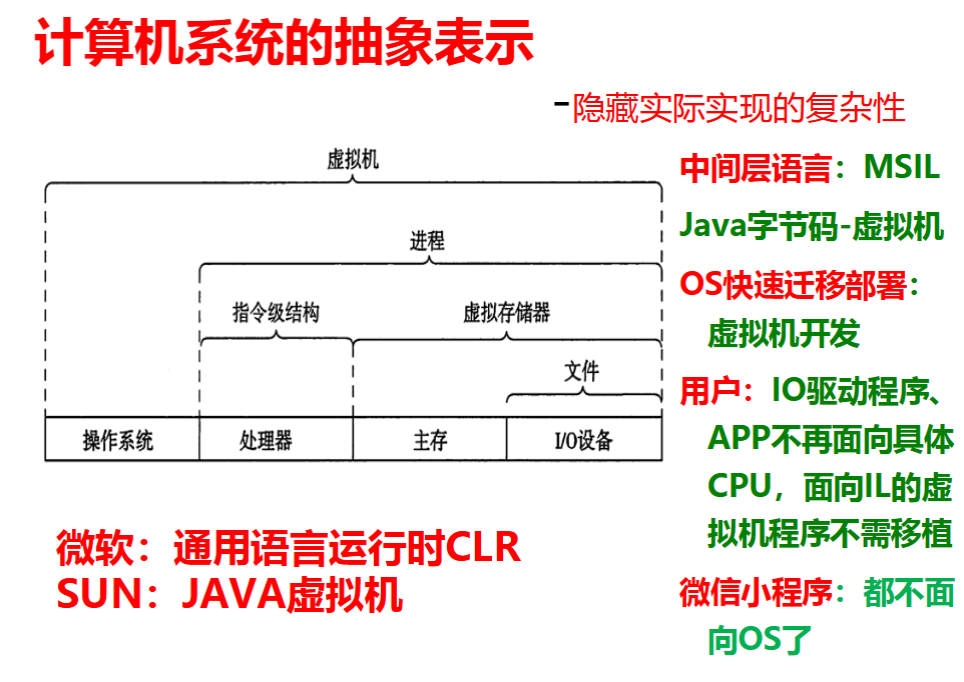
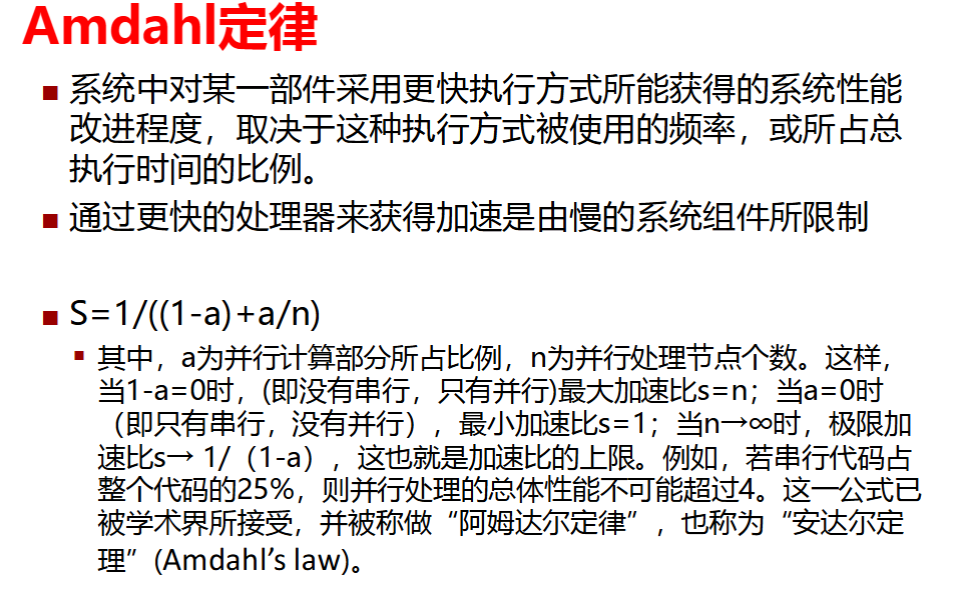
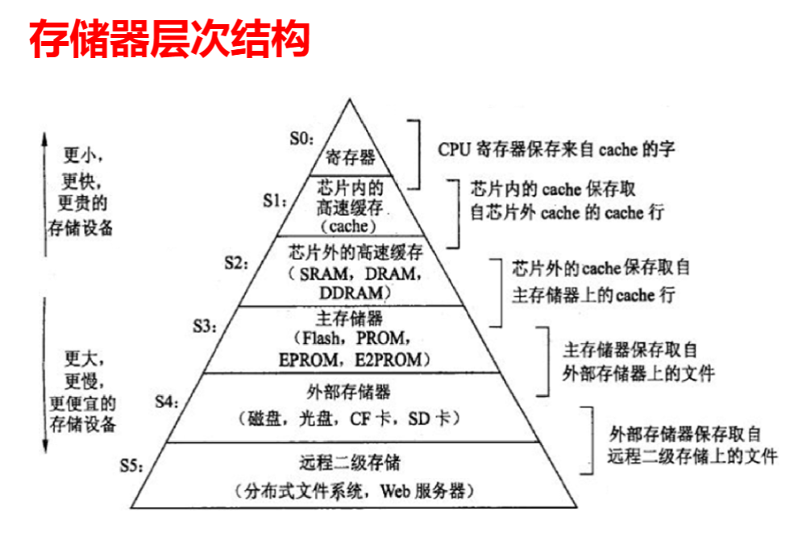

# 总览

## 1.整体

简单来说，Amdahl定律展示了一个复杂系统的一部分被加速后对整体系统的加速作用

## 2.信息表示与处理

信息的存储方法

整数类型和浮点类型的表示与运算

## 3.程序的机器表示

一系列汇编

算数逻辑、控制、栈过程、数据结构

存储引用，内存溢出

## 4.处理器体系

CPU、流水线

## 5.优化程序性能

内存性能、存储器架构

并行处理

## 6.存储器层次结构

存储器架构、高速缓存存储器

## 7.链接

链接重定位、共享库

## 8.异常控制

异常、进程控制

信号

## 9.虚拟内存

地址翻译、内存映射

动态内存分配

## 10.系统级IO

## 11.网络编程

## 12.并发编程
