# 图

## 相关概念

图是由一个非空的顶点集V和一个边集E组成的，记作G=（V,E），|V|表示顶点数目，|E|表示边的数目。

如果边集每条边都是顶点的有序对，则图为有向图。（v,w）为一条有向边（弧），v为弧尾，w为弧头

如果边集每条边都是顶点的无序对，则图为无向图。

如果一个图的顶点集和边集都是另一个图顶点集和边集的子集，则称为另一个图的子图。

完全图（有向完全图）简单来说就是任意一个顶点都与其他所有顶点有边。

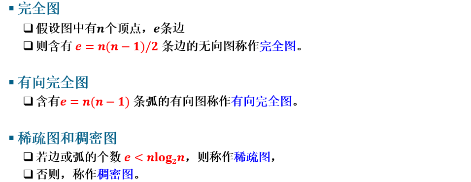

度简单来说就是有关一个顶点的边的数量关系

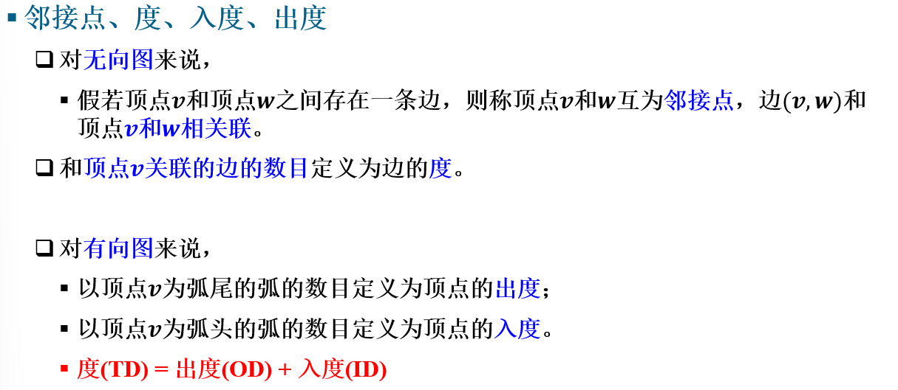

路径即指从一个顶点到另一个顶点的顶点序列，长度即是中途经过的边的数目（对于有权图带权路径长度则是路径上边权之和）

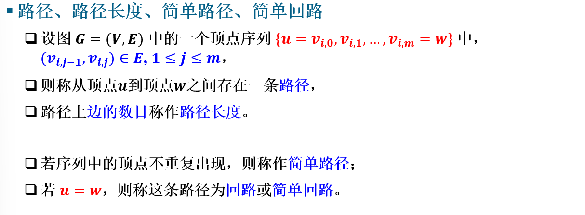

连通图（强连通图）简单来说就是从一个顶点经过若干顶点可以到任意一个顶点

连通分量（强连通分量）即一个非连通图中的各个极大连通子图

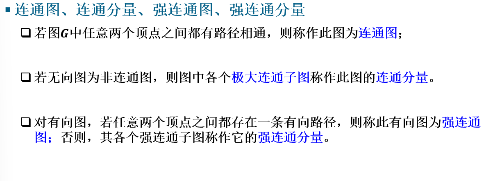

对于连通图，选择其中最少的边（顶点数-1）形成的连通图为图的生成树，对于非连通图，则是每个连通分量的生成树组成生成森林

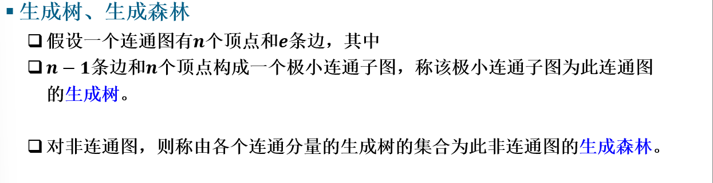

## 图的存储

### 顺序存储（邻接矩阵）

要存储一个图，必须要存储其顶点数据和顶点关系，顶点数据可以用数组存储，下标为顶点编号，对于顶点关系，我们用邻接矩阵进行存储，邻接矩阵简单来说就检测从列到行的顶点是否有边

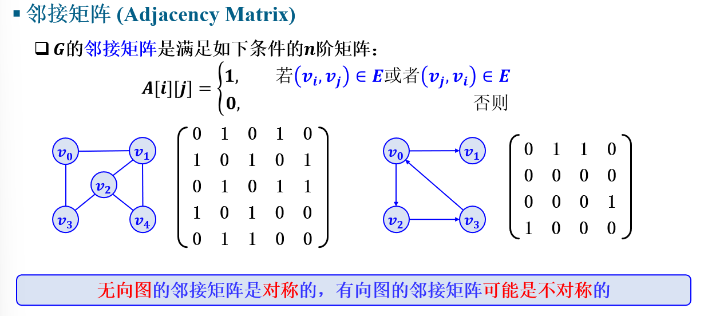

对于邻接矩阵，我们要判断两个顶点是否相邻，只需要判断对应数组的分量是否为1

在顶点不变的情况下，可以直接通过修改数组分量来添加或者删除边

对于带权的图（网络），邻接矩阵中存放的便是边的权重，对于没有边的两顶点，我们根据权重所指存储0或者无穷

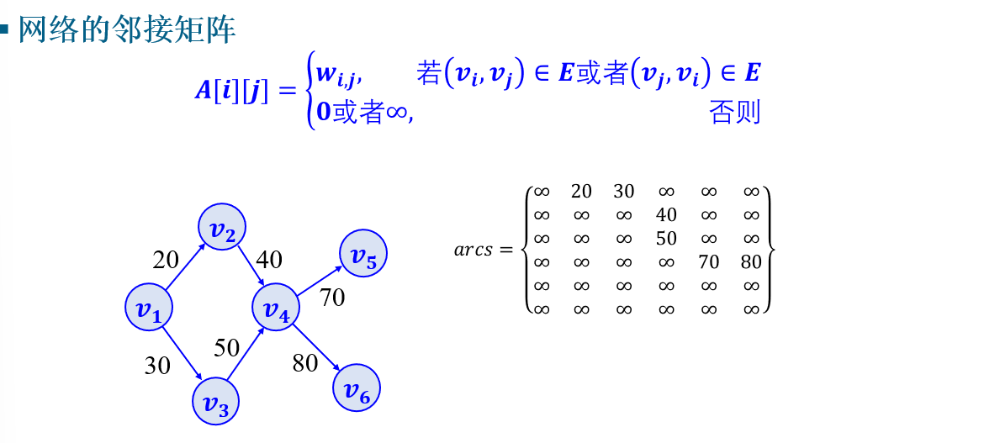

### 链式存储（邻接表）

对于顶点我们还是用数组存储，对于边我们用线性链表存储

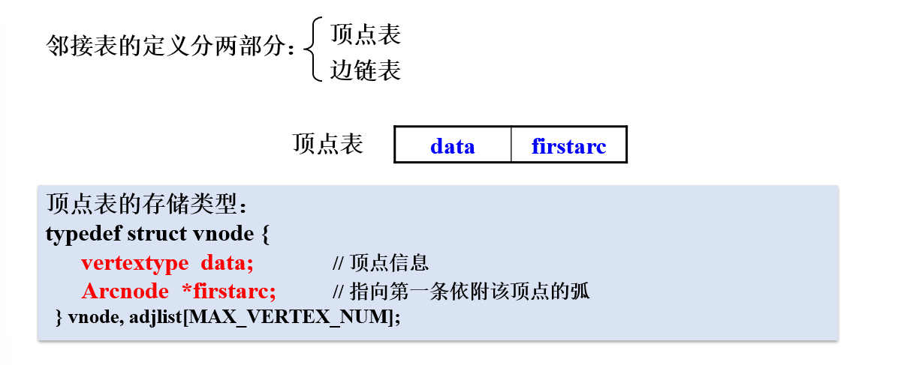

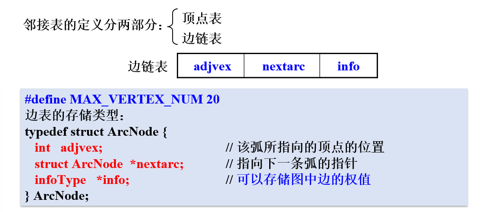

对于无向图，第i个顶点的度即是第i个顶点边链表顶点个数，总度数即所有边链表结点数，边数即所有边链表结点数的一半

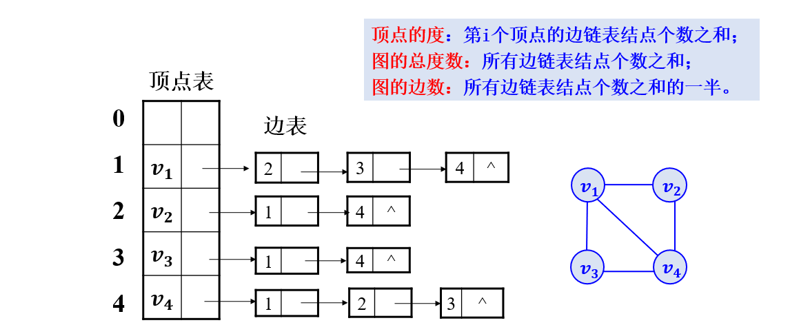

对于有向图，我们可以建立两个表，一个是出边表，一个是入边表（逆邻接表），通过出边表可以计算出出度和图的边数，通过入边表可以计算出入读和图的边数

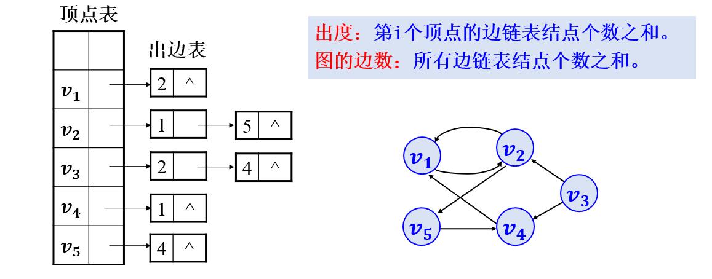

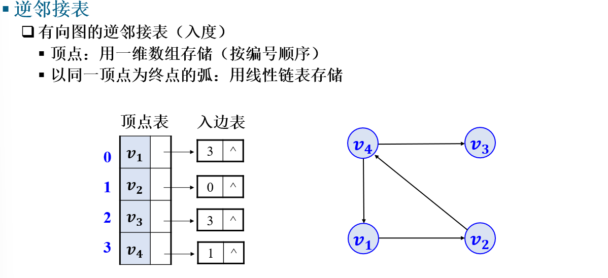

邻接表对于顶点多边少（类树结构）的图可以极大节省空间，同时对于每个顶点的第一个邻接点也可以较方便地找出

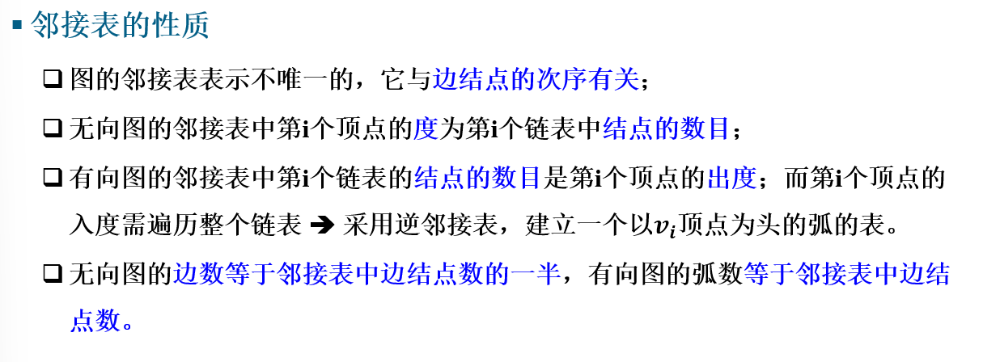

## 图的遍历

图的遍历是指根据顶点以及边的关系，按照一定顺序将图中的顶点遍历

### 深度优先搜索

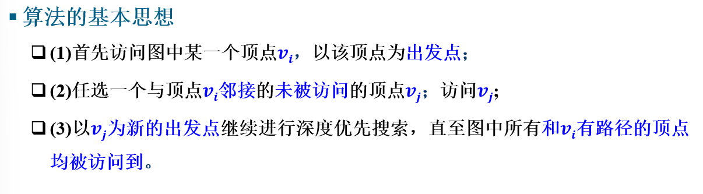

简单来说就是和深度优先搜索一样，利用栈结构不断遍历一个顶点的关联顶点

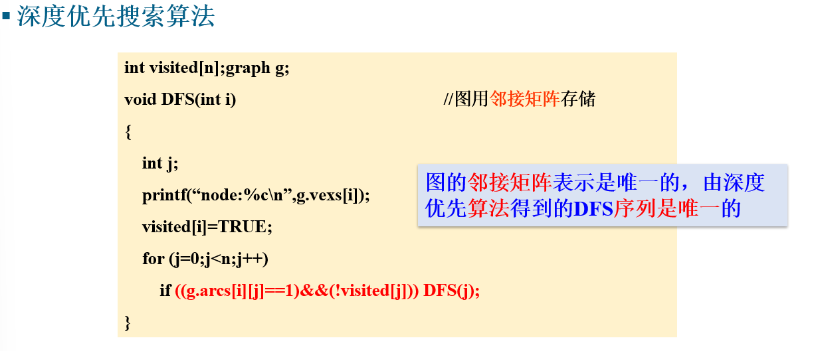

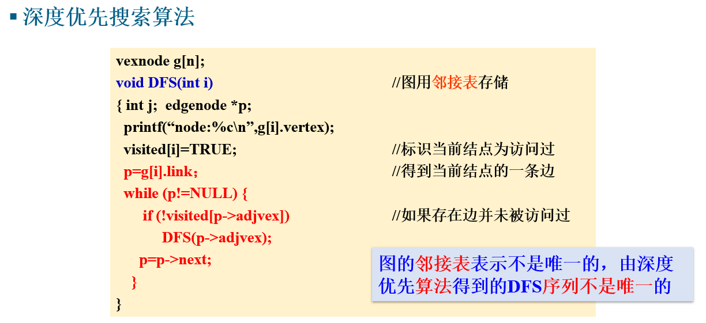

对于非联通图，我们想要对其每个连通分量进行深度优先遍历，于是我们可以先找一个顶点进行遍历，遍历后检查是否有顶点未被访问，如果有则从未访问的顶点开始继续遍历

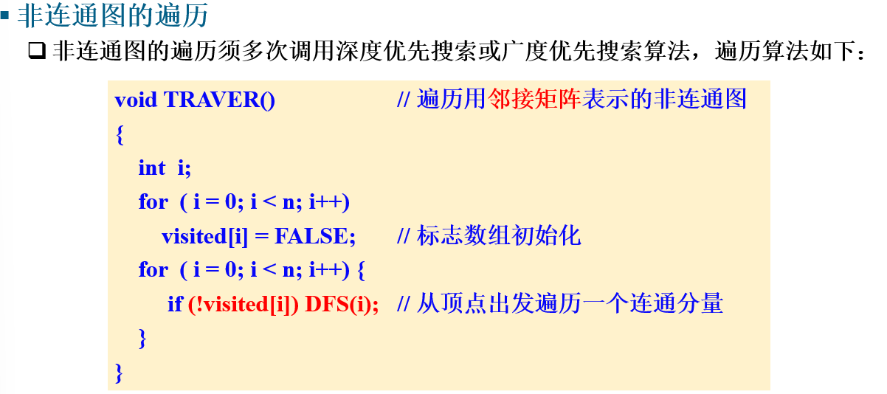

### 广度优先搜索

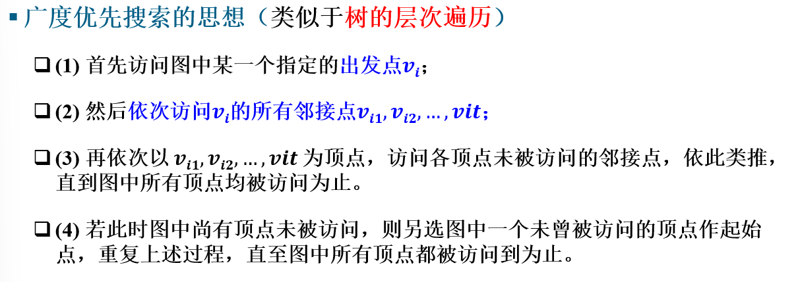

简单来说就是利用队列结构，将邻接点以此加入队列中，将一个顶点的邻接点都遍历完成后再遍历邻接点的邻接点

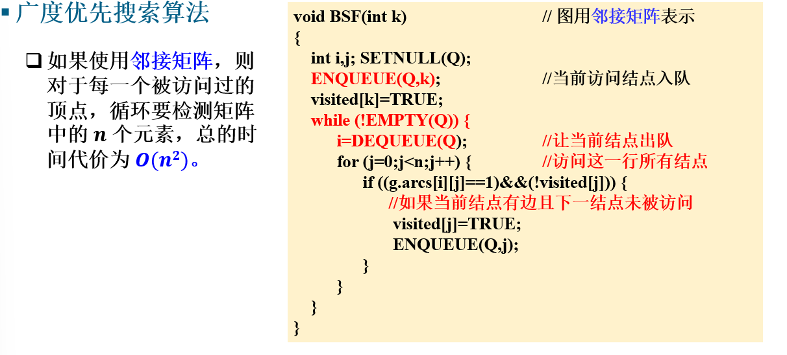

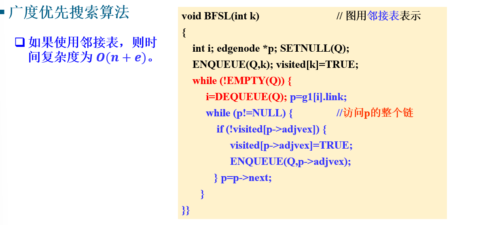

这里复杂度的区别在深度搜索上也是一样的，这是因为对于邻接矩阵形式，无法直接得到一个顶点的邻接点，必须要遍历以该点为横坐标的所有值并一一与1比较来判断邻接点，而对于邻接表我们可以直接知道邻接点的稀疏表示，进而快速拿到一个顶点的邻接点信息

## 生成树和最小生成树

### 相关概念

简单路径：一条路径中，除了起点和终点允许相同，其余顶点都没有相同顶点存在，若起点和终点相同，则成为简单回路

（强）连通图：任意两个顶点之间都存在路径

（强）连通分量：对于非连通图，图中各个极大连通子图为该图的连通分量

求解连通分量，需要基于某个顶点进行遍历，能访问到的顶点都属于一个连通分量，将所有顶点搜索完成后，即可得到所有的连通分量

连通图的生成树：一个连通图的所有顶点和能够连接所有顶点的最小数量边构成该连通图的生成树，对于非连通图，所有连通分量的生成树构成非连通图的生成森林

### 最小生成树

最小生成树是指权最小的生成树，在求解如何将所有顶点连通代价最小的问题时需要使用，权最小意味着所有边权之和最小

#### Prim算法

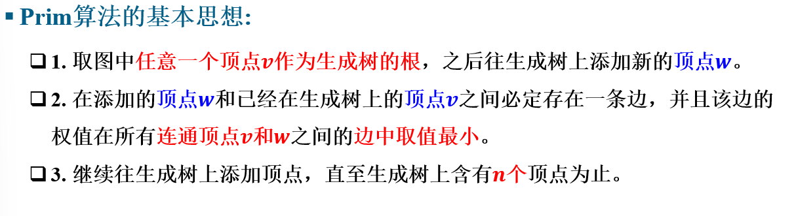

具体来说，维护额外两个数组，一个数组用来存储从哪一个顶点到该节点代价最小，另外一个存储最小代价，每次寻找最小代价的顶点，并遍历该顶点的相邻顶点，更新相邻顶点的表值，即如果从当前顶点到相邻顶点代价比当前表中代价小，则将表中代价更新为新代价，将表中顶点改为当前顶点，直到所有的顶点都被遍历

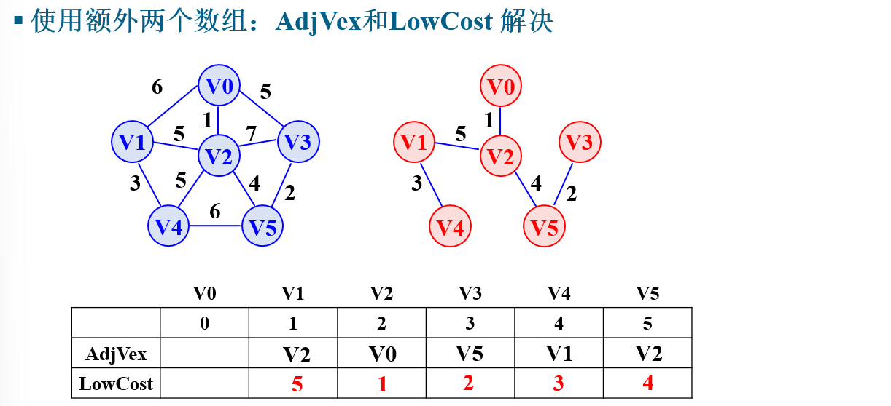

#### Kruskal算法

Prim算法是一个个更新点，而Kruskal算法是一个个更新边

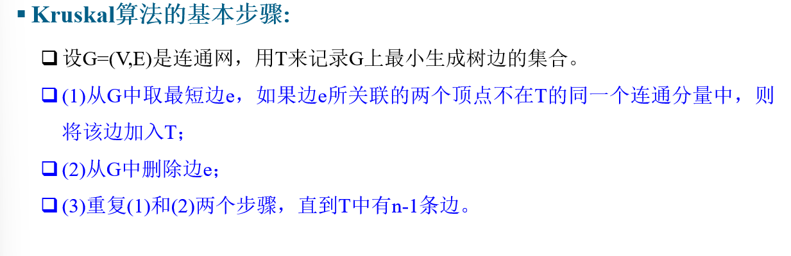

## 有向无环图应用

对于一个工程，其中的某些子工程必须要在另外一些子工程完成后才能开始，对于整个工程，我们会关心工程能否顺利进行以及完成整个工程所必须的最短时间，解决前一个问题我们会使用拓扑排序，对于后一个我们会使用关键路径

### 拓扑排序

对一个有向无环图（DAG），按照图中的次序关系，将顶点排成一个线性序列，对于其中没有限定次序的并列顶点我们认为添加任意次序，由此得到的线性序列我们称为拓扑有序序列

#### 相关概念：

顶点活动网（AOV网）：顶点表示活动，边表示活动之间的关系

拓扑序列：将AOV网中的所有顶点排成一个线性序列，满足如果AOV网中存在顶点i到顶点j的路径，那么序列中顶点i要在顶点j前面

拓扑排序：构造AOV网的拓扑排序的操作

#### 基本思想：

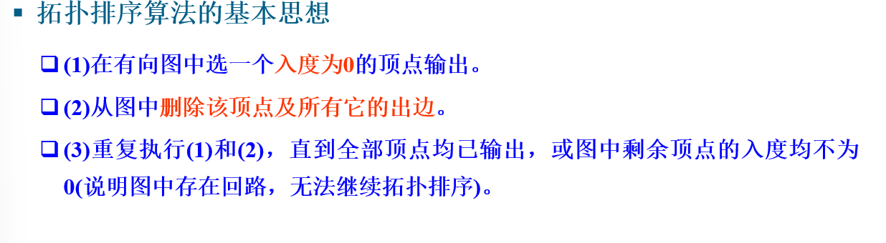

简单来说就是找到入度为0的点为可执行活动，执行后将该顶点删除去掉该活动的限制，再寻找与其有关的活动是否有可执行的活动

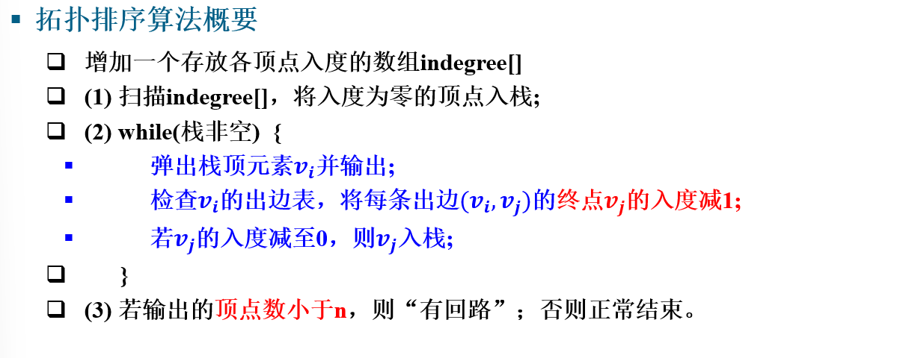

#### 算法分析：

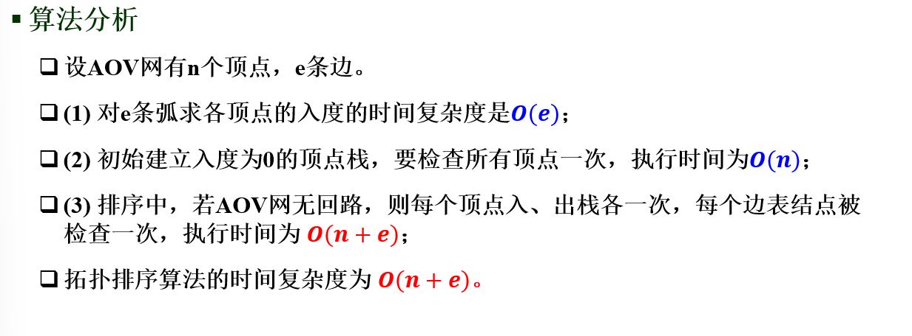

#### 特点：

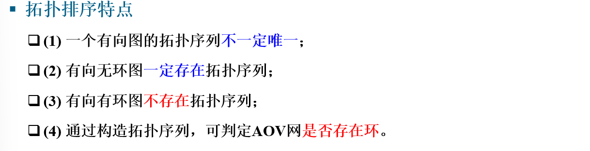

### 关键路径

#### 相关概念：

对于一个带权的有向无环图，用顶点表示事件，边表示活动，权代表活动持续时间的网络称为边活动网（AOE网）

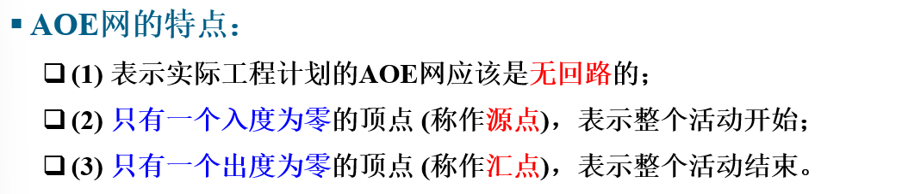

在AOE网中，路径长度最长的路径称为关键路径，关键路径上的活动都叫做关键活动

关键路径的实际含义是，整个工程所需要的最短时间

关键活动的实际含义是，将关键活动的权值增加，会使得有向图上的最长路径长度增加，即会使得最短工期增加

#### 事件最早发生时间与最迟发生时间：

简单来说，事件最早发生时间就是最早某个事件只能在什么时间开始，如果开始更早那么其前置要求不会被满足，事件最迟发生时间是指某个事件最迟是什么时间开始，如果开始时间更迟那么会影响整体进度，于是最早发生时间是受到源点的最大距离影响的，最迟时间是受到汇点的最小距离影响的

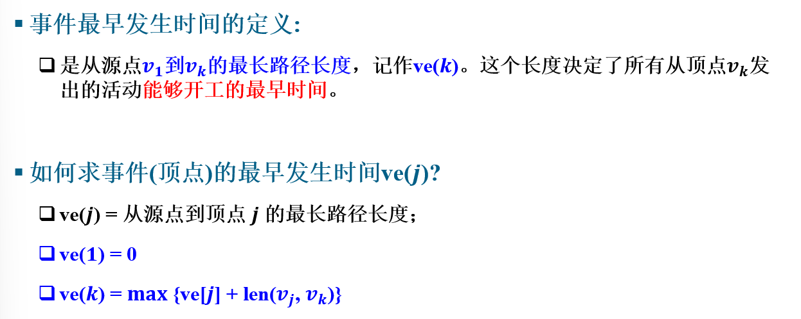

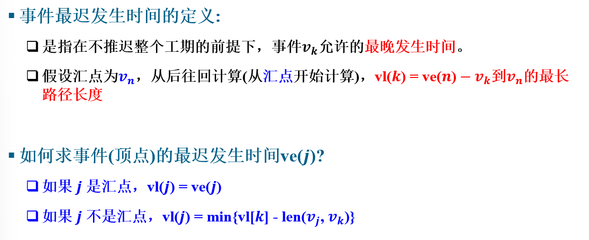

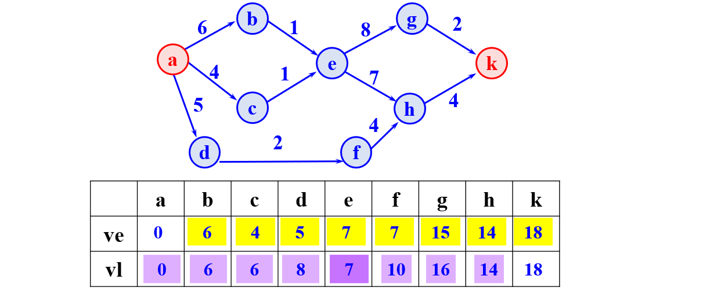

#### 活动最早开始时间与活动最晚开始时间

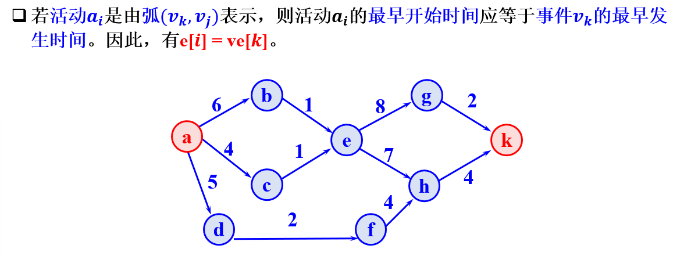

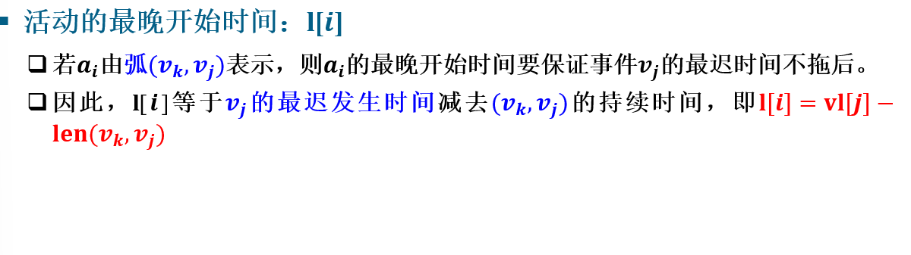

算出所有活动的最早与最晚开始时间后，最早开始时间等于最晚开始时间的活动为关键活动，由此也可以找到关键路径

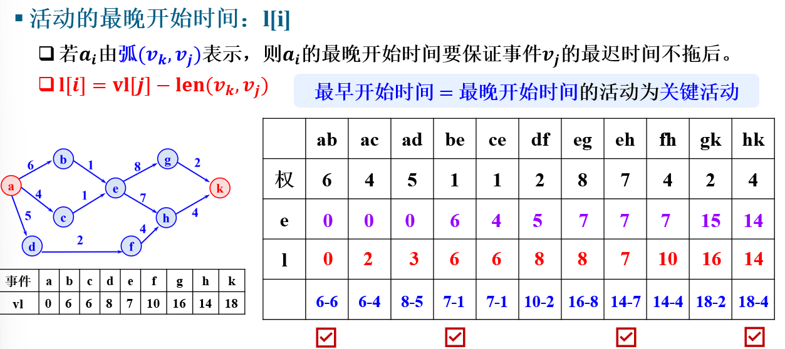

## 最短路径

### Dijkstra算法

对于单源最短路径，即对于一个带权有向图，我们求从源点到图中其他顶点的最短路径，我们可以用迪杰斯特拉算法（Dijkstra算法）

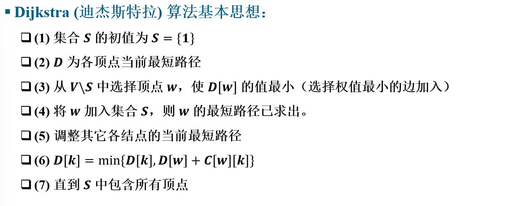

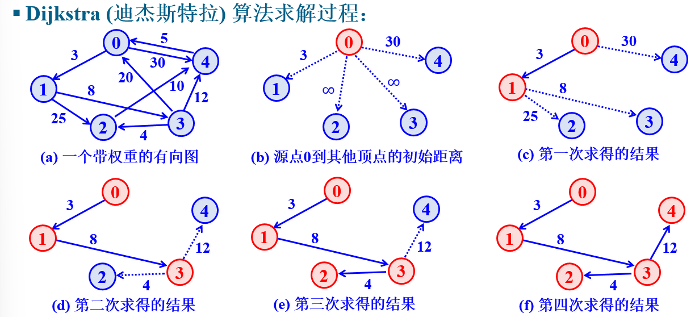

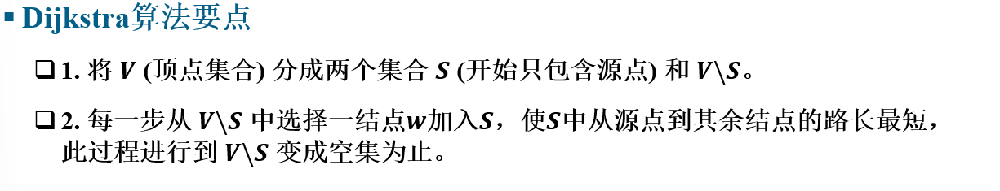

### Floyd算法

如果想找到每对顶点之间的最短路径，可以使用Floyd算法

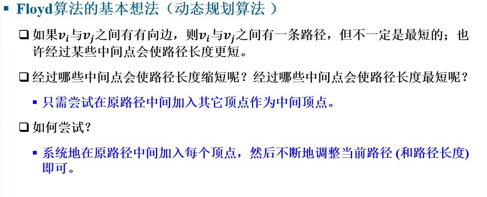

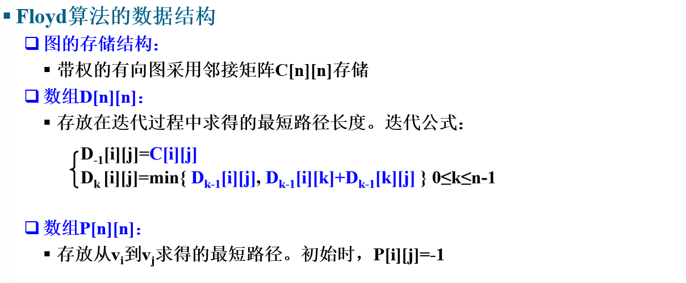

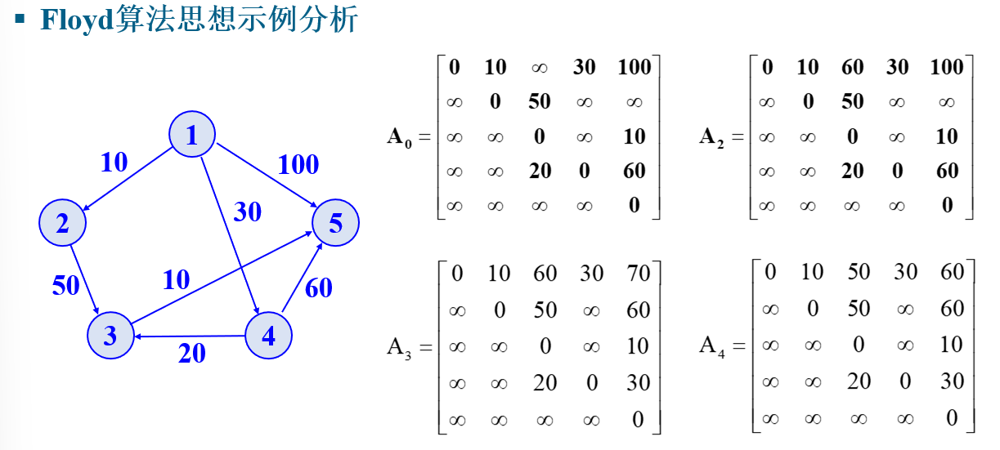
