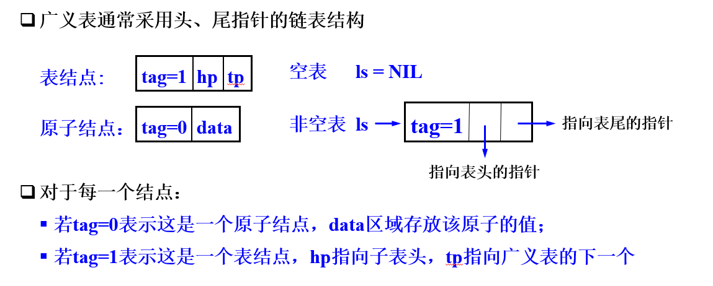
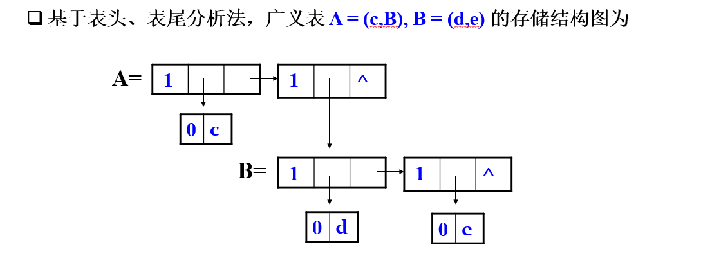
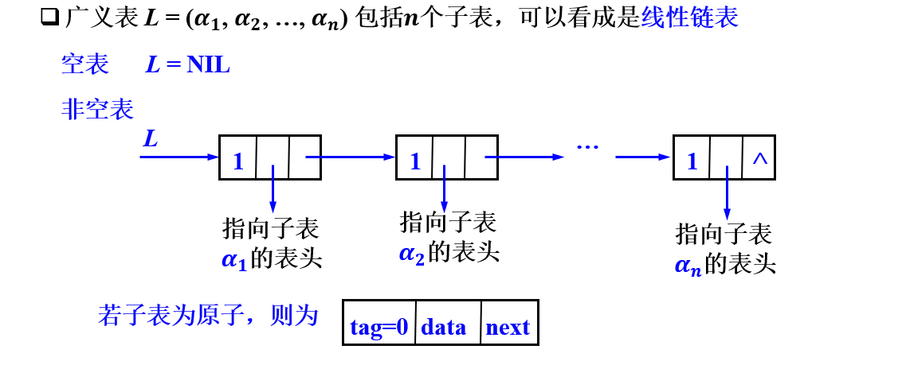
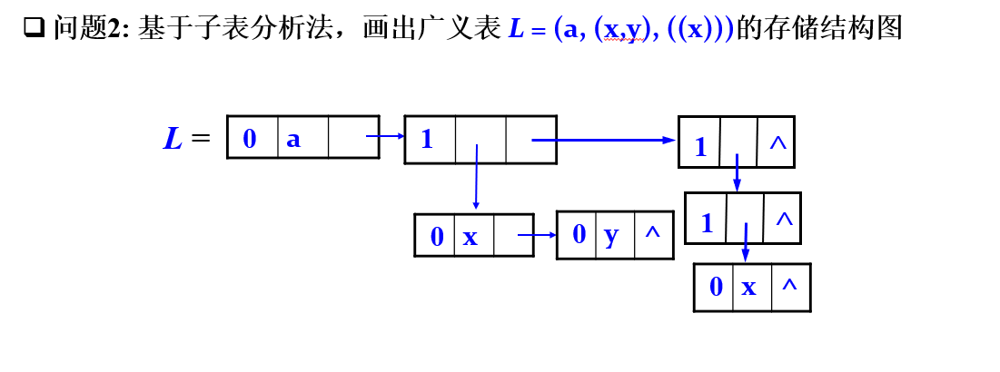

# 广义表

## 广义表定义

广义表是线性表的推广，也称列表(Lists)。它是$n$个元素的有限序列，记作

$$L=(\alpha_1, \alpha_2, \dots, \alpha_n)$$

其中$L$是表名，$n$是广义表的长度;

如果$\alpha_i$是广义表，称为子表，用大写字母表示；

如果$\alpha_i$是单个元素，称为原子，用小写字母表示。

## 广义表特点

(1)  广义表中的数据元素有相对次序

(2)  广义表的长度定义为最外层包含元素个数

(3)  广义表的深度定义为所含括弧的数目

注意：”原子”的深度为 $0$，”空表”的深度为 $1$

(4)  广义表可以共享（不必列出子表的值，而是通过子表的名称来引用）

(5)  广义表可以是一个递归的表

递归表的深度是无穷值，长度是有限值

## 广义表存储方式

### 表头表尾分析法

表节点为框架，元素只在原子节点出现，原子节点只在表头出现

其构建顺序相当于将表头弹出，剩下的作为表尾。

### 子表分析法

将空间利用的更好，深度和长度都可以体现在图上

其构建方式相当于链表式，将链表元素分类成表和原子

