# 树

## 基本定义

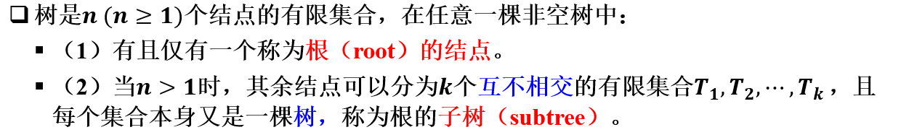

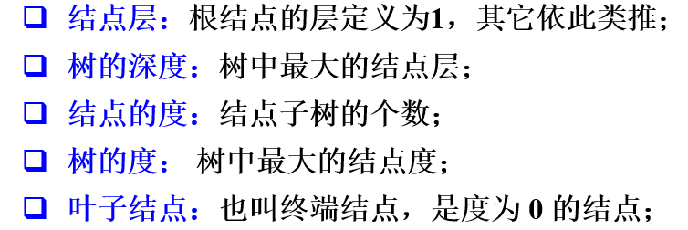

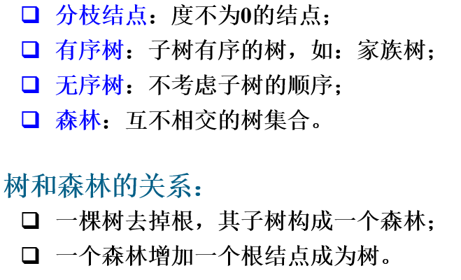

除根外，其余结点都有且仅一个前驱；都存在唯一一条从根到该结点的路径。

## 二叉树

### 基本概念

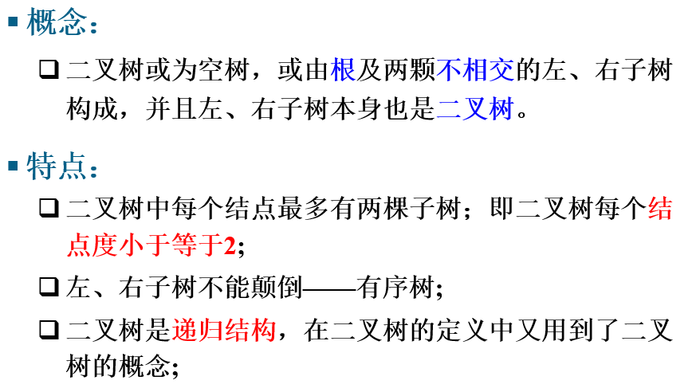

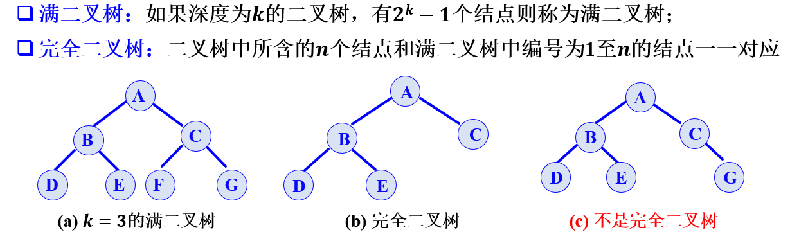

### 性质瓦

1. 
2. 
3. 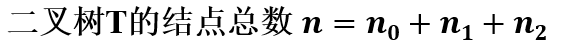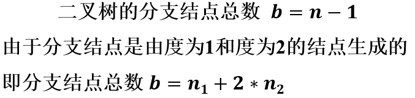
4. 
5. 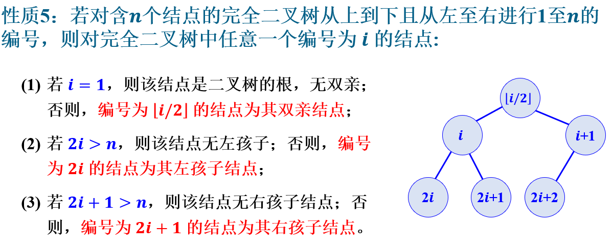
   *(这里索引是从1开始的，如果根节点索引是0，如在数组中实现，则一个i节点的左右孩子为 2i+1和 2i+2)*

### 存储

线性存储中，通过虚设部分节点，以完全二叉树的形式存储，但是面对特殊的树比如右斜树时会浪费空间，故一般不使用。

链式存储中，采用二叉链表的形式

*链式存储中，具有n个结点的二叉树中，共有n+1个空指针域。*

但是其无法快速找到双亲节点，因此在特定需求下也使用三叉链表存储

### 二叉树的遍历

遍历是指：按某种搜索路径访问二叉树的每个结点，而且每个结点仅被访问一次。

对于线性存储结构，只有一种方式遍历。

对于链式存储结构，有先序遍历，中序遍历，后序遍历等。

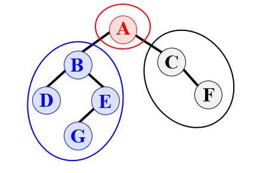

先序遍历序列： A B D E G C F  先输出，再左树，最后右树

中序遍历序列：D B G E A C F  先左树，再输出，最后右树

后序遍历序列：D G E B F C A  先左树，再右树，最后输出

知道中序遍历序列和先序后序中任意一个，即可还原树。

除此之外还有按层遍历的，需要引入队列辅助。

通过遍历我们可以得到结点的层次，以及树的层等重要参数。

### 相关算法

对于一颗树，我们常做一种寻找公共祖先的（lca）的操作，用来寻找两个节点的最近公共祖先，这里有好多种算法

一种是自上而下遍历，递归寻找祖先的方式。

还有一种是基于stl中的vector来存储树，并基于此实现的算法，更加简单而且快速。基本思路是维护一个记录每个节点深度的数组，先将两个节点的深度调整到一致，再一个一个向上走寻找祖先。

同时，可以使用vector结构存储子树关系，用一个正常数组存储父节点关系，这样在保证空间利用的基础上大大提升了可操作性。

## 线索二叉树

二叉链表是一种单向链接结构，从一个结点出发，沿着指针走向只能到达其子孙结点，却无法返回其祖先结点。由于具有n个结点的二叉树有n+1个空指针域，利用二叉链表的空指针域来存放遍历后结点的前驱和后继信息，这就是线索二叉树构成的思想。

在这里有一个容易被误解的地方，其后继线索和前驱线索的用途实际上是不一样的。对于后继线索，其是为了在正序遍历时，搭配算法一起遍历；前驱线索则是为了逆序遍历，并不是说只利用前驱和后继线索进行正序遍历。

### 存储方式

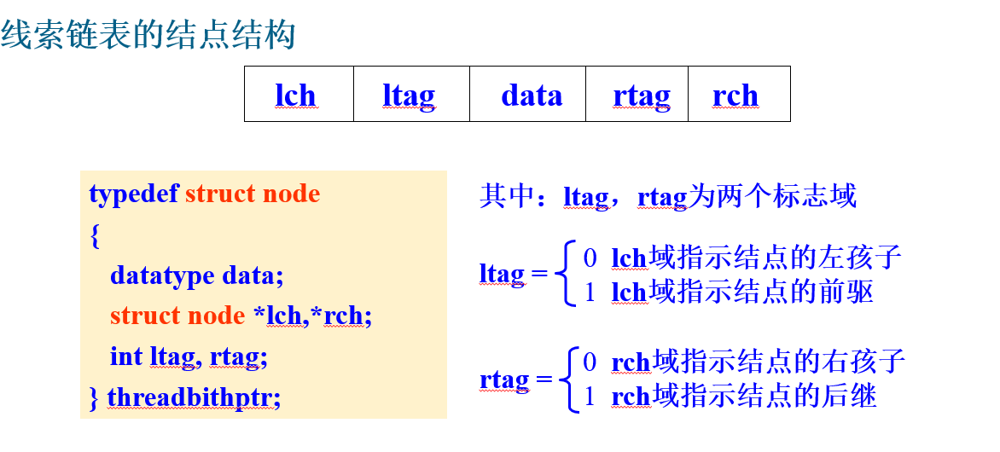

### 线索化与遍历

#### 1.生成头节点方法

要求在中序遍历下的第一个结点的前驱线索和最后一个结点的后继线索均指向头结点。

对于头节点本身有下面两种初始化方法

第一种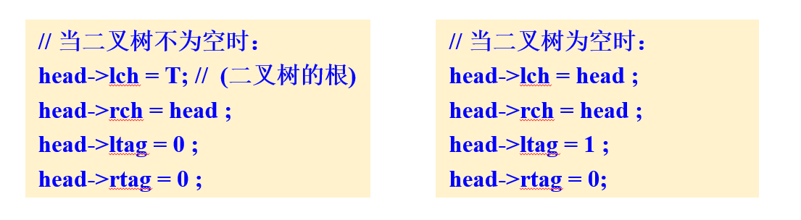
第二种

head -> lch 指向根结点

head -> rch 指向中序最后一个结点

head -> ltag = 0

head -> rtag = 1

#### 2.线索化

简单来说，需要按照中序遍历的顺序建立线索，如果没有左孩子，则在左孩子处存储前驱，如果没有右孩子，则在右孩子处存储后继

首先要清楚我们要做的是中序线索，因此要进行一次中序遍历，即线索化左节点，对当前结点操作，线索化右节点。

对于当前节点进行操作需要通过维护一个pre指针进行，当前结点指针为p，只要pre存在且pre的右节点是空的，则pre的后继为p，只要p的左节点是空的，p的前驱为pre，接下来将pre更新到p，p正常进行中序更新既可。

#### 3.查找中序前驱方法

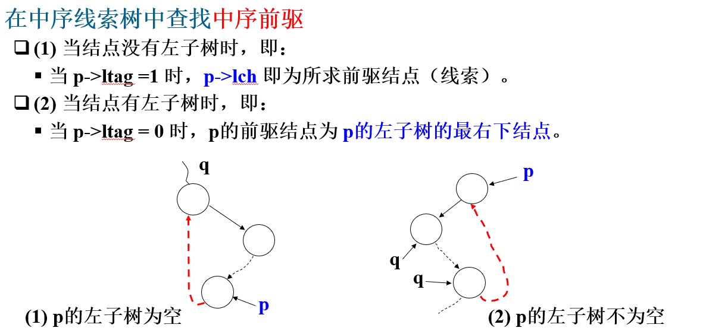

#### 4.查找中序后继方法

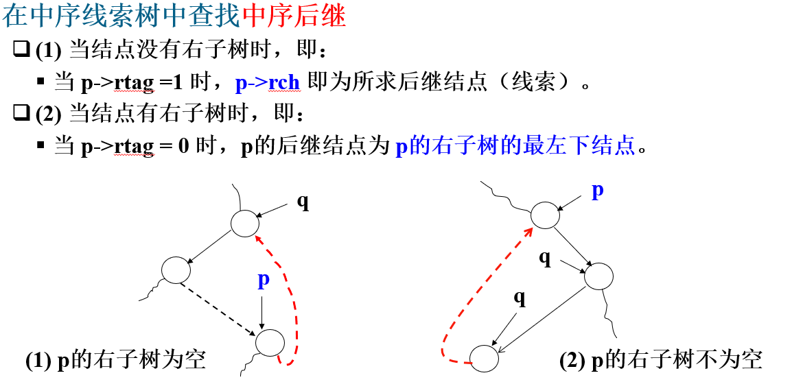

#### 5.遍历

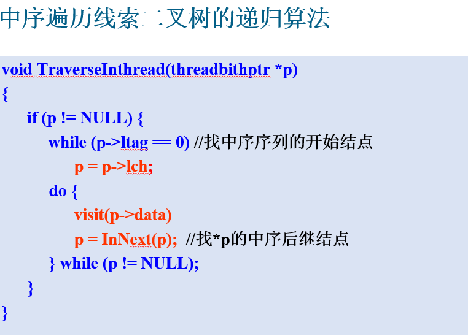

#### 6.结点插入

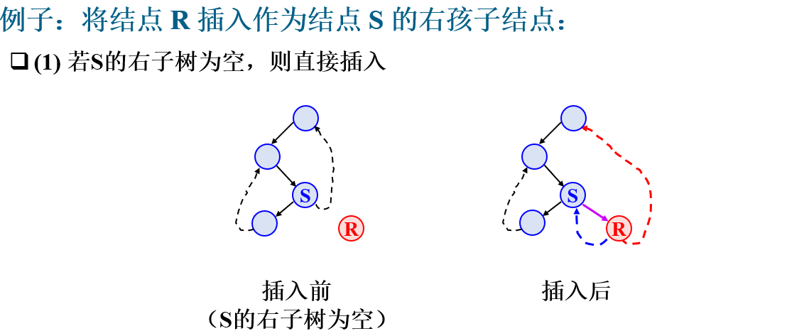

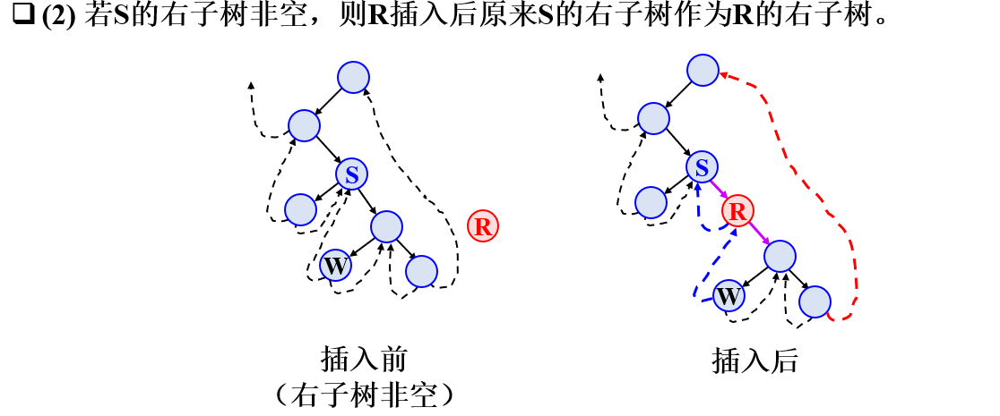

## 树和森林

### 树的存储

对于一般的树，我们很难用二叉链表存储结构，于是有几个更通用的存储结构

#### 双亲表示法

双亲表示法是利用了树的每个节点只有一个双亲节点的特性，通过数组结构既可实现，这种结构利于向上寻找节点，但是向下寻找时不方便

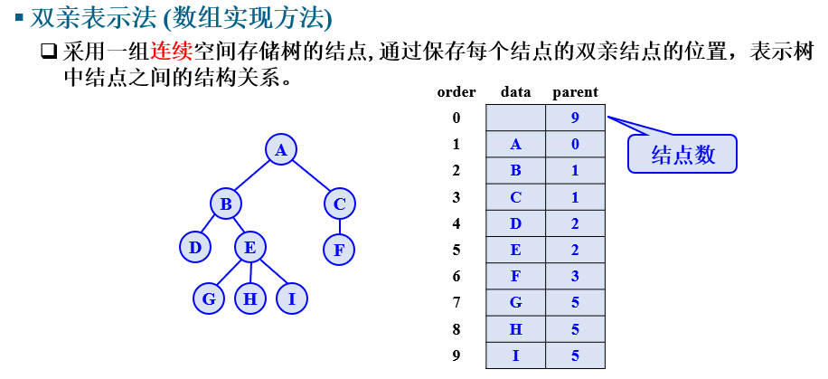

孩子表示法

孩子表示法是利用了线性链表的形式存储，对于一个双亲节点，包含一个指向第一个孩子的指针，而每个孩子节点包含一个指向下一个孩子的指针，通过一个数组存放双亲节点，既可以构造树

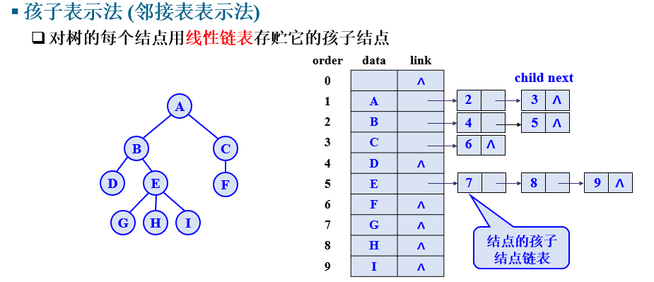

#### 双亲孩子表示法

结合上面两种存储方法，将孩子表示法的数组上加上每个节点的双亲节点指针，形成双亲孩子表示法

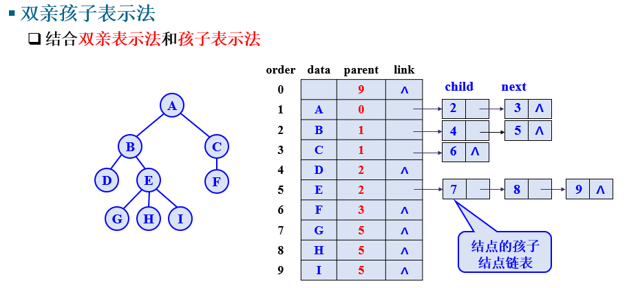

#### 孩子兄弟表示法

利用类似于二叉树的结构表示，以二叉链表为存储结构，左侧指针指向第一个孩子节点，右侧指针指向其下一个兄弟节点。

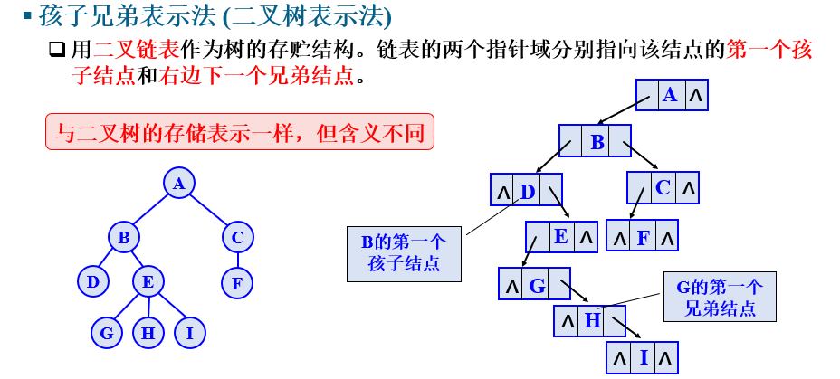

### 树、森林、二叉树之间的转换

#### 树到二叉树的转换

基于树的孩子兄弟表示法，可以将一棵树转化为二叉树的形式，具体转化方式为，在所有兄弟结点之间加一条线，对于每个结点，除了保留其与长子的连线，去电该节点与其他孩子的连线。

注意，这里沿用了孩子兄弟表示法的存储形式，即对于一个节点，其孩子节点在其左侧指针，兄弟结点在其右侧指针。即使这棵树本身就是二叉树，其也可以经过转化变成我们需要的二叉树。

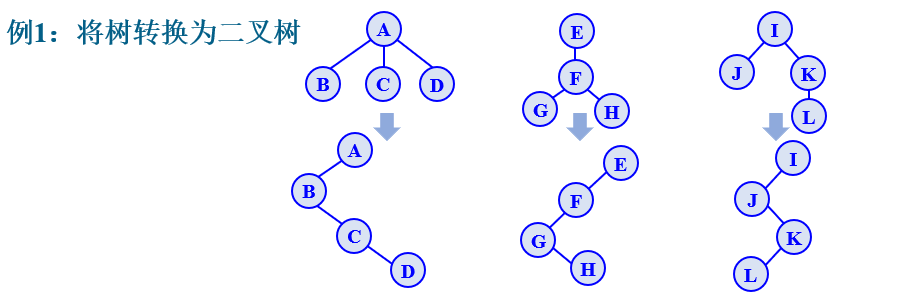

#### 森林到二叉树的转换

首先将森林中的每一棵树都转化为二叉树，接着将每个二叉树的根节点视为兄弟节点，继续用孩子兄弟表示法连在一起，即从第一棵树开始不断向右拓展。

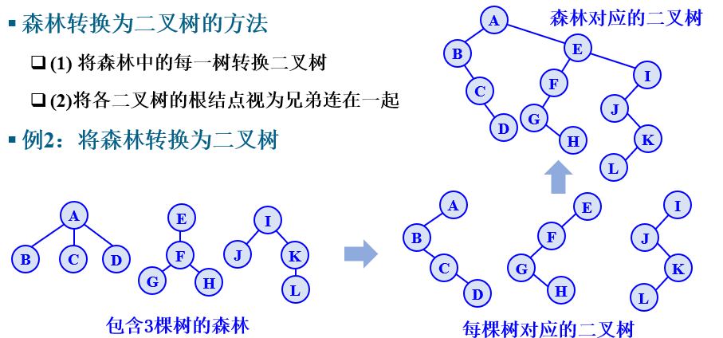

#### 二叉树到树、森林的转换

首先，如果一个二叉树的根节点有右孩子，则说明这个二叉树是由森林转换成的，要想将二叉树转换回去，需要先断开所有根节点与根节点右孩子之间的线，形成多个二叉树，每个二叉树可转化为一棵树。

而对于一棵树对应的二叉树来说，其每个节点，左侧节点是下一层，右侧节点是同一层，因此对于每个节点，可以将其所有的右侧节点与其双亲节点连接，同时断开其与右侧节点的连线。

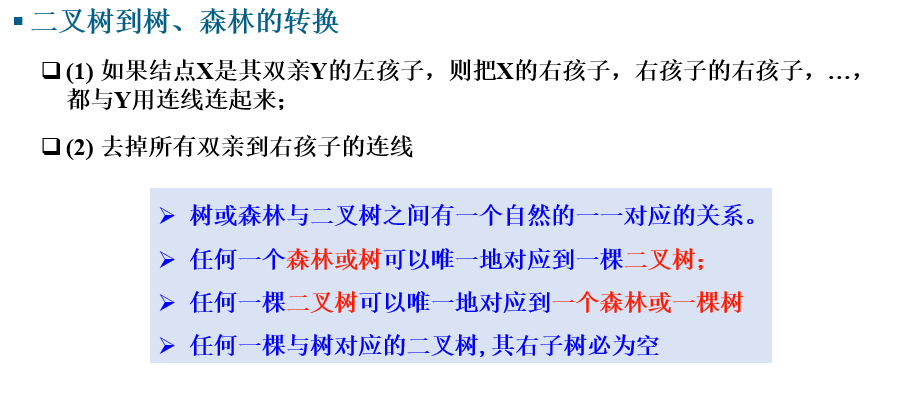

### 树与森林的遍历

#### 树的遍历

与二叉树类似，树的遍历有先根遍历和后根遍历以及层次遍历等，在这些遍历中，我们主要考虑孩子兄弟表示法的存储方式，原因是其他几种表示方式可以轻易地通过遍历数组来遍历。

由于一个节点有不止两个节点，因此中序遍历没有太大价值不再考虑。

树的先根遍历简单来说就是先访问再递归，具体如下

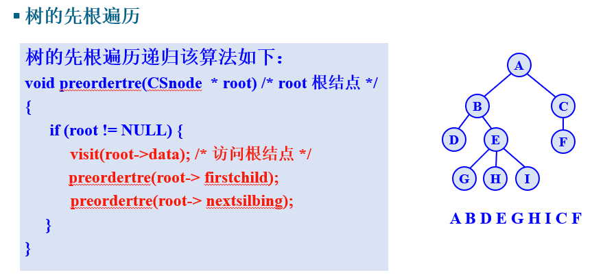

树的后根遍历简单来说就是先遍历再访问，具体如下

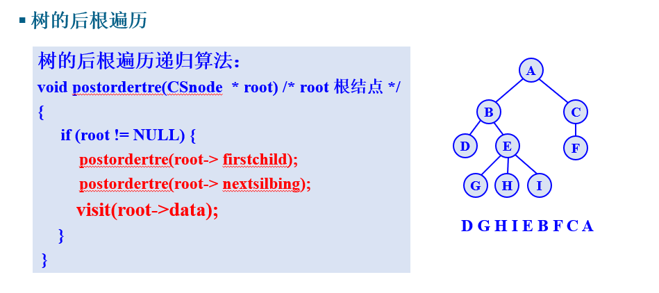

树的层次遍历与二叉树基本完全一致，借助队列来进行考虑

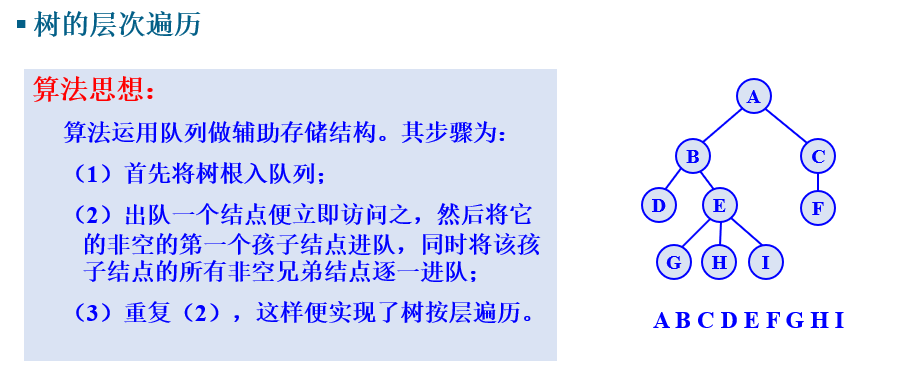

#### 森林的遍历

对于森林的结构，可以将其分解为森林中第一棵树的根节点，森林中第一棵树的子树组成的森林，森林中除了第一棵树以外其他的树组成的森林，因此可以进行递归遍历。

先序遍历，简单来说就是从左往右对森林中的每一棵树进行先根遍历。

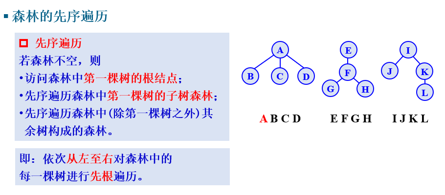

后序遍历，简单来说就是从左到右对森林里中的每一棵树进行后根遍历。

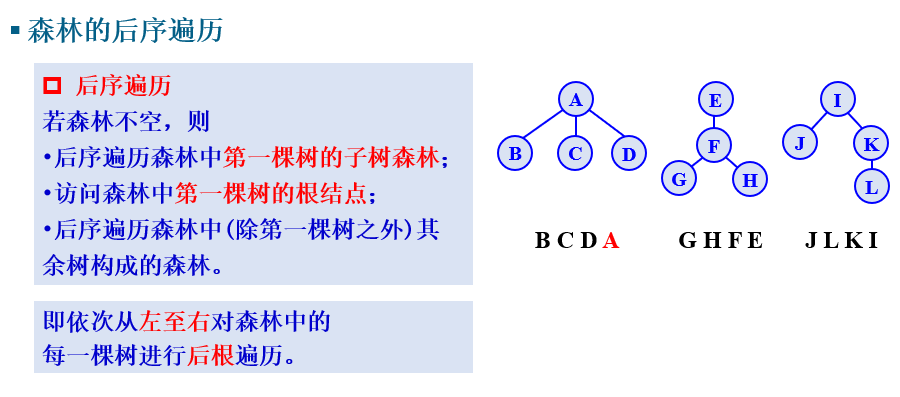

#### 森林深度求解

想要求森林深度，我们可以利用遍历时对森林采取的划分结构，即节点，子树森林，其他树森林的形式进行递归运算，具体如下

```C++
// T 指向森林中的第一棵树（即整个森林的代表）
function ForestDepth(T: CSTree): int
    if T == null then
        return 0
    else
        depthOfFirstTree = 1 + ForestDepth(T.firstChild)     // 第一棵树的深度
        depthOfRestForest = ForestDepth(T.nextSibling)       // 其他树构成的森林深度
        return max(depthOfFirstTree, depthOfRestForest)
```

## 哈夫曼树

### 相关概念

结点的路径长度 ：从根节点到该结点的路径上的连线数目
结点的带权路径长度（权值在结点上）：结点权值乘结点的路径长度

树的路径长度：树中每个叶子结点的路径长度之和
（结点数相同时，完全二叉树是路径最短的二叉树）

树的带权路径长度：树中所有叶子结点的带权路径长度之和

最优树：在所有的含n个叶子结点，带有相同权值的m叉树中，必存在一棵带权路径长度最小的树

最优二叉树（哈夫曼树）：带权路径长度最小的二叉树。

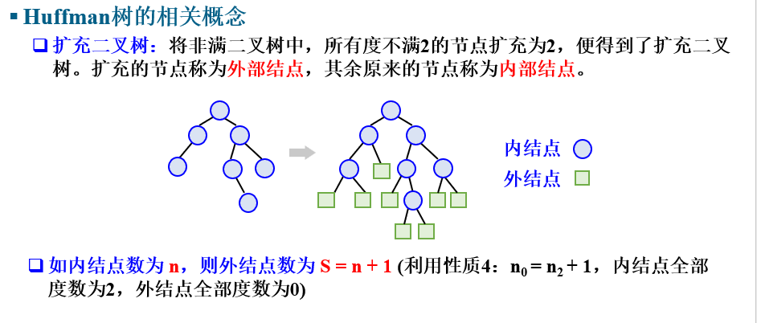

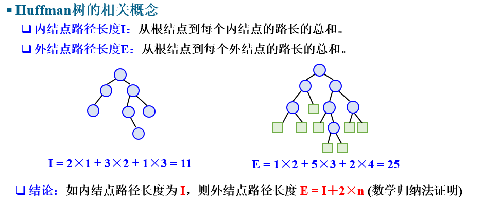

### 哈夫曼树的构造

简单来说就是不断选取当前最小的两个结点组成新结点，新结点权值为两个结点的权值和，将新结点替换原来的两个结点重新进行排序，不断重复直到最后只有一个结点。（我们约定，较小的一个在左侧）

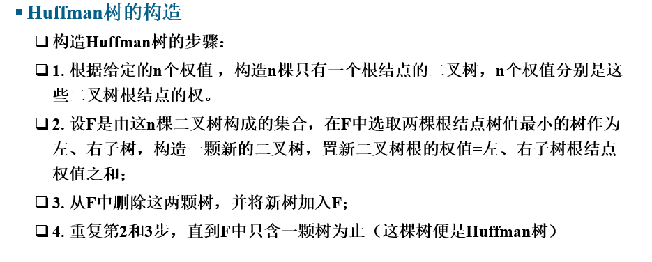

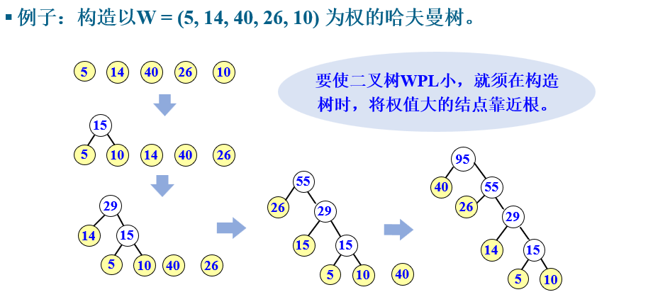

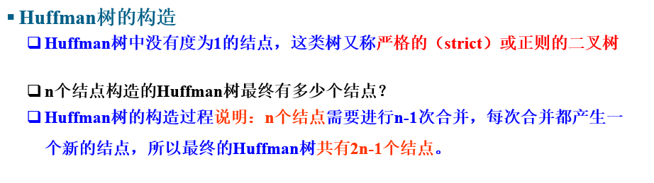

### 哈夫曼编码

#### 相关概念：

前缀编码：任何一个字符的编码都不是同一字符集中另一个字符的编码的前缀。

等长编码：各个字符的编码长度都相等

不等长编码：各个字符的编码长度不等（不全相等）

不等长编码的好处：可以使传送电文的字符串的总长度尽可能地短。

对出现频率高的字符采用尽可能短的编码，则传送电文的总长便可减少。

#### 哈夫曼编码构造

向左为0向右为1，每个叶子结点的路径可组成编码

这是一个不等长的前缀编码，不会混淆同时可以保证传输效率

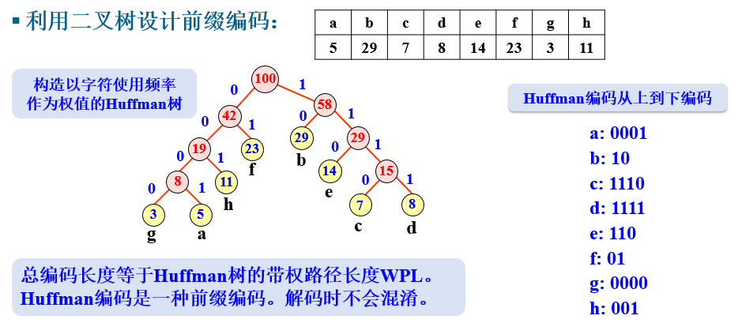
