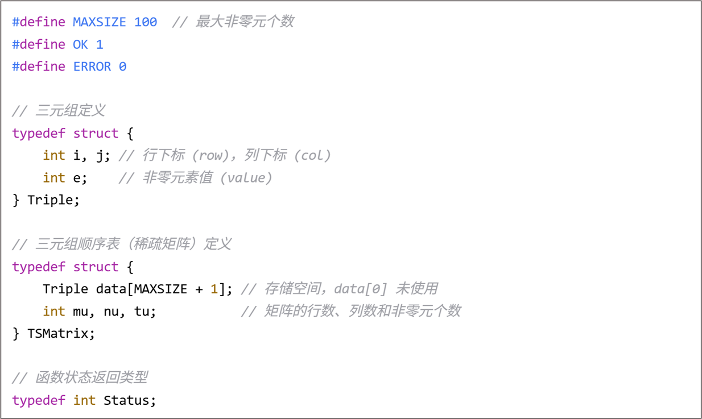
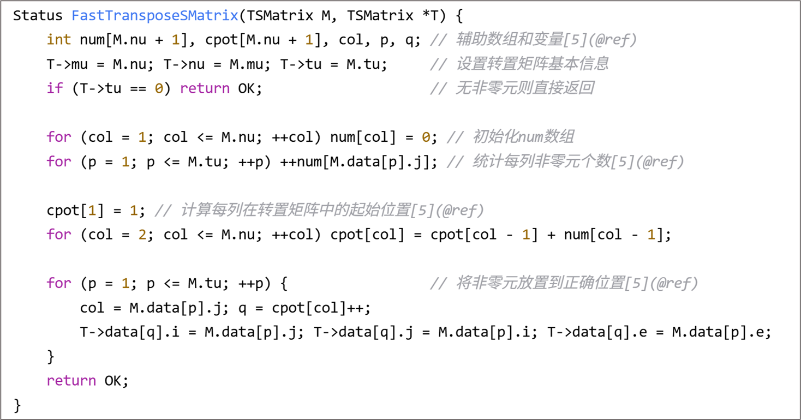

# 稀疏矩阵

## 三元组稀疏矩阵基本实现

## 三元组稀疏矩阵转置

基本原理是，开两个数组num,cpot，分别代表下标列有多少非零元素以及下标列第一个非零元素在新的三元组数组中的下标。

接着在原三元组中，遍历所有的非零元素，得到列号，进而通过cpot得到其在新三元组的位置，同时将该列的cpot++，让该列下一个元素得以正确转置。

这样的复杂度是O(col+num)，col是原矩阵列数，num是非零元素个数。
