# 不等式与凹凸性

# 函数凹凸性

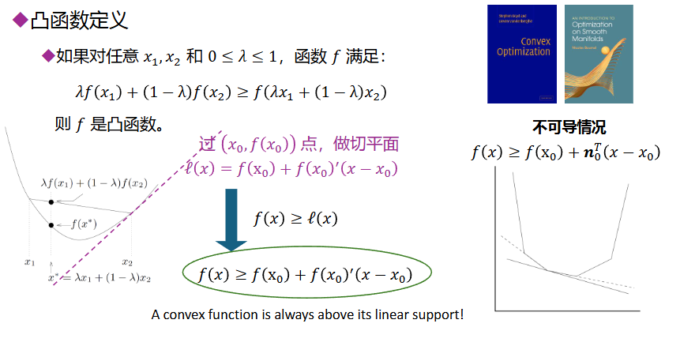

同一个x，函数上的点都在切线上点的上方，即为凸函数，反之即为凹函数

# Jensen不等式

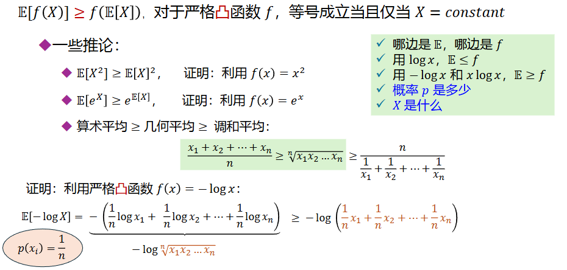

E[f(X)] >= f(E[X])

随机变量函数的期望大于等于随机变量期望的函数

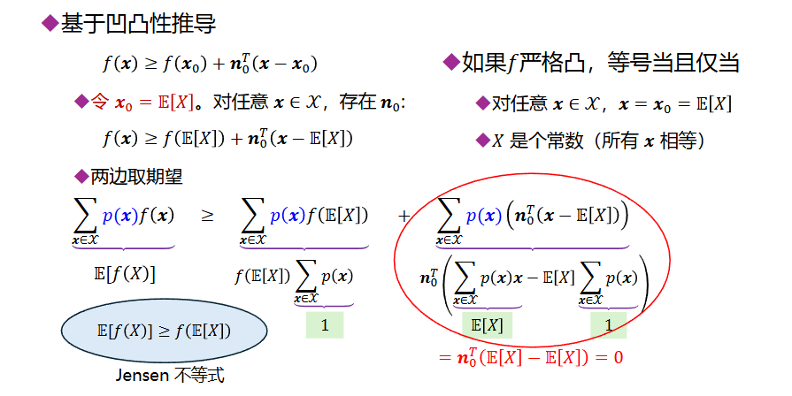

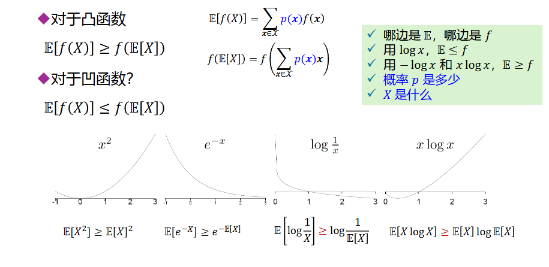

# log-sum不等式

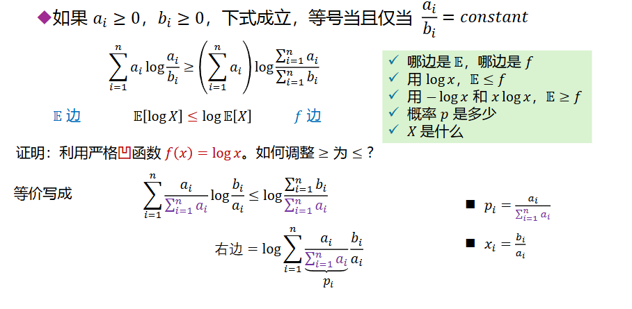

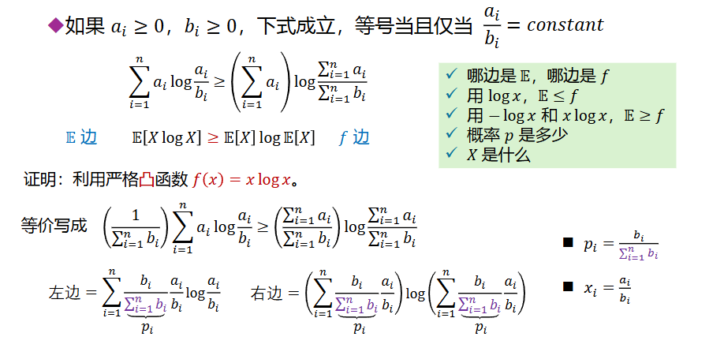

两种证明方式，既可以用logx也可以xlogx

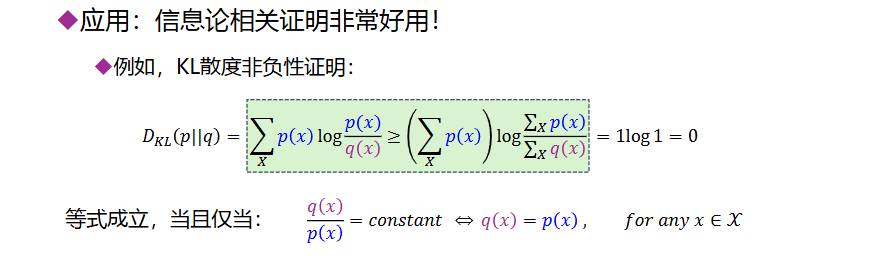

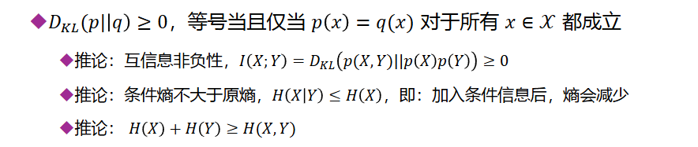

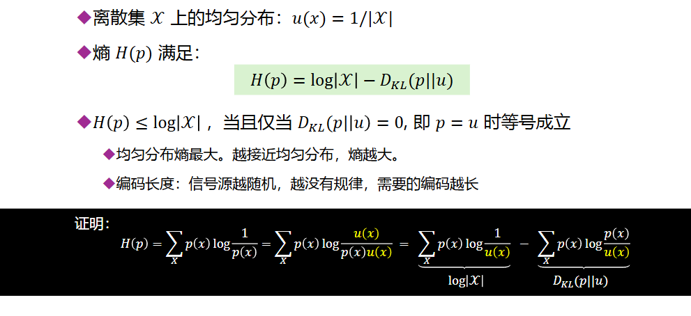

可以得到均匀分布的熵最大的结论

# KL散度凹凸性（凸）

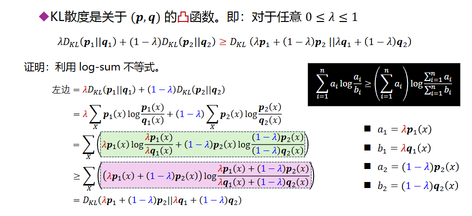

这里的 λp1+(1−λ)p2 和 λq1+(1−λ)q2就是概率分布向量的线性插值，它们本身也是有效的概率分布。

# 熵的凹凸性（凹）

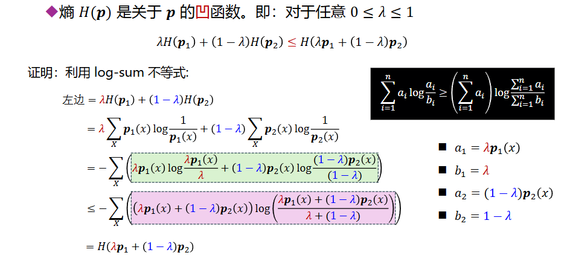

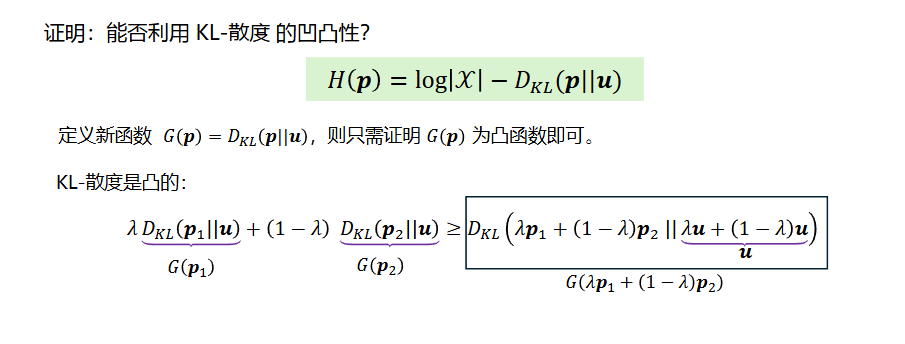

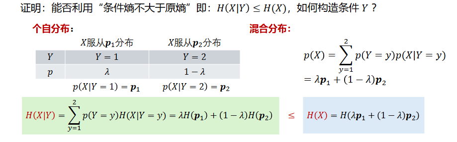

# 互信息的凹凸性

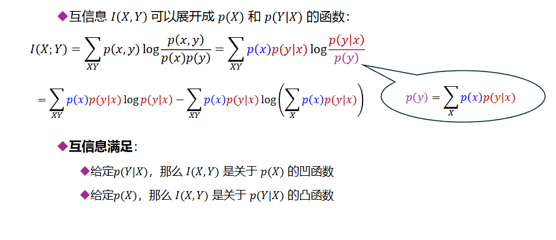
