# 连续分布

## 量化

### 微分熵

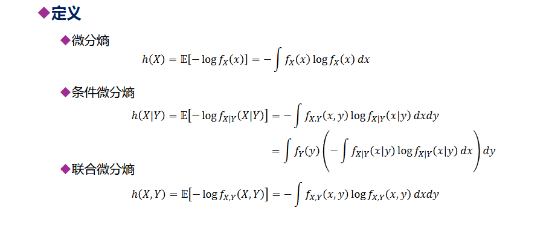

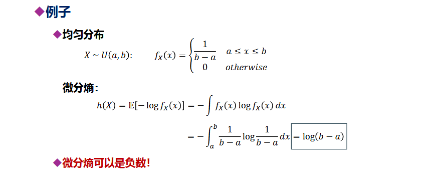

### KL散度

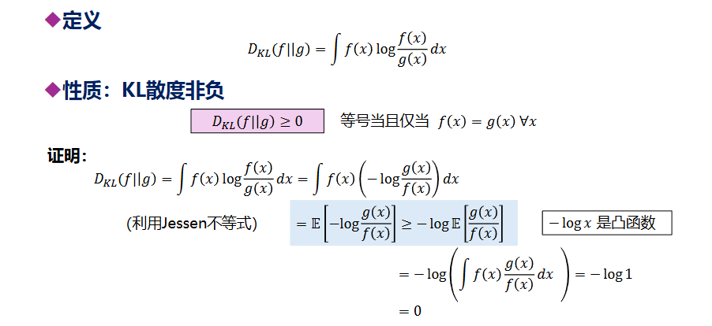

### 互信息

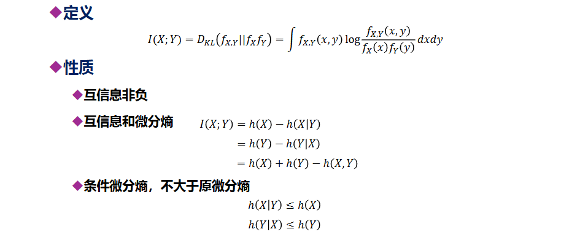

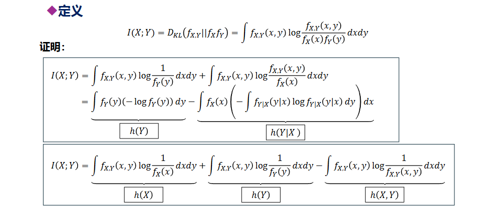

### 变量替换

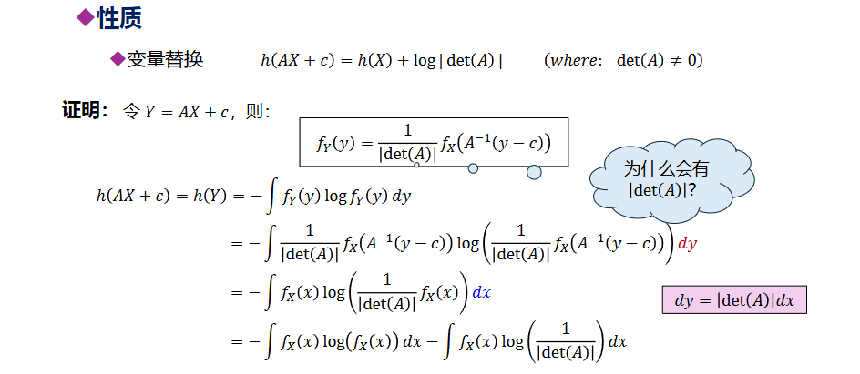

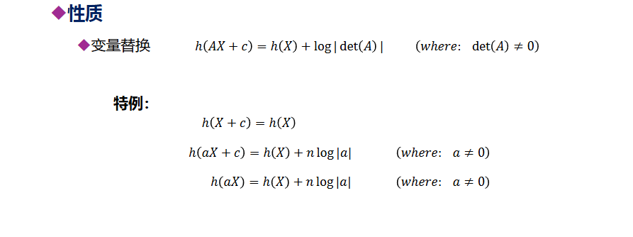

### 微分熵与离散熵

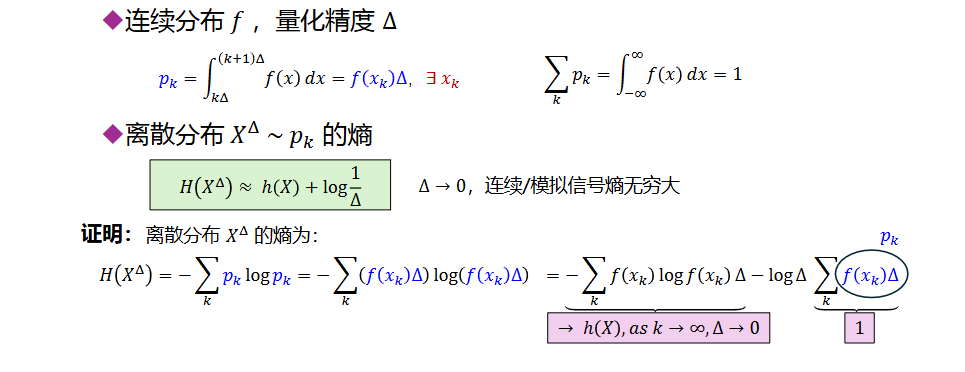

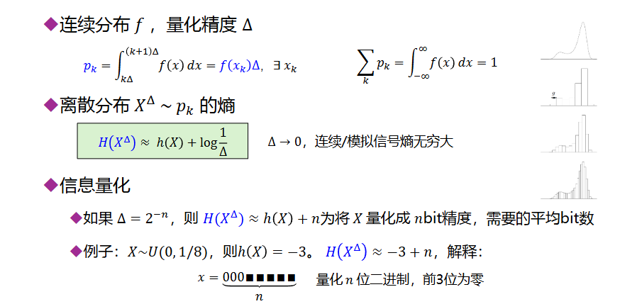

微分熵可以表示信息集中程度，当为负的时候就说明其已经集中在比0，1更小的范围中了，于是可以省去一定量的二进制，只需考虑更小的尺度

## 高斯分布

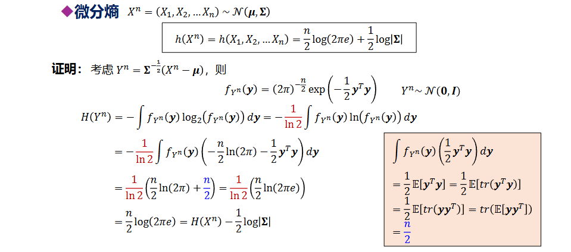

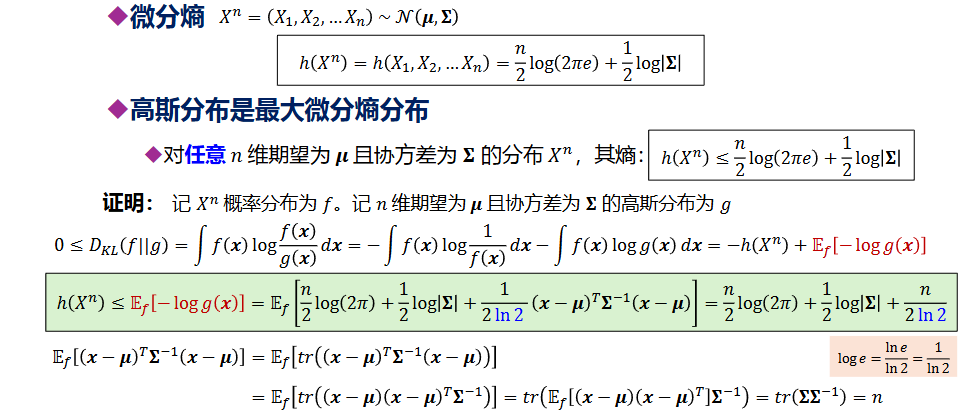

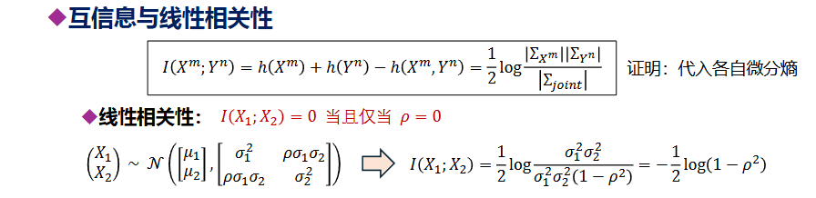

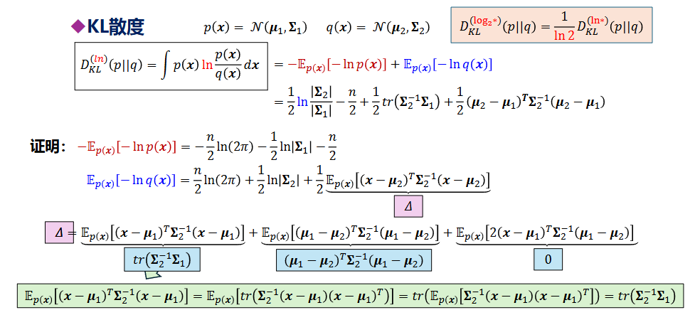

## 高斯信道

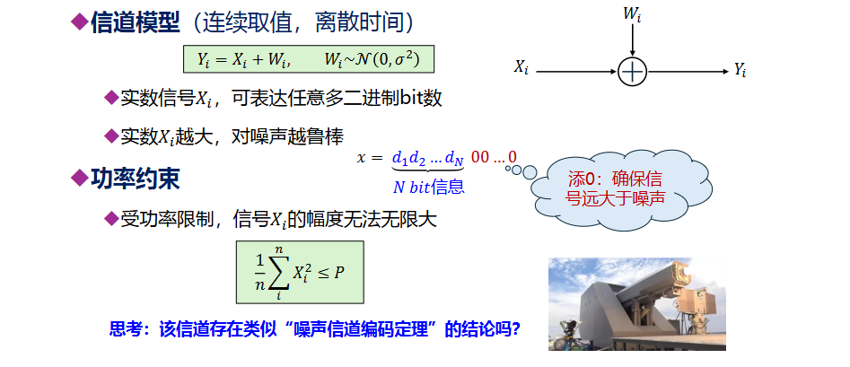

功率限制P即方差最大为P

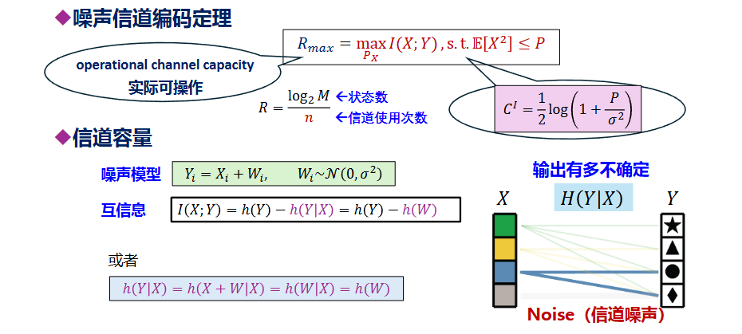

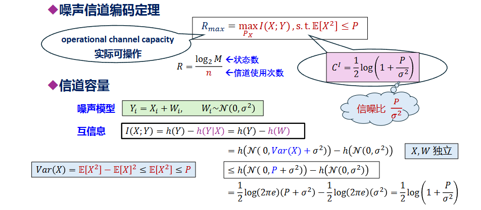

这里运用方差计算，由于Y的方差最大为X方差加上W方差，而X方差最大为P，W方差为σ，因此可以得到对应的最优分布

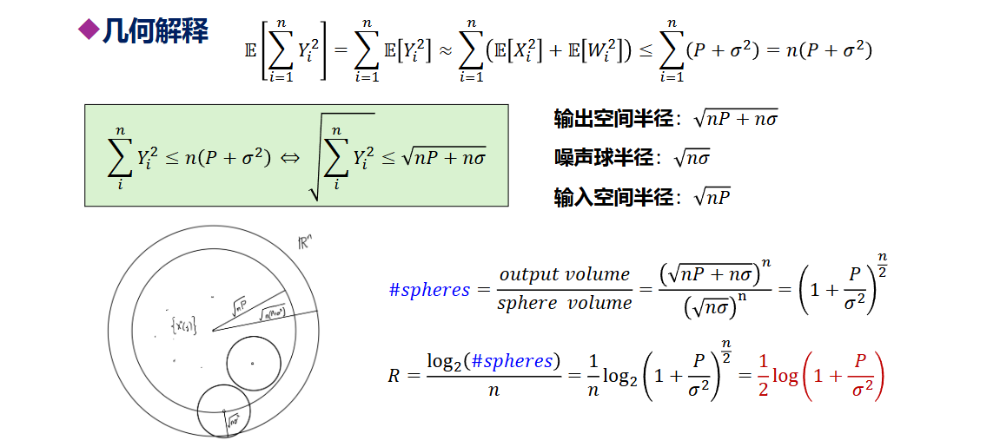

本质是高维球体积比例，即总空间中能放下多少噪声球，进而就是能有多少可被分辨的码字，进而求出最大传输率R

## 并行高斯信道

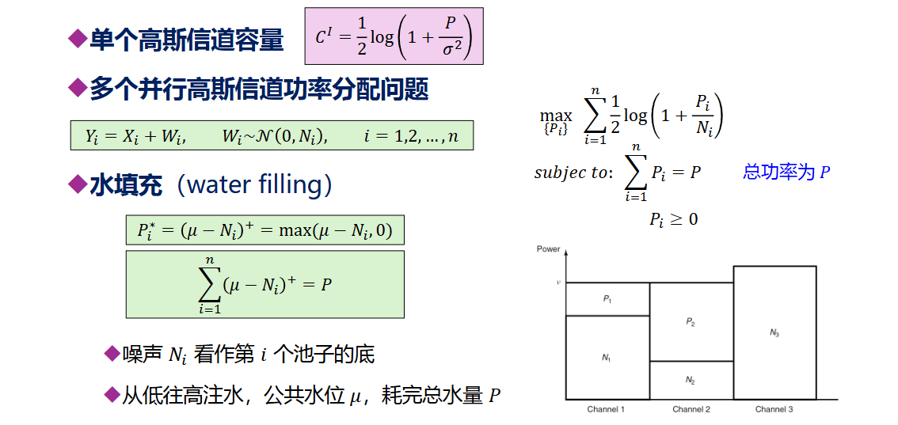

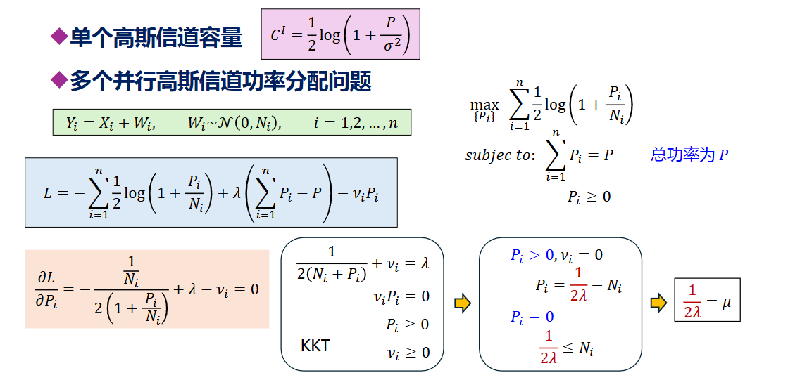
