# 零空间及汉明码

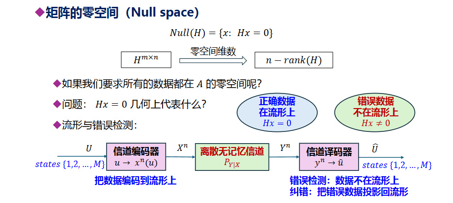

要求所有数据都在H零空间，即对于U，将其编码为X，满足X在H零空间，经过信道传输后X变成了Y，这时，如果Y在零空间上，则认为数据正确，如果Y不在零空间上，则认为数据错误，这时将Y投影到零空间上，投影结果认为是纠错后的信息

## GF(2)域零空间

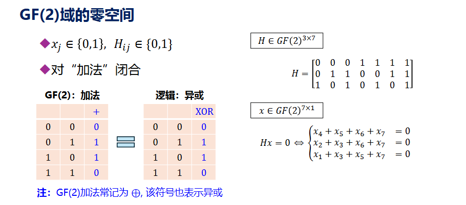

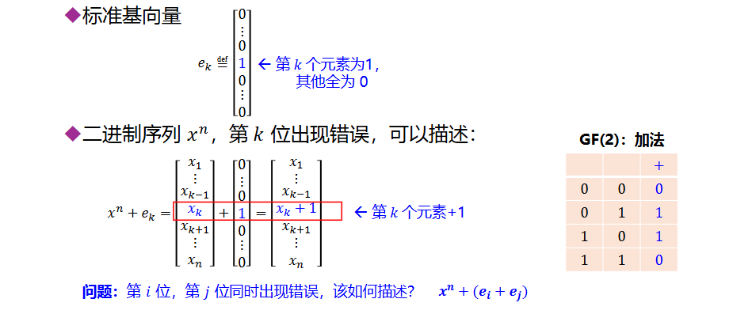

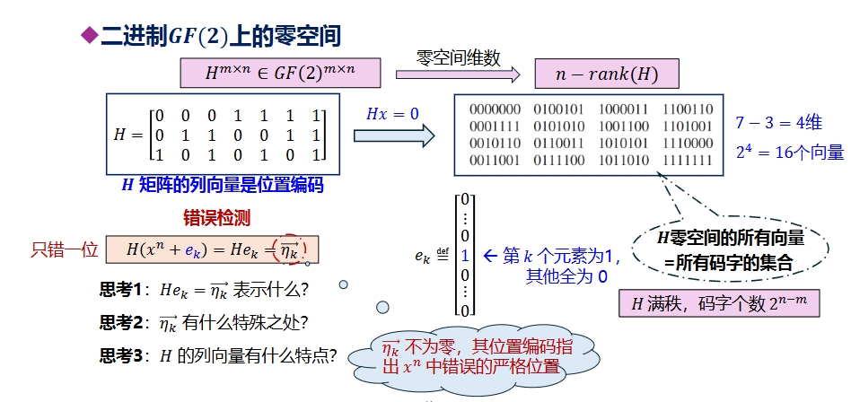

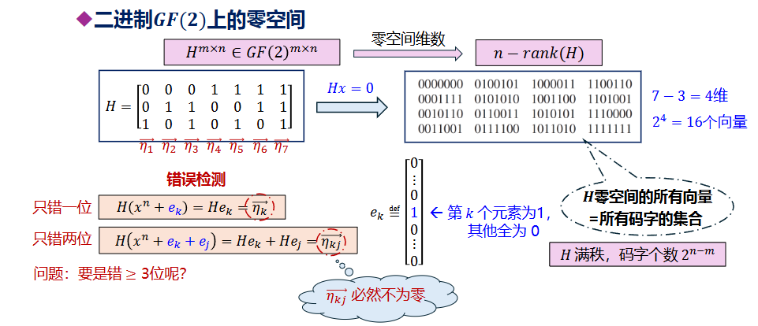

即将传输后的结果与测试矩阵H相乘，得到向量，如果是0向量则说明没有错误，如果等于H的某个列向量，则说明是对应的位出现传输错误，取反（+1）即可纠错，若不为0且不是任意一个列向量，则说明出现大于1位的错误，一般认为出现两位错误

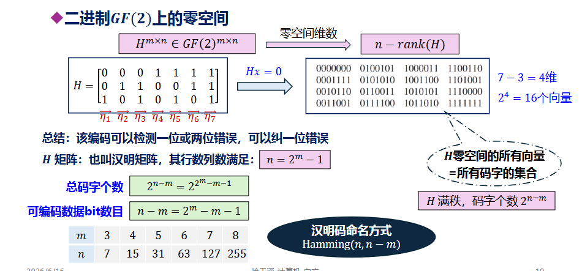

这里默认H各列向量互相不相等且都不为0

## 编码方式

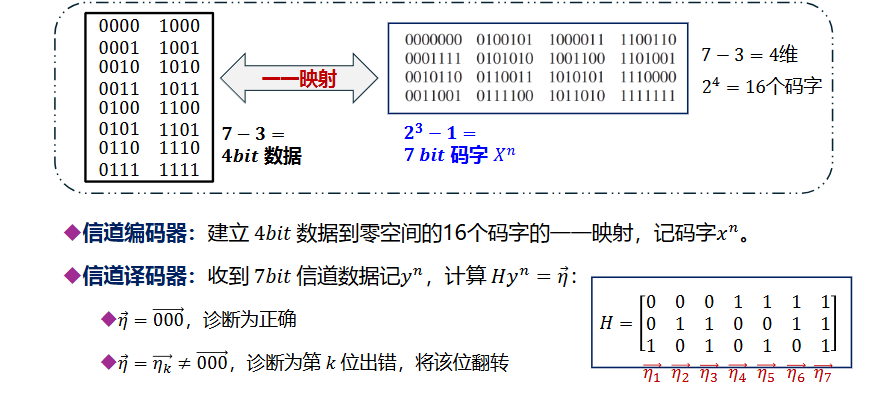

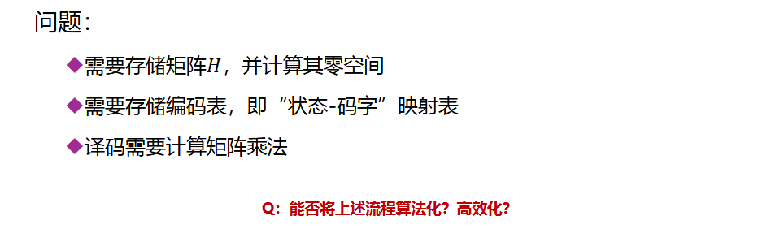

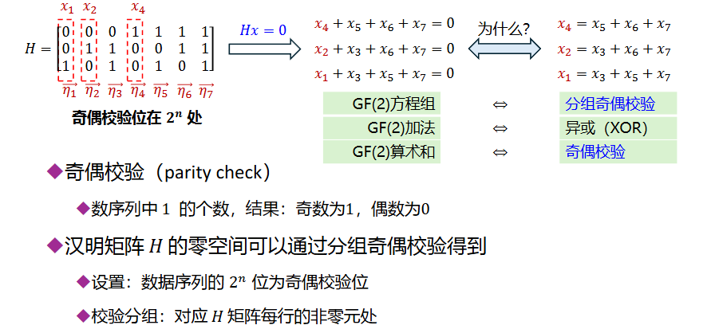

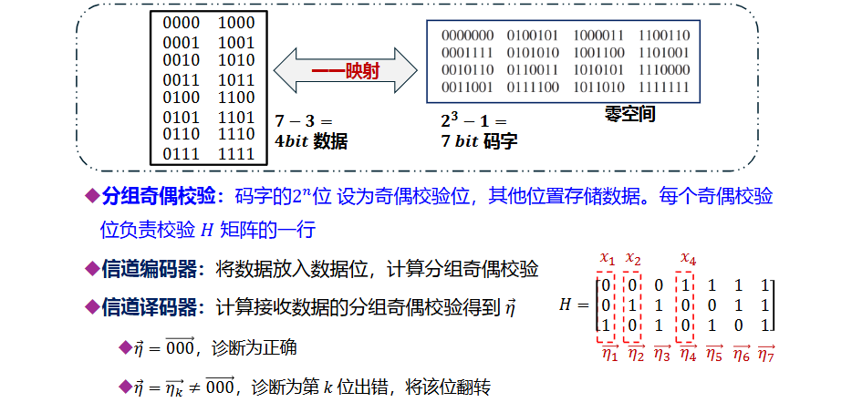

编码（发送端）

* 输入：你有4 bit的数据（比如`1011`）。
* 映射：把这4个数据填入码字的第3、5、6、7位。
* 计算校验位：根据第一张图的方程（奇偶校验规则），算出第1、2、4位应该填什么，才能保证所有方程都等于0。
* 输出：得到了一个7 bit的“完美码字”（属于零空间）。

译码（接收端 - 纠错时刻）

* 计算伴随式 η⃗：接收端拿到数据后，先代入方程算一遍。
  * 如果结果η⃗=[0,0,0]：没出错（或者错得无法检测）。
  * 如果结果η⃗≠[0,0,0]：出错了
* 定位错误：算出来的这个非零向量η⃗，它的数值直接告诉你哪一位错了。
  * 例如：算出来η⃗=[1,0,1]（二进制），转成十进制是5。
  * 诊断：第5位出错了。
  * 纠正：把第5位翻转（0变1，1变0），数据就恢复了。

## 汉明码

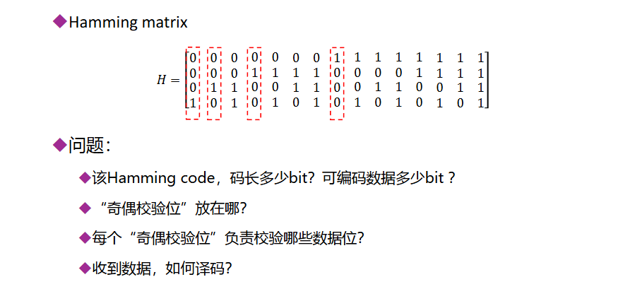

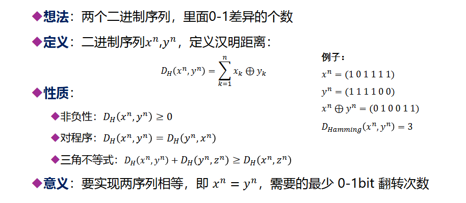

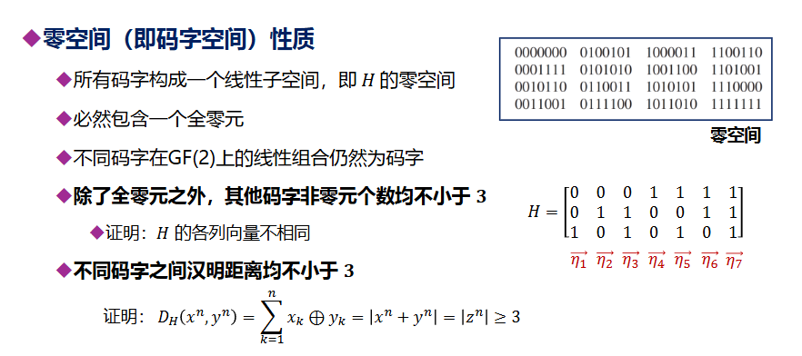

H各列向量不相同，且都不为0，因此至少非零元个数为3才有可能出现与H相乘为0；接下来，不同码字汉明距离即两个向量和，由于每个向量都在零空间，于是向量和也在零空间，即也是零空间向量，又零空间向量非零元个数大于等于3，于是汉明距离也大于等于3。

因此，零空间具有一个性质就是两个码字之间的距离不小于3，即至少有3个翻转才可能会出现码字混淆
