# 率失真

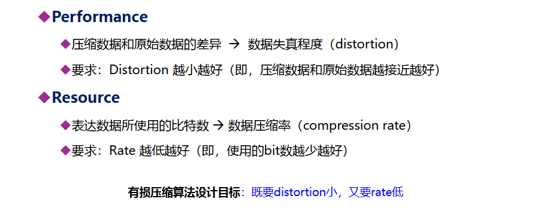

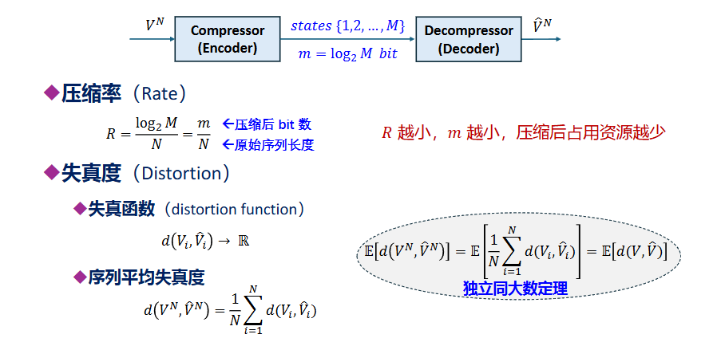

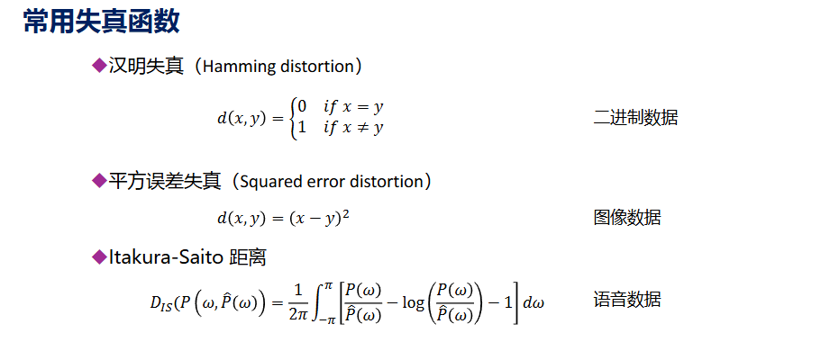

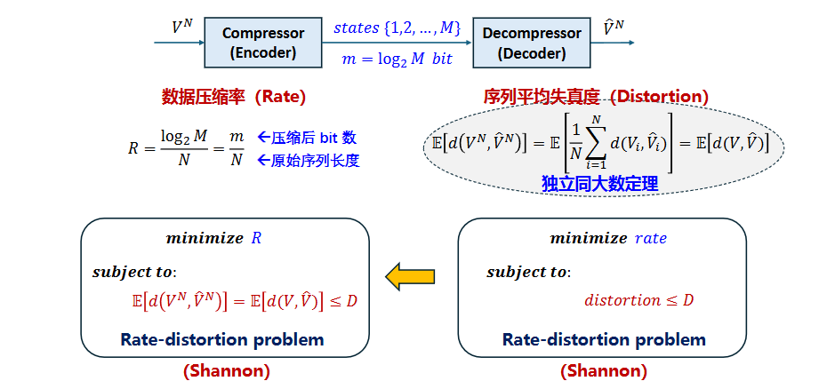

即保证损失不超过一定值的情况下优化压缩率使其最小

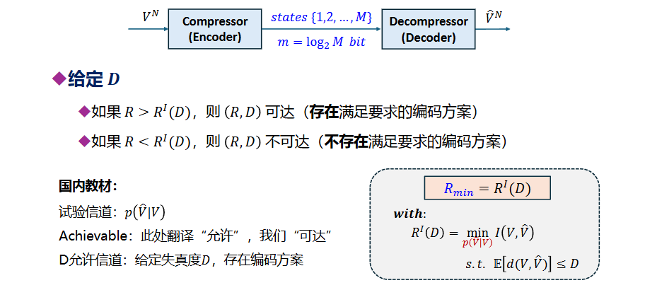

这里注意区分和噪声信道编码定理的关系，噪声信道编码定理是确定噪声的Y|X，为了保证将信道填满，需要找到合适的X使得互信息最大，即保留更多信息；而率失真理论是指要压缩一个信息，同时允许其有一定的损失，那么这里要优化Y|X，使得得到的Y最少也要保留X的一些信息，因此是要找到其底线

## 率失真函数

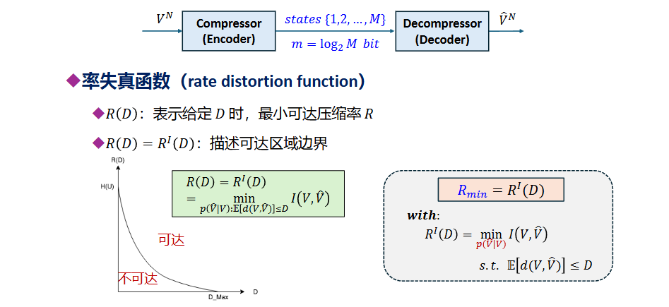

从图上可以更好地解释，在右侧可达部分，失真程度更大，因此更易到达，我们目标就是找到这个区分平面

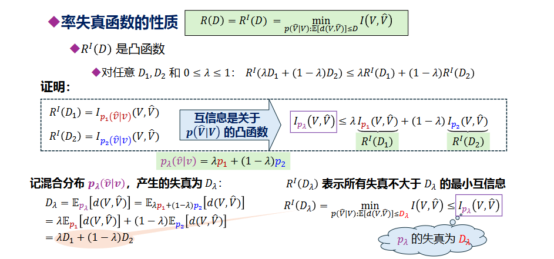

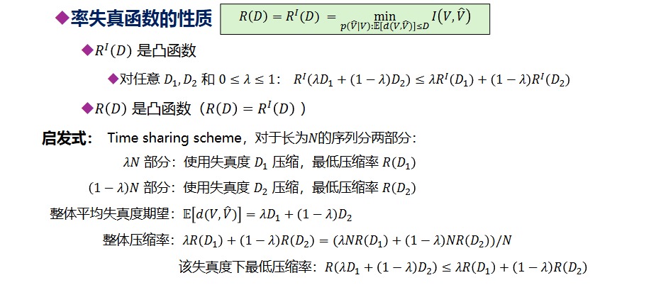

即整体编码>=分别编码再合并

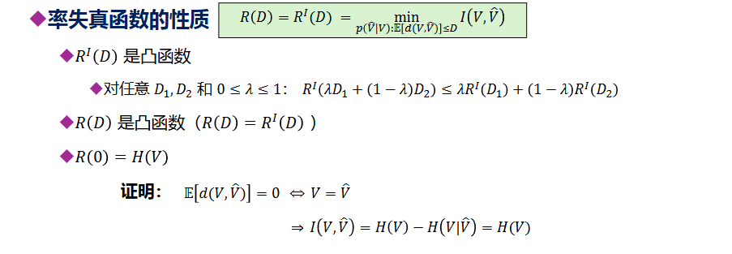

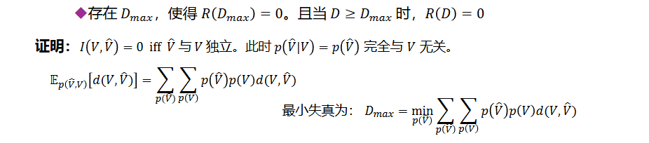

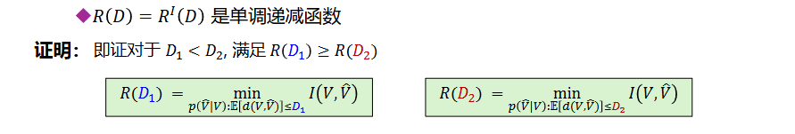

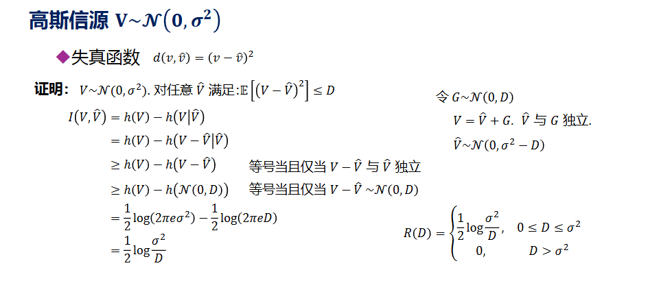

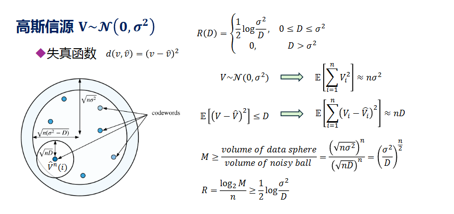

每个噪声球都代表着一个码字能够包括那些数据，目标是求出最少的码字数量，因此用数据球除噪声球， 就是最少需要多少码字才能使其覆盖整个数据球

## 证明

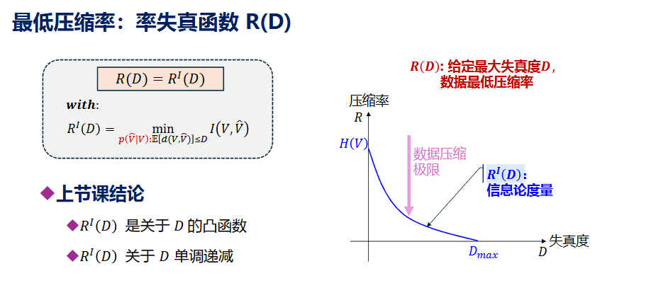

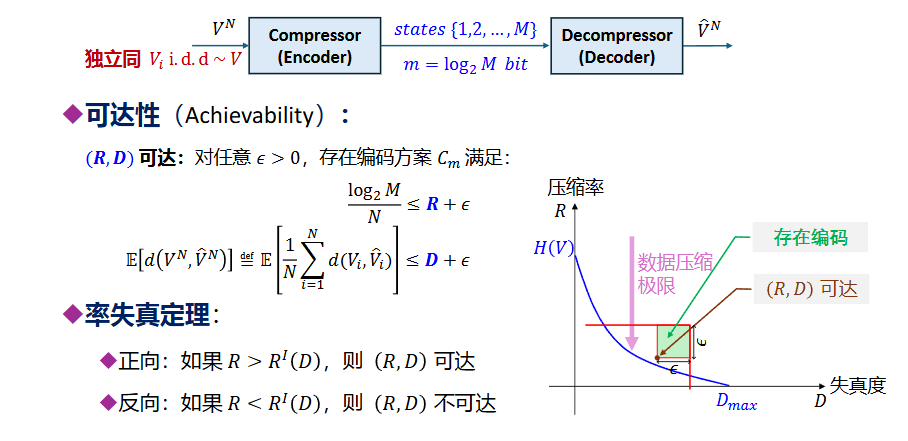

### 反向

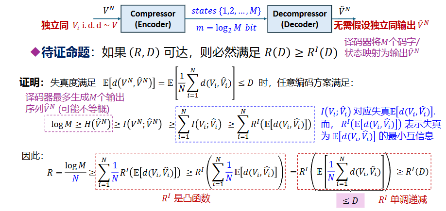

### 正向

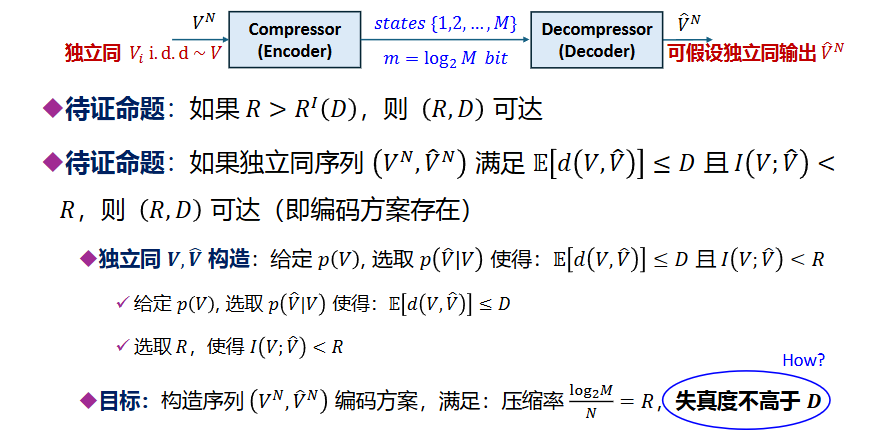

需要用到强典型集来找到编码方案使其失真度不高于D

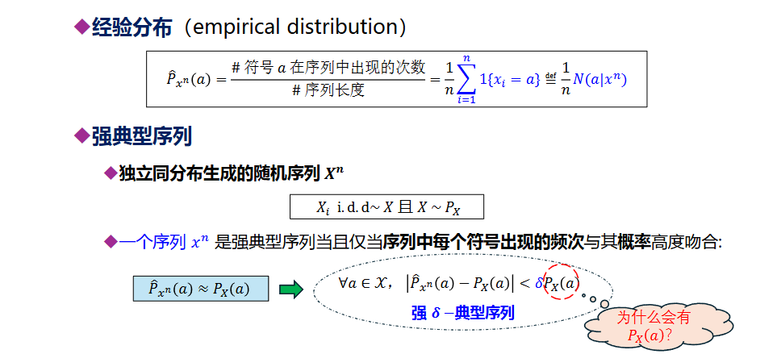

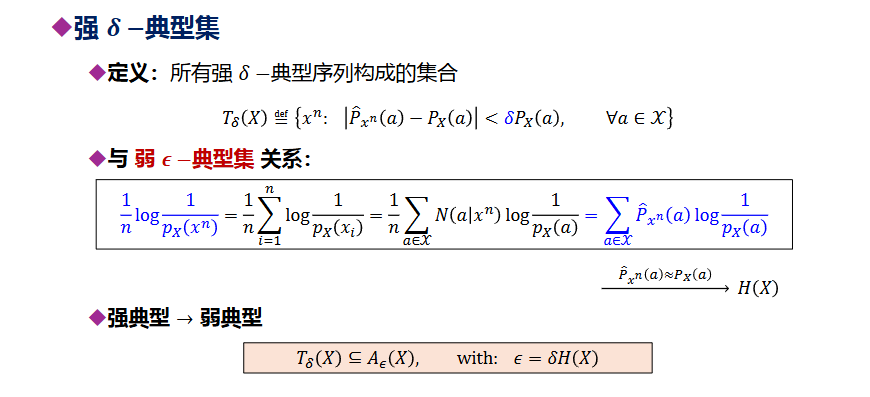

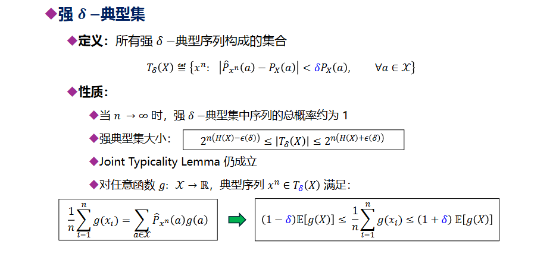

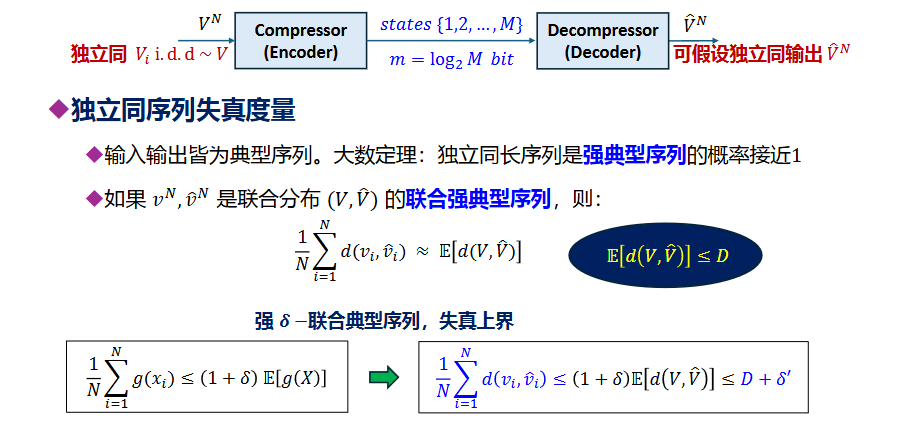

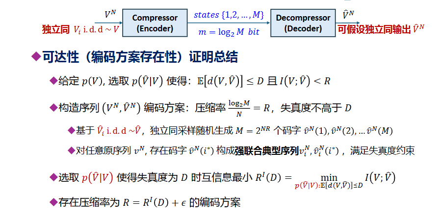

简单来说，我们目标是证明如果R>D率失真函数，则(R,D)可达，可达可以理解成存在一个编码策略使其满足压缩率等于R,失真度等于D。

由于D率失真函数是指给定p(X)，找到最优p(Y|X)，使得在满足X,Y失真度小于等于D的条件下，最小化的X,Y互信息，可以将原证明转化为其充分性证明：

条件是  存在一对V,W随机变量，这里V固定，变化W|V，使满足V,W失真度小于等于D，其互信息小于R；结果是   存在编码方案满足压缩率为R，失真度为D

这里需要知道，X分布是固定的，因此我们需要利用的是X分布，存在的一堆满足条件的V,W随机变量，去构造一个编码方案，将X编码后解码为Y，满足压缩率为R，失真度为D

接下来就是构造这个编码，利用强典型集构造，对于X，利用存在的V,W随机变量分布，求出Y的分布，接着对于Y的N阶独立同分布，在其中随机取M个作为码字，这里M满足压缩率为R，接着，对于一个X的N阶独立同分布，在M中找m使得输入X与码字组成的序列在V,W强典型集中，进而就可证明这样构造的编码方案失真度小于等于D，压缩率等于R

最后，取W|V为最优Y|X，由此即可将充分性命题转换成原命题，即存在压缩率为D率失真函数的编码方案

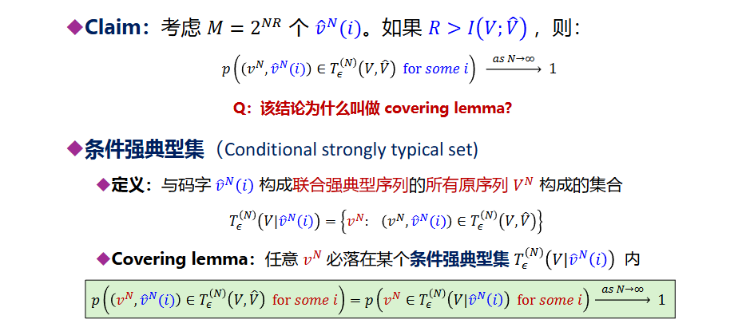

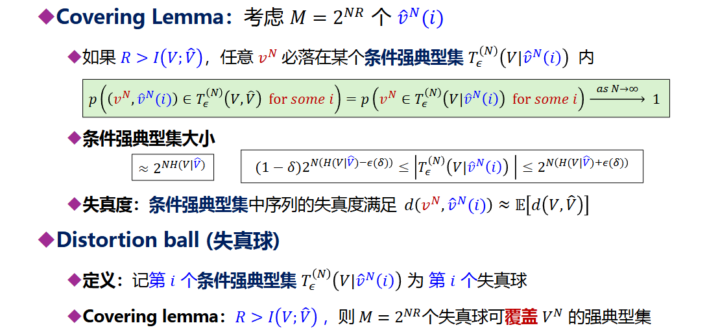

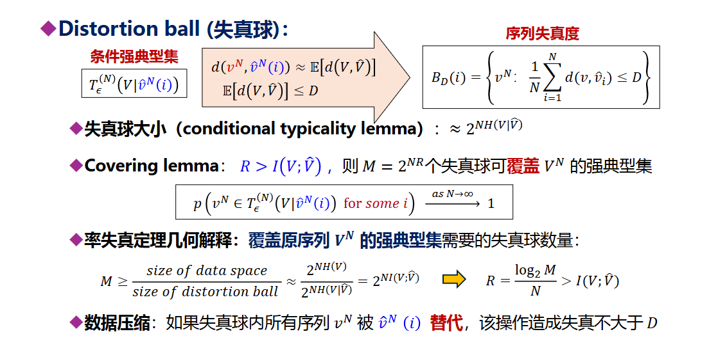

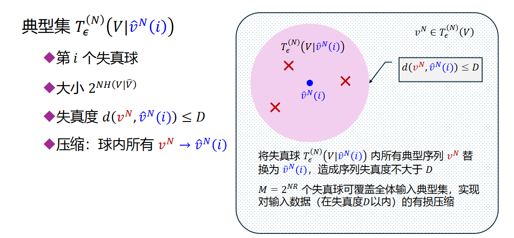

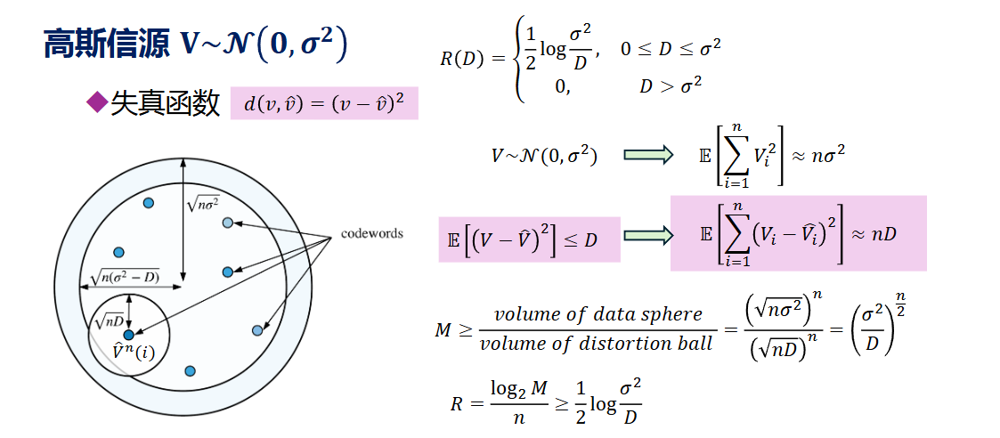
