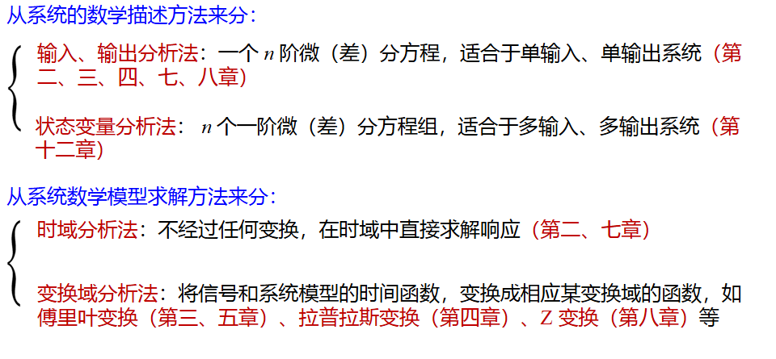
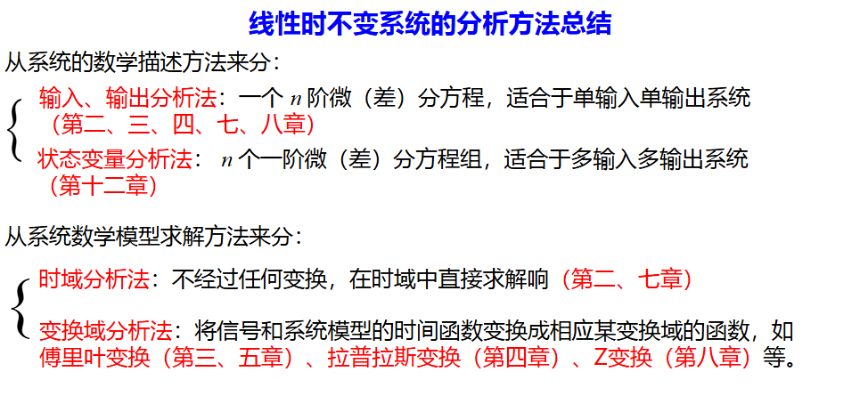

# 综述

|      | 时域          | 频域            | 复频域          |
| ---- | ------------- | --------------- | --------------- |
| 连续 | 微分方程（2） | 傅里叶（3，5）  | 拉普拉斯（4）   |
| 离散 | 差分方程（7） | FFT/DFT（8，9） | z变换/DTFT（8） |

